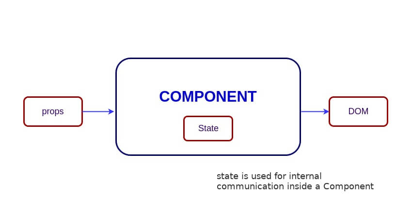
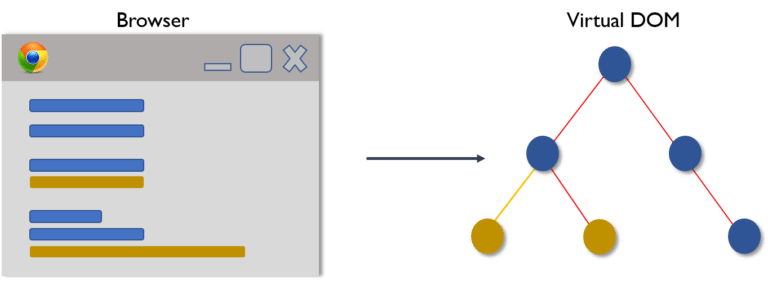
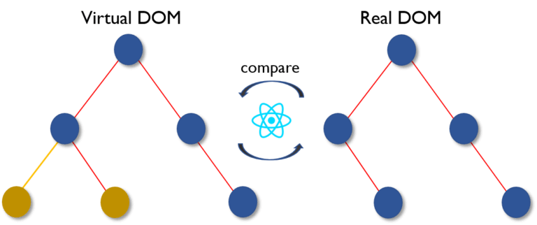
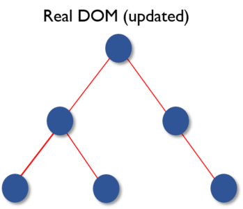
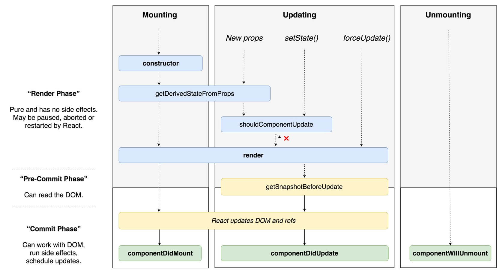
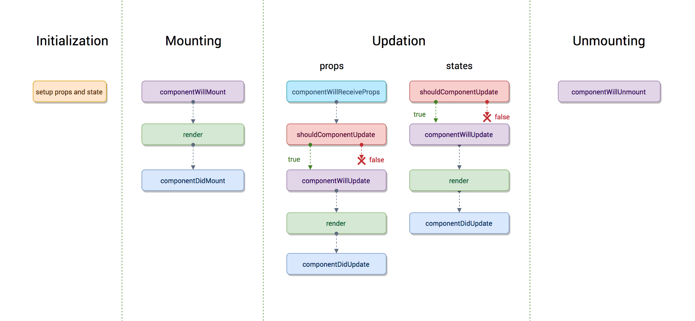
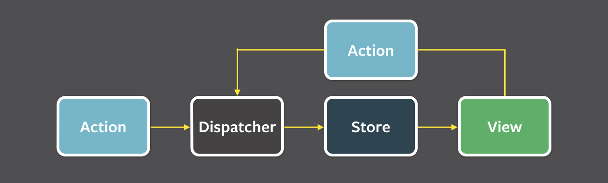
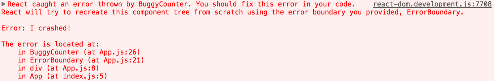

### 目录

| No. | 问题 |
| --- | --------- |
|   | **React 核心** |
|1  | [什么是React?](#what-is-react) |
|2  | [React的主要特点是什么?](#what-are-the-major-features-of-react) |
|3  | [什么是JSX?](#what-is-jsx) |
|4  | [元素(Element)和组件(Component)有什么区别?](#what-is-the-difference-between-element-and-component) |
|5  | [如何在React中创建组件？](#how-to-create-components-in-react) |
|6  | [何时在功能组件上使用类组件？](#when-to-use-a-class-component-over-a-function-component) |
|7  | [什么是Pure Components?](#what-are-pure-components) |
|8  | [React中的state是什么?](#what-is-state-in-react) |
|9  | [React中的props是什么?](#what-are-props-in-react) |
|10 | [state和props有什么区别?](#what-is-the-difference-between-state-and-props) |
|11 | [为什么不直接更新state?](#why-should-we-not-update-the-state-directly) |
|12 | [回调函数作为setState()参数的目的是什么?](#what-is-the-purpose-of-callback-function-as-an-argument-of-setstate)
|13 | [HTML和React事件处理之间有什么区别？](#what-is-the-difference-between-html-and-react-event-handling) |
|14 | [如何在JSX回调中绑定方法或事件处理程序？](#how-to-bind-methods-or-event-handlers-in-jsx-callbacks) |
|15 | [如何将参数传递给事件处理程序或回调？](#how-to-pass-a-parameter-to-an-event-handler-or-callback) |
|16 | [什么是React中的综合事件(synthetic events)？](#what-are-synthetic-events-in-react) |
|17 | [什么是内联条件表达式？](#what-are-inline-conditional-expressions) |
|18 | [什么是“key”属性？在元素数组中使用它的好处是什么？](#what-is-key-prop-and-what-is-the-benefit-of-using-it-in-arrays-of-elements) |
|19 | [refs有什么用?](#what-is-the-use-of-refs) |
|20 | [如何创建refs?](#how-to-create-refs)
|21 | [什么是forward refs?](#what-are-forward-refs) |
|22 | [callback refs 和 findDOMNode()哪个是首选方法??](#which-is-preferred-option-with-in-callback-refs-and-finddomnode) |
|23 | [为什么String Refs是旧式的？](#why-are-string-refs-legacy) |
|24 | [什么是虚拟DOM？](#what-is-virtual-dom) |
|25 | [虚拟DOM如何工作？](#how-virtual-dom-works) |
|26 | [Shadow DOM和Virtual DOM有什么区别？](#what-is-the-difference-between-shadow-dom-and-virtual-dom) |
|27 | [什么是 React Fiber?](#what-is-react-fiber) |
|28 | [React Fiber的主要目标是什么？](#what-is-the-main-goal-of-react-fiber) |
|29 | [什么是受控组件？](#what-are-controlled-components) |
|30 | [什么是不受控制的组件？](#what-are-uncontrolled-components) |
|31 | [createElement和cloneElement有什么区别？](#what-is-the-difference-between-createelement-and-cloneelement) |
|32 | [什么是React中的提升状态？](#what-is-lifting-state-up-in-react) |
|33 | [组件生命周期有哪些不同阶段？](#what-are-the-different-phases-of-component-lifecycle) |
|34 | [React的生命周期方法是什么？](#what-are-the-lifecycle-methods-of-react) |
|35 | [什么是高阶组件?](#what-are-higher-order-components) |
|36 | [如何为HOC组件创建props代理？](#how-to-create-props-proxy-for-hoc-component) |
|37 | [什么是context?](#what-is-context) |
|38 | [什么是children prop?](#what-is-children-prop) |
|39 | [如何在React中写注释？](#how-to-write-comments-in-react) |
|40 | [将super constructor 和 props 参数 一起使用的目的是什么?](#what-is-the-purpose-of-using-super-constructor-with-props-argument) |
|41 | [什么是reconciliation?](#what-is-reconciliation) |
|42 | [怎么动态设置state的键名](#how-to-set-state-with-a-dynamic-key-name) |
|43 | [每次组件渲染时调用函数的常见错误是什么？](#what-would-be-the-common-mistake-of-function-being-called-every-time-the-component-renders) |
|44 | [lazy函数支持exports吗?](#is-lazy-function-supports-named-exports) |
|45 | [为什么React会在`class`属性上使用`className`？](#why-react-uses-classname-over-class-attribute) |
|46 | [什么是fragments?](#what-are-fragments) |
|47 | [为什么fragments比容器div更好？](#why-fragments-are-better-than-container-divs) |
|48 | [React中的portals 是什么？](#what-are-portals-in-react) |
|49 | [什么是无状态组件？](#what-are-stateless-components) |
|50 | [什么是有状态组件？](#what-are-stateful-components) |
|51 | [如何在React中对props进行验证？](#how-to-apply-validation-on-props-in-react) |
|52 | [React有什么优势？](#what-are-the-advantages-of-react) |
|53 | [React有什么局限性？](#what-are-the-limitations-of-react) |
|54 | [React v16中的错误边界是什么？](#what-are-error-boundaries-in-react-v16) |
|55 | [React v15如何处理错误边界？](#how-error-boundaries-handled-in-react-v15) |
|56 | [推荐的静态类型检查方法是什么？](#what-are-the-recommended-ways-for-static-type-checking) |
|57 | [`react-dom`包有什么用？](#what-is-the-use-of-react-dom-package) |
|58 | [`react-dom`的render的目的是什么？](#what-is-the-purpose-of-render-method-of-react-dom) |
|59 | [什么是ReactDOMServer？](#what-is-reactdomserver) |
|60 | [如何在React中使用innerHTML？](#how-to-use-innerhtml-in-react) |
|61 | [如何在React中使用样式？](#how-to-use-styles-in-react) |
|62 | [React中的事件有何不同？](#how-events-are-different-in-react) |
|63 | [如果在构造函数中使用`setState()`会发生什么？](#what-will-happen-if-you-use-setstate-in-constructor) |
|64 | [索引作为键有什么影响？](#what-is-the-impact-of-indexes-as-keys) |
|65 | [在componentWillMount()方法中使用setState()好吗？](#is-it-good-to-use-setstate-in-componentwillmount-method) |
|66 | [如果在初始状态下使用props会怎样？](#what-will-happen-if-you-use-props-in-initial-state) |
|67 | [您如何有条件地渲染组件？](#how-do-you-conditionally-render-components)
|68 | [为什么在DOM元素上传播props时需要格外小心？?](#why-we-need-to-be-careful-when-spreading-props-on-dom-elements) |
|69 | [在React中如何使用装饰器？](#how-you-use-decorators-in-react) |
|70 | [您如何记住一个组件？](#how-do-you-memoize-a-component) |
|71 | [如何实现服务器端渲染或SSR？](#how-you-implement-server-side-rendering-or-ssr) |
|72 | [如何在React中启用生产模式？](#how-to-enable-production-mode-in-react) |
|73 | [什么是CRA及其好处？](#what-is-cra-and-its-benefits) |
|74 | [安装过程中生命周期方法的顺序是什么？](#what-is-the-lifecycle-methods-order-in-mounting) |
|75 | [React v16中将弃用哪些生命周期方法？](#what-are-the-lifecycle-methods-going-to-be-deprecated-in-react-v16) |
|76 | [getDerivedStateFromProps()生命周期方法的目的是什么？](#what-is-the-purpose-of-getderivedstatefromprops-lifecycle-method) |
|77 | [`getSnapshotBeforeUpdate()`生命周期方法的目的是什么？](#what-is-the-purpose-of-getsnapshotbeforeupdate-lifecycle-method) |
|78 | [Hooks是否可以代替渲染props和高阶组件？](#do-hooks-replace-render-props-and-higher-order-components) |
|79 | [推荐的命名方式是什么？](#what-is-the-recommended-way-for-naming-components) |
|80 | [类组件中建议的方法顺序是什么？](#what-is-the-recommended-ordering-of-methods-in-component-class) |
|81 | [什么是交换组件？](#what-is-a-switching-component) |
|82 | [为什么我们需要将一个函数传递给setState()？](#why-we-need-to-pass-a-function-to-setstate) |
|83 | [React中的严格模式是什么？](#what-is-strict-mode-in-react) |
|84 | [什么是React Mixins？](#what-are-react-mixins) |
|85 | [为什么`isMounted()`是反模式，正确的解决方案是什么？](#why-is-ismounted-an-anti-pattern-and-what-is-the-proper-solution) |
|86 | [React中支持什么指针事件？](#what-are-the-pointer-events-supported-in-react) |
|87 | [为什么组件名称应以大写字母开头？](#why-should-component-names-start-with-capital-letter) |
|88 | [React v16是否支持自定义DOM属性？](#are-custom-dom-attributes-supported-in-react-v16) |
|89 | [constructor和getInitialState有什么区别？](#what-is-the-difference-between-constructor-and-getinitialstate) |
|90 | [您可以不调用setState强制重新渲染组件吗？](#can-you-force-a-component-to-re-render-without-calling-setstate) |
|91 | [使用ES6类在React中的`super()`和`super(props)`有什么区别？](#what-is-the-difference-between-super-and-superprops-in-react-using-es6-classes) |
|92 | [如何在JSX内部循环？](#how-to-loop-inside-jsx) |
|93 | [如何在属性引号中访问props](#how-do-you-access-props-in-attribute-quotes) |
|94 | [什么是具有形状的React原型数组？](#what-is-react-proptype-array-with-shape) |
|95 | [如何有条件地应用类属性？](#how-to-conditionally-apply-class-attributes) |
|96 | [React和ReactDOM有什么区别？](#what-is-the-difference-between-react-and-reactdom) |
|97 | [为什么ReactDOM与React分开？](#why-reactdom-is-separated-from-react) |
|98 | [如何使用React标签元素？](#how-to-use-react-label-element) |
|99 | [如何合并多个内联样式对象？](#how-to-combine-multiple-inline-style-objects) |
|100| [调整浏览器大小时如何重新渲染视图？](#how-to-re-render-the-view-when-the-browser-is-resized)
|101| [setState()和replaceState()方法有什么区别](#what-is-the-difference-between-setstate-and-replacestate-methods) |
|102| [如何聆状态变化？](#how-to-listen-to-state-changes) |
|103| [建议在React状态下删除数组中元素的方法是什么？](#what-is-the-recommended-approach-of-removing-an-array-element-in-react-state) |
|104| [是否可以在不渲染HTML的情况下使用React？](#is-it-possible-to-use-react-without-rendering-html) |
|105| [如何使用React漂亮地打印JSON？](#how-to-pretty-print-json-with-react) |
|106| [为什么您不能在React中更新道具？](#why-you-cant-update-props-in-react) |
|107| [如何在页面加载时设置input为focus状态？](#how-to-focus-an-input-element-on-page-load) |
|108| [有什么可能的方法来更新state对象？](#what-are-the-possible-ways-of-updating-objects-in-state) |
|110| [我们如何在运行时在浏览器中找到React的版本？](#how-can-we-find-the-version-of-react-at-runtime-in-the-browser) |
|111| [在您的`create-react-app`中包含polyfill的方法有哪些？](#what-are-the-approaches-to-include-polyfills-in-your-create-react-app) |
|112| [如何在create-react-app中使用https代替http？](#how-to-use-https-instead-of-http-in-create-react-app) |
|113| [如何避免在create-react-app中使用相对路径导入？](#how-to-avoid-using-relative-path-imports-in-create-react-app) |
|114| [如何为 React Router添加Google Analytics ？](#how-to-add-google-analytics-for-react-router) |
|115| [如何每秒更新一次组件？](#how-to-update-a-component-every-second) |
|116| [如何在React中将供应商前缀应用于内联样式？](#how-do-you-apply-vendor-prefixes-to-inline-styles-in-react) |
|117| [如何使用React和ES6导入和导出组件？](#how-to-import-and-export-components-using-react-and-es6) |
|118| [React组件命名有什么例外？](#what-are-the-exceptions-on-react-component-naming) |
|119| [为什么组件构造函数只调用一次？](#why-is-a-component-constructor-called-only-once) |
|120| [如何在React中定义常量？](#how-to-define-constants-in-react) |
|121| [如何在React中以编程方式触发click事件？](#how-to-programmatically-trigger-click-event-in-react) |
|122| [是否可以在普通React中使用async / await？](#is-it-possible-to-use-asyncawait-in-plain-react) |
|123| [React常用的文件夹结构是什么？](#what-are-the-common-folder-structures-for-react) |
|124| [有哪些流行的动画软件包？](#what-are-the-popular-packages-for-animation) |
|125| [styles modules的好处是什么？](#what-is-the-benefit-of-styles-modules) |
|126| [什么是最受欢迎的React-specific linters？](#what-are-the-popular-react-specific-linters) |
|127| [如何进行AJAX调用，应该在哪个组件生命周期方法中进行AJAX调用？](#how-to-make-ajax-call-and-in-which-component-lifecycle-methods-should-i-make-an-ajax-call) |
|128| [什么是render props?](#what-are-render-props) |
|   | **React 路由** |
|129| [什么是 React Router?](#what-is-react-router) |
|130| [React Router与history库有何不同？](#how-react-router-is-different-from-history-library) |
|131| [React Router v4的`<Router>`组件是什么？](#what-are-the-router-components-of-react-router-v4) |
|132| [`history`的`push()`和`replace()`方法的目的是什么？](#what-is-the-purpose-of-push-and-replace-methods-of-history) |
|133| [您如何使用React Router v4以编程方式导航？](#how-do-you-programmatically-navigate-using-react-router-v4) |
|134| [如何在React Router v4中获取查询参数？](#how-to-get-query-parameters-in-react-router-v4) |
|135| [为什么会收到`Router may have only one child element`警告？](#why-you-get-router-may-have-only-one-child-element-warning) |
|136| [如何在React Router v4中将参数传递给`history.push`方法？](#how-to-pass-params-to-historypush-method-in-react-router-v4) |
|137| [如何实现*默认*或*未找到*页面？](#how-to-implement-default-or-notfound-page) |
|138| [如何在React Router v4中获取history](#how-to-get-history-on-react-router-v4) |
|139| [登录后如何执行自动重定向？](#how-to-perform-automatic-redirect-after-login) |
|   | **React 国际化** |
|140| [什么是 React Intl?](#what-is-react-intl) |
|141| [React Intl的主要功能是什么？](#what-are-the-main-features-of-react-intl) |
|142| [在React Intl中格式化的两种方式是什么？](#what-are-the-two-ways-of-formatting-in-react-intl) |
|143| [如何使用React Intl将`<FormattedMessage>`用作占位符？](#how-to-use-formattedmessage-as-placeholder-using-react-intl) |
|144| [如何使用React Intl访问当前语言环境？](#how-to-access-current-locale-with-react-intl) |
|145| [如何使用React Intl格式化日期？](#how-to-format-date-using-react-intl) |
|   | **React 测试** |
|146| [什么是React测试中的Shallow Renderer？](#what-is-shallow-renderer-in-react-testing) |
|147| [React中的`TestRenderer`包是什么？](#what-is-testrenderer-package-in-react) |
|148| [ReactTestUtils包的目的是什么？](#what-is-the-purpose-of-reacttestutils-package) |
|149| [什么是Jest?](#what-is-jest) |
|150| [与Jasmine相比，Jest有什么优势？](#what-are-the-advantages-of-jest-over-jasmine) |
|151| [给出一个简单的Jest测试案例示例](#give-a-simple-example-of-jest-test-case) |
|   | **React Redux** |
|152| [什么是flux](#what-is-flux) |
|153| [什么是Redux](#what-is-redux) |
|154| [Redux的核心原则是什么？](#what-are-the-core-principles-of-redux) |
|155| [与Flux相比，Redux有何缺点？](#what-are-the-downsides-of-redux-compared-to-flux) |
|156| [`mapStateToProps()`和`mapDispatchToProps()`有什么区别？](#what-is-the-difference-between-mapstatetoprops-and-mapdispatchtoprops) |
|157| [Can I dispatch an action in reducer?](#can-i-dispatch-an-action-in-reducer) |
|158| [How to access Redux store outside a component?](#how-to-access-redux-store-outside-a-component) |
|159| [What are the drawbacks of MVW pattern](#what-are-the-drawbacks-of-mvw-pattern) |
|160| [Are there any similarities between Redux and RxJS?](#are-there-any-similarities-between-redux-and-rxjs) |
|161| [How to dispatch an action on load?](#how-to-dispatch-an-action-on-load) |
|162| [How to use connect from React Redux?](#how-to-use-connect-from-react-redux) |
|163| [How to reset state in Redux?](#how-to-reset-state-in-redux) |
|164| [Whats the purpose of at symbol in the redux connect decorator?](#whats-the-purpose-of-at-symbol-in-the-redux-connect-decorator) |
|165| [What is the difference between React context and React Redux?](#what-is-the-difference-between-react-context-and-react-redux) |
|166| [Why are Redux state functions called reducers?](#why-are-redux-state-functions-called-reducers) |
|167| [How to make AJAX request in Redux?](#how-to-make-ajax-request-in-redux) |
|168| [Should I keep all component's state in Redux store?](#should-i-keep-all-components-state-in-redux-store) |
|169| [What is the proper way to access Redux store?](#what-is-the-proper-way-to-access-redux-store) |
|170| [What is the difference between component and container in React Redux?](#what-is-the-difference-between-component-and-container-in-react-redux) |
|171| [What is the purpose of the constants in Redux? ](#what-is-the-purpose-of-the-constants-in-redux) |
|172| [What are the different ways to write mapDispatchToProps()?](#what-are-the-different-ways-to-write-mapdispatchtoprops) |
|173| [What is the use of the ownProps parameter in mapStateToProps() and mapDispatchToProps()?](#what-is-the-use-of-the-ownprops-parameter-in-mapstatetoprops-and-mapdispatchtoprops) |
|174| [How to structure Redux top level directories?](#how-to-structure-redux-top-level-directories) |
|175| [What is redux-saga?](#what-is-redux-saga) |
|176| [What is the mental model of redux-saga?](#what-is-the-mental-model-of-redux-saga) |
|177| [What are the differences between call and put in redux-saga](#what-are-the-differences-between-call-and-put-in-redux-saga) |
|178| [What is Redux Thunk?](#what-is-redux-thunk) |
|179| [What are the differences between redux-saga and redux-thunk](#what-are-the-differences-between-redux-saga-and-redux-thunk) |
|180| [What is Redux DevTools?](#what-is-redux-devtools) |
|181| [What are the features of Redux DevTools?](#what-are-the-features-of-redux-devtools) |
|182| [What are Redux selectors and Why to use them?](#what-are-redux-selectors-and-why-to-use-them) |
|183| [What is Redux Form?](#what-is-redux-form) |
|184| [What are the main features of Redux Form?](#what-are-the-main-features-of-redux-form) |
|185| [How to add multiple middlewares to Redux?](#how-to-add-multiple-middlewares-to-redux) |
|186| [How to set initial state in Redux?](#how-to-set-initial-state-in-redux) |
|187| [How Relay is different from Redux?](#how-relay-is-different-from-redux) |
|188| [What is an action in Redux?](#what-is-an-action-in-redux) |
|   | **React Native** |
|188| [What is the difference between React Native and React?](#what-is-the-difference-between-react-native-and-react) |
|189| [How to test React Native apps?](#how-to-test-react-native-apps) |
|190| [How to do logging in React Native?](#how-to-do-logging-in-react-native) |
|191| [How to debug your React Native?](#how-to-debug-your-react-native) |
|   | **React 集成第三方库** |
|192| [What is reselect and how it works?](#what-is-reselect-and-how-it-works) |
|193| [What is Flow?](#what-is-flow) |
|194| [What is the difference between Flow and PropTypes?](#what-is-the-difference-between-flow-and-proptypes) |
|195| [How to use font-awesome icons in React?](#how-to-use-font-awesome-icons-in-react) |
|196| [What is React Dev Tools?](#what-is-react-dev-tools) |
|197| [Why is DevTools not loading in Chrome for local files?](#why-is-devtools-not-loading-in-chrome-for-local-files) |
|198| [How to use Polymer in React?](#how-to-use-polymer-in-react) |
|199| [What are the advantages of React over Vue.js?](#what-are-the-advantages-of-react-over-vuejs) |
|200| [What is the difference between React and Angular?](#what-is-the-difference-between-react-and-angular) |
|201| [Why React tab is not showing up in DevTools?](#why-react-tab-is-not-showing-up-in-devtools) |
|202| [What are styled components?](#what-are-styled-components) |
|203| [Give an example of Styled Components?](#give-an-example-of-styled-components) |
|204| [What is Relay?](#what-is-relay) |
|205| [How to use TypeScript in create-react-app application?](#how-to-use-typescript-in-create-react-app-application) |
|   | **其他** |
|206| [What are the main features of reselect library?](#what-are-the-main-features-of-reselect-library) |
|207| [Give an example of reselect usage?](#give-an-example-of-reselect-usage) |
|209| [Does the statics object work with ES6 classes in React?](#does-the-statics-object-work-with-es6-classes-in-react) |
|210| [Can Redux only be used with React?](#can-redux-only-be-used-with-react) |
|211| [Do you need to have a particular build tool to use Redux?](#do-you-need-to-have-a-particular-build-tool-to-use-redux) |
|212| [How Redux Form initialValues get updated from state?](#how-redux-form-initialvalues-get-updated-from-state) |
|213| [How React PropTypes allow different type for one prop?](#how-react-proptypes-allow-different-types-for-one-prop) |
|214| [Can I import an SVG file as react component?](#can-i-import-an-svg-file-as-react-component) |
|215| [Why are inline ref callbacks or functions not recommended?](#why-are-inline-ref-callbacks-or-functions-not-recommended)|
|216| [What is render hijacking in React?](#what-is-render-hijacking-in-react)|
|217| [What are HOC factory implementations?](#what-are-hoc-factory-implementations)|
|218| [How to pass numbers to React component?](#how-to-pass-numbers-to-react-component)|
|219| [Do I need to keep all my state into Redux? Should I ever use react internal state?](#do-i-need-to-keep-all-my-state-into-redux-should-i-ever-use-react-internal-state)|
|220| [What is the purpose of registerServiceWorker in React?](#what-is-the-purpose-of-registerserviceworker-in-react)|
|221| [What is React memo function?](#what-is-react-memo-function)|
|222| [What is React lazy function?](#what-is-react-lazy-function)|
|223| [How to prevent unnecessary updates using setState?](#how-to-prevent-unnecessary-updates-using-setstate)|
|224| [How do you render Array, Strings and Numbers in React 16 Version?](#how-do-you-render-array-strings-and-numbers-in-react-16-version)|
|225| [How to use class field declarations syntax in React classes?](#how-to-use-class-field-declarations-syntax-in-react-classes)|
|226| [What are hooks?](#what-are-hooks)|
|227| [What are the rules needs to follow for hooks?](#what-are-the-rules-needs-to-follow-for-hooks)|
|228| [How to ensure hooks followed the rules in your project?](#how-to-ensure-hooks-followed-the-rules-in-your-project)|
|229| [What are the differences between Flux and Redux?](#what-are-the-differences-between-flux-and-redux)|
|230| [What are the benefits of React Router V4?](#what-are-the-benefits-of-react-router-v4)|
|231| [Can you describe about componentDidCatch lifecycle method signature?](#can-you-describe-about-componentdidcatch-lifecycle-method-signature)|
|232| [In which scenarios error boundaries do not catch errors?](#in-which-scenarios-error-boundaries-do-not-catch-errors)|
|233| [Why do not you need error boundaries for event handlers?](#why-do-not-you-need-error-boundaries-for-event-handlers)|
|234| [What is the difference between try catch block and error boundaries?](#what-is-the-difference-between-try-catch-block-and-error-boundaries)|
|235| [What is the behavior of uncaught errors in react 16?](#what-is-the-behavior-of-uncaught-errors-in-react-16)|
|236| [What is the proper placement for error boundaries?](#what-is-the-proper-placement-for-error-boundaries)|
|237| [What is the benefit of component stack trace from error boundary?](#what-is-the-benefit-of-component-stack-trace-from-error-boundary)|
|238| [What is the required method to be defined for a class component?](#what-is-the-required-method-to-be-defined-for-a-class-component)|
|239| [What are the possible return types of render method?](#what-are-the-possible-return-types-of-render-method)|
|240| [What is the main purpose of constructor?](#what-is-the-main-purpose-of-constructor)|
|241| [Is it mandatory to define constructor for React component?](#is-it-mandatory-to-define-constructor-for-react-component)|
|242| [What are default props?](#what-are-default-props)|
|243| [Why should not call setState in componentWillUnmount?](#why-should-not-call-setstate-in-componentwillunmount)|
|244| [What is the purpose of getDerivedStateFromError?](#what-is-the-purpose-of-getderivedstatefromerror)|
|245| [What is the methods order when component re-rendered?](#what-is-the-methods-order-when-component-re-rendered)|
|246| [What are the methods invoked during error handling?](#what-are-the-methods-invoked-during-error-handling)|
|247| [What is the purpose of displayName class property?](#what-is-the-purpose-of-displayname-class-property)|
|248| [What is the browser support for react applications?](#what-is-the-browser-support-for-react-applications)|
|249| [What is the purpose of unmountComponentAtNode method?](#what-is-the-purpose-of-unmountcomponentatnode-method)|
|250| [What is code-splitting?](#what-is-code-splitting)|
|251| [What is the benefit of strict mode?](#what-is-the-benefit-of-strict-mode)|
|252| [What are Keyed Fragments?](#what-are-keyed-fragments)|
|253| [Does React support all HTML attributes?](#does-react-support-all-html-attributes)|
|254| [What are the limitations with HOCs?](#what-are-the-limitations-with-hocs)|
|255| [How to debug forwardRefs in DevTools?](#how-to-debug-forwardrefs-in-devtools)|
|256| [When component props defaults to true?](#when-component-props-defaults-to-true)|
|257| [What is NextJS and major features of it?](#what-is-nextjs-and-major-features-of-it)|
|258| [How do you pass an event handler to a component?](#how-do-you-pass-an-event-handler-to-a-component)|
|259| [Is it good to use arrow functions in render methods?](#is-it-good-to-use-arrow-functions-in-render-methods)|
|260| [How to prevent a function from being called multiple times?](#how-to-prevent-a-function-from-being-called-multiple-times)|
|261| [How JSX prevents Injection Attacks?](#how-jsx-prevents-injection-attacks)|
|262| [How do you update rendered elements?](#how-do-you-update-rendered-elements)|
|263| [How do you say that props are read only?](#how-do-you-say-that-props-are-read-only)|
|264| [How do you say that state updates are merged?](#how-do-you-say-that-state-updates-are-merged)|
|265| [How do you pass arguments to an event handler?](#how-do-you-pass-arguments-to-an-event-handler)|
|266| [How to prevent component from rendering?](#how-to-prevent-component-from-rendering)|
|267| [What are the conditions to safely use the index as a key?](#what-are-the-conditions-to-safely-use-the-index-as-a-key)|
|268| [Is it keys should be globally unique?](#is-it-keys-should-be-globally-unique)|
|269| [What is the popular choice for form handling?](#what-is-the-popular-choice-for-form-handling)|
|270| [What are the advantages of formik over redux form library?](#what-are-the-advantages-of-formik-over-redux-form-library)|
|271| [Why do you not required to use inheritance?](#why-do-you-not-required-to-use-inheritance)|
|272| [Can I use web components in react application?](#can-i-use-web-components-in-react-application)|
|273| [What is dynamic import?](#what-is-dynamic-import)|
|274| [What are loadable components?](#what-are-loadable-components)|
|275| [What is suspense component?](#what-is-suspense-component)|
|276| [What is route based code splitting?](#what-is-route-based-code-splitting)|
|277| [Give an example on How to use context?](#give-an-example-on-how-to-use-context)|
|278| [What is the purpose of default value in context?](#what-is-the-purpose-of-default-value-in-context)|
|279| [How do you use contextType?](#how-do-you-use-contexttype)|
|280| [What is a consumer?](#what-is-a-consumer)|
|281| [How do you solve performance corner cases while using context?](#how-do-you-solve-performance-corner-cases-while-using-context)|
|282| [What is the purpose of forward ref in HOCs?](#what-is-the-purpose-of-forward-ref-in-hocs)|
|283| [Is it ref argument available for all functions or class components?](#is-it-ref-argument-available-for-all-functions-or-class-components)|
|284| [Why do you need additional care for component libraries while using forward refs?](#why-do-you-need-additional-care-for-component-libraries-while-using-forward-refs)|
|285| [How to create react class components without ES6?](#how-to-create-react-class-components-without-es6)|
|286| [Is it possible to use react without JSX?](#is-it-possible-to-use-react-without-jsx)|
|287| [What is diffing algorithm?](#what-is-diffing-algorithm)|
|288| [What are the rules covered by diffing algorithm?](#what-are-the-rules-covered-by-diffing-algorithm)|
|289| [When do you need to use refs?](#when-do-you-need-to-use-refs)|
|290| [Is it prop must be named as render for render props?](#is-it-prop-must-be-named-as-render-for-render-props)|
|291| [What are the problems of using render props with pure components?](#what-are-the-problems-of-using-render-props-with-pure-components)|
|292| [How do you create HOC using render props?](#how-do-you-create-hoc-using-render-props)|
|293| [What is windowing technique?](#what-is-windowing-technique)|
|294| [How do you print falsy values in JSX?](#how-do-you-print-falsy-values-in-jsx)|
|295| [What is the typical use case of portals?](#what-is-the-typical-use-case-of-portals?)|
|296| [How do you set default value for uncontrolled component?](#how-do-you-set-default-value-for-uncontrolled-component)|
|297| [What is your favorite React stack?](#what-is-your-favorite-react-stack)|
|298| [What is the difference between Real DOM and Virtual DOM?](#what-is-the-difference-between-real-dom-and-virtual-dom)|
|299| [How to add Bootstrap to a react application?](#how-to-add-bootstrap-to-a-react-application)|
|300| [Can you list down top websites or applications using react as front end framework?](#can-you-list-down-top-websites-or-applications-using-react-as-front-end-framework)|
|301| [Is it recommended to use CSS In JS technique in React?](#is-it-recommended-to-use-css-in-js-technique-in-react)|
|302| [Do I need to rewrite all my class components with hooks?](#do-i-need-to-rewrite-all-my-class-components-with-hooks)|
|303| [How to fetch data with React Hooks?](#how-to-fetch-data-with-react-hooks)|
|304| [Is Hooks cover all use cases for classes?](#is-hooks-cover-all-use-cases-for-classes)|
|305| [What is the stable release for hooks support?](#what-is-the-stable-release-for-hooks-support)|
|306| [Why do we use array destructuring (square brackets notation) in useState?](#why-do-we-use-array-destructuring-square-brackets-notation-in-usestate)|
|307| [What are the sources used for introducing hooks?](#what-are-the-sources-used-for-introducing-hooks)|
|308| [How do you access imperative API of web components?](#how-do-you-access-imperative-api-of-web-components)|
|309| [What is formik?](#what-is-formik)|
|310| [What are typical middleware choices for handling asynchronous calls in Redux?](#what-are-typical-middleware-choices-for-handling-asynchronous-calls-in-redux)|
|311| [Do browsers understand JSX code?](#do-browsers-understand-jsx-code)|
|312| [Describe about data flow in react?](#describe-about-data-flow-in-react)|
|313| [What is react scripts?](#what-is-react-scripts)|
|314| [What are the features of create react app?](#what-are-the-features-of-create-react-app)|
|315| [What is the purpose of renderToNodeStream method?](#what-is-the-purpose-of-rendertonodestream-method)|
|316| [What is MobX?](#what-is-mobx)|
|317| [What are the differences between Redux and MobX?](#what-are-the-differences-between-redux-and-mobx)|
|318| [Should I learn ES6 before learning ReactJS?](#should-i-learn-es6-before-learning-reactjs)|
|319| [What is Concurrent Rendering?](#what-is-concurrent-rendering)|
|320| [What is the difference between async mode and concurrent mode?](#what-is-the-difference-between-async-mode-and-concurrent-mode)|
|321| [Can I use javascript urls in react16.9?](#can-i-use-javascript-urls-in-react169)|
|322| [What is the purpose of eslint plugin for hooks?](#what-is-the-purpose-of-eslint-plugin-for-hooks)|
|323| [What is the difference between Imperative and Declarative in React?](#what-is-the-difference-between-imperative-and-declarative-in-react)|
|324| [What are the benefits of using typescript with reactjs?](#what-are-the-benefits-of-using-typescript-with-reactjs)|
|325| [How do you make sure that user remains authenticated on page refresh while using Context API State Management?](#how-do-you-make-sure-that-user-remains-authenticated-on-page-refresh-while-using-context-api-state-management)|
|326| [What are the benefits of new JSX transform?](#what-are-the-benefits-of-new-jsx-transform)
|327| [How does new JSX transform different from old transform?](#how-does-new-jsx-transform-different-from-old-transform)

## React 核心


    
1. ### 什么是React?

    React是一个开放源代码的前端JavaScript库，用于构建用户界面，尤其是单页应用程序。它用于处理Web和移动应用程序的视图层。 React是由Facebook的软件工程师Jordan Walke创建的。 React于2011年首次部署在Facebook的News Feed和2012年的Instagram上。


   **[⬆ Back to Top](#table-of-contents)**
    
2. ### React的主要特点是什么?

    React的主要特点:

    * 考虑到真实DOM操作昂贵，react使用**虚拟DOM**代替真实DOM。
    * 支持 **服务器端渲染**.
    * 遵循 **单向** 数据流或数据绑定.
    * 使用 **可重用/可组合** 的UI组件开发视图.


   **[⬆ Back to Top](#table-of-contents)**
    
3. ### 什么是JSX?

    *JSX* 是ECMAScript的类似于XML的语法扩展（缩写为 *JavaScript XML*）。基本上，它只是为`React.createElement()`函数提供语法糖，为我们提供了JavaScript的表现力以及类似模板语法的HTML。

    在下面的示例中，标记`<h1>`中的文本作为JavaScript函数返回到render函数。

    ```jsx harmony
    class App extends React.Component {
      render() {
        return(
          <div>
            <h1>{'Welcome to React world!'}</h1>
          </div>
        )
      }
    }
    ```


   **[⬆ Back to Top](#table-of-contents)**
    
4. ### 元素(Element)和组件(Component)有什么区别?

    *Element* 是一个普通的对象，它根据DOM节点或其他组件描述了您想要在屏幕上显示的内容. *Elements* 可以在他们的props中包含其他 *Elements*. 创建一个React元素很便宜. 一旦创建了元素, 它就永远不会被改变.

    React Element的对象表示如下：

    ```javascript
    const element = React.createElement(
      'div',
      {id: 'login-btn'},
      'Login'
    )
    ```

    上面的`React.createElement()`函数返回一个对象：

    ```
    {
      type: 'div',
      props: {
        children: 'Login',
        id: 'login-btn'
      }
    }
    ```

    最后，它使用`ReactDOM.render()`渲染给DOM：

    ```html
    <div id='login-btn'>Login</div>
    ```

   **Component**可以用几种不同的方式声明。它可以是带有`render()`方法的类。或者，在简单情况下，可以将其定义为函数。无论哪种情况，它都将props作为输入，并返回JSX树作为输出：

    ```javascript
    const Button = ({ onLogin }) =>
      <div id={'login-btn'} onClick={onLogin}>Login</div>
    ```

    然后，JSX被编译为React.createElement()函数树：

    ```javascript
    const Button = ({ onLogin }) => React.createElement(
      'div',
      { id: 'login-btn', onClick: onLogin },
      'Login'
    )
    ```


   **[⬆ Back to Top](#table-of-contents)**
    
5. ### 如何在React中创建组件？

    有两种创建组件的可能方法。

    1. **功能组件** 这是创建组件的最简单方法。这些是纯JavaScript函数，它们接受props对象作为第一个参数并返回React元素：

        ```jsx harmony
        function Greeting({ message }) {
          return <h1>{`Hello, ${message}`}</h1>

        }
        ```

    2. **类组件** 您还可以使用ES6类来定义组件。上面的功能组件可以写成：

        ```jsx harmony
        class Greeting extends React.Component {
          render() {
            return <h1>{`Hello, ${this.props.message}`}</h1>
          }
        }
        ```


   **[⬆ Back to Top](#table-of-contents)**
    
6. ### 何时在功能组件上使用类组件？

    如果组件需要状态或生命周期方法，则使用类组件，否则使用功能组件。
    但是，从带有Hooks的React 16.8开始，您可以使用state，生命周期方法和其他功能，这些功能仅在您的功能组件中的类组件中可用。


   **[⬆ Back to Top](#table-of-contents)**
    
7. ### 什么是Pure Components?

    *`React.PureComponent` *与*`React.Component` *完全相同，不同之处在于它为您处理了shouldComponentUpdate()方法。当props或state更改时，*PureComponent* 将对props和state进行浅表比较。另一方面，*组件*不会将当前的props和state与开箱即用的下一个进行比较。因此，每当调用"shouldComponentUpdate"时，组件将默认重新渲染。


   **[⬆ Back to Top](#table-of-contents)**
    
8. ### React中的state是什么?

    组件的“state”是一个对象，其中包含一些在组件的生命周期中可能会发生变化的信息。我们应该始终尝试使state尽可能简单，并减少有状态组件的数量。

    让我们创建一个带有消息状态的用户组件，


    ```jsx harmony
    class User extends React.Component {
      constructor(props) {
        super(props)

        this.state = {
          message: 'Welcome to React world'
        }
      }

      render() {
        return (
          <div>
            <h1>{this.state.message}</h1>
          </div>
        )
      }
    }
    ```

    

    state类似于props，但它是私有的，并由组件完全控制。即，除了拥有和设置它的组件之外，其他任何组件都无法访问它。

   **[⬆ Back to Top](#table-of-contents)**
    
9. ### React中的props是什么?

    *props*是组件的输入。它们是单个值或包含一组值的对象，这些对象在创建时会使用类似于HTML标签属性的命名约定传递给组件。它们是从父组件传递到子组件的数据。

    React中props的主要目的是提供以下组件功能：

    1. 将自定义数据传递到您的组件。
    2. 触发状态更改。
    3. 通过组件的render()方法中的this.props.reactProp使用。

    例如，让我们创建一个具有`reactProp`属性的元素：

    ```jsx harmony
    <Element reactProp={'1'} />
    ```

   然后，这个“reactProp”（或您想出的任何名称）成为附加到React的本地props对象的属性，该对象最初已经存在于使用React库创建的所有组件上。

    ```
    props.reactProp
    ```


   **[⬆ Back to Top](#table-of-contents)**
    
10. ### state和props有什么区别?

    *props*和*state*都是普通的JavaScript对象。 尽管它们两者都具有影响渲染输出的信息，但它们在组件方面的功能不同。 props函数传参一样传给组件，而state则类似于函数中声明的变量那样在组件内进行管理。


   **[⬆ Back to Top](#table-of-contents)**
    
11. ### 为什么不直接更新state?

    如果您尝试直接更新state，那么它将不会重新渲染组件。

    ```javascript
    //Wrong
    this.state.message = 'Hello world'
    ```

    而是使用setState()方法。它为组件的state对象安排更新。state更改时，组件通过重新渲染进行响应。

    ```javascript
    //Correct
    this.setState({ message: 'Hello World' })
    ```

    **注意** 您可以使用*constructor*或使用最新的javascript的类字段声明语法直接将其分配给状态对象。


   **[⬆ Back to Top](#table-of-contents)**
    
12. ### 回调函数作为setState()参数的目的是什么?

    setState完成并渲染组件时，将调用回调函数。由于setState()是异步的，因此回调函数可用于任何后期操作。

    **注意** 建议使用生命周期方法，而不要使用此回调函数。

    ```javascript
    setState({ name: 'John' }, () => console.log('The name has updated and component re-rendered'))
    ```


   **[⬆ Back to Top](#table-of-contents)**
    
13. ### HTML和React事件处理之间有什么区别？
    以下是HTML和React事件处理之间的一些主要区别，

    1. 在HTML中，事件名称应为*(小写)*：

        ```html
        <button onclick='activateLasers()'>
        ```

       而在React中，它遵循*camelCase*(驼峰写法)约定：

        ```jsx harmony
        <button onClick={activateLasers}>
        ```

    2. 在HTML中，您可以返回`false`以防止默认行为：

        ```html
        <a href='#' onclick='console.log("The link was clicked."); return false;' />
        ```

       在React中，您必须显式调用`preventDefault()`：

        ```javascript
        function handleClick(event) {
          event.preventDefault()
          console.log('The link was clicked.')
        }
        ```

    3. 在HTML中，您需要通过附加`()`来调用该函数。
       而在rea​​ct中，您不应在函数名称后附加`()`。 （例如，请首先参考“ activateLasers”功能）


   **[⬆ Back to Top](#table-of-contents)**
    
14. ### 如何在JSX回调中绑定方法或事件处理程序？

    有3种可能的方法可以实现此目的：

    1.	**在构造方法中绑定** 在JavaScript类中，默认情况下未绑定方法。同样的事情也适用于定义为类方法的React事件处理程序。通常我们将它们绑定在构造函数中。

        ```javascript
        class Component extends React.Component {
          constructor(props) {
            super(props)
            this.handleClick = this.handleClick.bind(this)
          }

          handleClick() {
            // ...
          }
        }
        ```

    2. **公共类字段语法** 如果您不喜欢使用绑定方法，那么可以使用*公共类字段语法*正确地绑定回调。

        ```jsx harmony
        handleClick = () => {
          console.log('this is:', this)
        }
        ```

        ```jsx harmony
        <button onClick={this.handleClick}>
          {'Click me'}
        </button>
        ```

    3. **回调函数中的箭头函数** *您可以直接在回调函数中使用* 箭头函数。

        ```jsx harmony
        <button onClick={(event) => this.handleClick(event)}>
          {'Click me'}
        </button>
        ```

   **注意** 如果将回调作为prop传递给子组件，则这些组件可能会进行额外的重新渲染。在这些情况下，考虑到性能，最好使用.bind（）或*公共类字段语法*方法。


   **[⬆ Back to Top](#table-of-contents)**
    
15. ### 如何将参数传递给事件处理程序或回调？

    您可以使用*箭头功能*包裹*事件处理程序*并传递参数：

    ```jsx harmony
    <button onClick={() => this.handleClick(id)} />
    ```

    这等效于调用`.bind`：

    ```jsx harmony
    <button onClick={this.handleClick.bind(this, id)} />
    ```
    除了这两种方法，您还可以将参数传递给定义为箭头函数的函数
    ```jsx harmony
    <button onClick={this.handleClick(id)} />
    handleClick = (id) => () => {
        console.log("Hello, your ticket number is", id)
    };
    ```


   **[⬆ Back to Top](#table-of-contents)**
    
16. ### 什么是React中的综合事件(synthetic events)？

    “SyntheticEvent”是围绕浏览器本地事件的跨浏览器包装。它的API与浏览器的本地事件相同，包括stopPropagation()和preventDefault()，但事件在所有浏览器中均相同。


   **[⬆ Back to Top](#table-of-contents)**
    
17. ### 什么是内联条件表达式？

    您可以使用*if语句*或*三元表达式*（可从JS获得）来有条件地渲染表达式。除了这些方法之外，还可以通过将所有表达式用花​​括号括起来然后在其后跟JS逻辑运算符“ &&”来将任何表达式嵌入JSX。

    ```jsx harmony
    <h1>Hello!</h1>
    {
        messages.length > 0 && !isLogin?
          <h2>
              You have {messages.length} unread messages.
          </h2>
          :
          <h2>
              You don't have unread messages.
          </h2>
    }
    ```


   **[⬆ Back to Top](#table-of-contents)**
    
18. ### 什么是“key”属性？在元素数组中使用它的好处是什么？

    `key`是一个特殊的字符串属性，在创建元素数组时应包括在内。 *Key*属性可帮助React识别哪些项目已更改，添加或删除。

    通常，我们使用数据中的ID作为*key*：

    ```jsx harmony
    const todoItems = todos.map((todo) =>
      <li key={todo.id}>
        {todo.text}
      </li>
    )
    ```

    如果您的项目没有稳定的ID，则可以将*index*作为*key*作为最后的手段：

    ```jsx harmony
    const todoItems = todos.map((todo, index) =>
      <li key={index}>
        {todo.text}
      </li>
    )
    ```

    **注意**

    1. 如果项的顺序可能更改，则不建议使用*indexes*作为*key*。这会对性能产生负面影响，并可能导致组件状态出现问题。
    2. 如果您将列表项提取为单独的组件，则在列表组件上应用*keys*而不是`li`标签。
    3. 如果列表项中不存在“key”属性，则控制台中将出现警告消息。


   **[⬆ Back to Top](#table-of-contents)**
    
19. ### refs有什么用?

    
   *ref*用于返回对该元素的引用。在大多数情况下，应避免使用它们，但是，当您需要直接访问DOM元素或组件实例时，它们会很有用。


   **[⬆ Back to Top](#table-of-contents)**
    
20. ### 如何创建refs?

    有两种方法
    1. 这是最近添加的方法。 Refs是使用React.createRef()方法创建的，并通过ref属性附加到React元素上。为了在整个组件中使用*refs*，只需将*ref*分配给构造函数中的instance属性。

        ```jsx harmony
        class MyComponent extends React.Component {
          constructor(props) {
            super(props)
            this.myRef = React.createRef()
          }
          render() {
            return <div ref={this.myRef} />
          }
        }
        ```
    2. 无论React版本如何，您也可以使用ref回调方法。例如，按以下方式访问搜索栏组件的输入元素，
        ```jsx harmony
        class SearchBar extends Component {
           constructor(props) {
              super(props);
              this.txtSearch = null;
              this.state = { term: '' };
              this.setInputSearchRef = e => {
                 this.txtSearch = e;
              }
           }
           onInputChange(event) {
              this.setState({ term: this.txtSearch.value });
           }
           render() {
              return (
                 <input
                    value={this.state.term}
                    onChange={this.onInputChange.bind(this)}
                    ref={this.setInputSearchRef} />
              );
           }
        }
        ```

    您也可以使用**closures**在功能组件中使用*refs*。
    **注意**：即使不推荐这样做，您也可以使用内联引用回调

   **[⬆ Back to Top](#table-of-contents)**
    
21. ### 什么是forward refs?

    *Ref forwarding* 是一项功能，可让某些组件获取它们收到的*ref*，并将其进一步传递给子组件。

    ```jsx harmony
    const ButtonElement = React.forwardRef((props, ref) => (
      <button ref={ref} className="CustomButton">
        {props.children}
      </button>
    ));

    // Create ref to the DOM button:
    const ref = React.createRef();
    <ButtonElement ref={ref}>{'Forward Ref'}</ButtonElement>
    ```


   **[⬆ Back to Top](#table-of-contents)**
    
22. ### callback refs 和 findDOMNode()哪个是首选方法??

    最好在`findDOMNode()`API上使用*callback refs*。因为`findDOMNode()`将来会阻止React的某些改进。

    使用`findDOMNode`的“传统”方法：

    ```javascript
    class MyComponent extends Component {
      componentDidMount() {
        findDOMNode(this).scrollIntoView()
      }

      render() {
        return <div />
      }
    }
    ```

    推荐的方法是：

    ```javascript
    class MyComponent extends Component {
      constructor(props){
        super(props);
        this.node = createRef();
      }
      componentDidMount() {
        this.node.current.scrollIntoView();
      }

      render() {
        return <div ref={this.node} />
      }
    }
    ```


   **[⬆ Back to Top](#table-of-contents)**
    
23. ### 为什么String Refs是旧式的？

    如果您以前使用过React，那么您可能会熟悉一个较旧的API，其中的ref属性是一个字符串，例如ref = {'textInput'}，并且DOM节点作为this.refs.textInput访问。 。我们建议您不要这样做，因为*字符串引用存在以下问题*，并且被认为是遗留问题。字符串引用在**v16中已删除**。

    1. 它们*迫使React跟踪当前正在执行的组件*。这是有问题的，因为它使React模块成为有状态的，并因此在捆绑中复制React模块时引起奇怪的错误。
    2. 它们是“不可组合的” —如果库在传递的子项上放置了引用，则用户无法在其上放置其他引用。callback ref完全可以组合。
    3. 它们*不适用于Flow等静态分析*。 Flow不能猜测框架使字符串ref出现在this.refs上的魔力，以及它的类型（可能不同）。callback refs比静态分析更友好。
    4. 不能像大多数人期望的那样使用“渲染回调”模式 (e.g. <DataGrid renderRow={this.renderRow} />)
       ```jsx harmony
       class MyComponent extends Component {
         renderRow = (index) => {
           // 这行不通. Ref 将附加到 DataTable 而不是 MyComponent:
           return <input ref={'input-' + index} />;

           // 这将工作! Callback refs 很棒.
           return <input ref={input => this['input-' + index] = input} />;
         }

         render() {
           return <DataTable data={this.props.data} renderRow={this.renderRow} />
         }
       }
       ```

   **[⬆ Back to Top](#table-of-contents)**
    
24. ### 什么是虚拟DOM？

    *虚拟DOM*（VDOM）是*真实DOM*的内存表示形式。 UI的表示形式保留在内存中，并与“真实” DOM同步。这是在调用渲染函数和在屏幕上显示元素之间发生的一步。这整个过程称为“调和”。

   **[⬆ Back to Top](#table-of-contents)**
    
25. ### 虚拟DOM如何工作？

    虚拟DOM仅需三个简单步骤。

    1. 无论何时任何基础数据发生更改，整个UI都将以虚拟DOM表示形式重新渲染。

        

    2. 然后计算先前的DOM表示和新的DOM表示之间的差异。

        

    3. 一旦完成计算，将仅使用实际已更改的内容来更新实际DOM。

        


   **[⬆ Back to Top](#table-of-contents)**
    
26. ### Shadow DOM和Virtual DOM有什么区别？

    *Shadow DOM*是一种浏览器技术，主要用于确定*web组件*中的变量和CSS。虚拟DOM是由浏览器API之上的JavaScript库实现的概念。


   **[⬆ Back to Top](#table-of-contents)**
    
27. ### 什么是 React Fiber?

    Fiber是React v16中的新*调和*引擎或核心算法的重新实现。 React Fiber的目标是提高其在动画，布局，手势，暂停，中止或重用工作的能力以及为不同类型的更新分配优先级等方面的适用性；和新的并发原语。

   **[⬆ Back to Top](#table-of-contents)**
    
28. ### React Fiber的主要目标是什么？

    *React Fiber*的目标是提高其对动画，布局和手势等区域的适用性。它的标志功能是**增量渲染**：将渲染工作分成多个块并将其分布到多个帧中的能力(分片)。

    **React Fiber是对核心算法的一次重新实现**
    **React的更新过程是同步的，如果项目过大的情况下会出现卡顿,React Fiber就是将这个同步过程进行分片**


   **[⬆ Back to Top](#table-of-contents)**
    
29. ### 什么是受控组件？

    在随后的用户输入上控制表单中输入元素的组件称为*受控组件*，即每个state修改都将具有关联的处理函数。

    例如，要使用大写字母写所有名称，我们使用如下所示的handleChange，

    ```javascript
    handleChange(event) {
      this.setState({value: event.target.value.toUpperCase()})
    }
    ```


   **[⬆ Back to Top](#table-of-contents)**
    
30. ### 什么是不受控制的组件？

    **不受控制的组件**是内部存储其自身状态的组件，您可以使用ref查询DOM以在需要时查找其当前值。这有点像传统的HTML。

    在下面的UserProfile组件中，使用ref访问`name`input。

    ```jsx harmony
    class UserProfile extends React.Component {
      constructor(props) {
        super(props)
        this.handleSubmit = this.handleSubmit.bind(this)
        this.input = React.createRef()
      }

      handleSubmit(event) {
        alert('A name was submitted: ' + this.input.current.value)
        event.preventDefault()
      }

      render() {
        return (
          <form onSubmit={this.handleSubmit}>
            <label>
              {'Name:'}
              <input type="text" ref={this.input} />
            </label>
            <input type="submit" value="Submit" />
          </form>
        );
      }
    }
    ```

    在大多数情况下，建议使用受控组件来实现表单。


   **[⬆ Back to Top](#table-of-contents)**
    
31. ### createElement和cloneElement有什么区别？

    JSX元素将被转换为`React.createElement()`函数以创建React元素，这些元素将用于UI的对象表示。而`cloneElement`用于克隆元素并将新的props传递给它。


   **[⬆ Back to Top](#table-of-contents)**
    
32. ### 什么是React中的提升状态？

    当多个组件需要共享相同的变化数据时，建议将共享状态*提升*到它们最接近的共同祖先。这意味着，如果两个子组件共享来自其父组件的相同数据，则将状态移到父组件，而不是在两个子组件中都保持本地状态。


   **[⬆ Back to Top](#table-of-contents)**
    
33. ### 组件生命周期有哪些不同阶段？

    组件生命周期具有三个不同的生命周期阶段：

    1. **Mounting:** 该组件已准备好安装在浏览器DOM中。 这个阶段包括的生命周期方法 `constructor()`, `getDerivedStateFromProps()`, `render()`, `componentDidMount()`。

    2. **Updating:** 在这个阶段，组件有两种更新方式， 发送新的props 和 使用`setState()` 或 `forceUpdate()`来更新state. 这个阶段包括的生命周期方法 `getDerivedStateFromProps()`, `shouldComponentUpdate()`, `render()`, `getSnapshotBeforeUpdate()`, `componentDidUpdate()`。

    3. **Unmounting:** 在最后一个阶段，不需要该组件，并且可以从浏览器DOM上卸载该组件。这个阶段包括的生命周期方法 `componentWillUnmount()`。

    值得一提的是，在将更改应用于DOM时，React内部具有阶段性概念。它们分开如下

    1. **Render** 该组件将渲染而没有任何副作用。这适用于Pure组件，在此阶段，React可以暂停，中止或重新启动渲染。

    2. **Pre-commit** 在组件实际将更改应用于DOM之前，有一段时间，React可以通过以下方式从DOM中读取内容：`getSnapshotBeforeUpdate()`.

    3. **Commit** React与DOM一起工作并分别执行最终的生命周期 `componentDidMount()` for mounting, `componentDidUpdate()` for updating, and `componentWillUnmount()` for unmounting.

    React 16.3+ Phases (or an [interactive version](http://projects.wojtekmaj.pl/react-lifecycle-methods-diagram/))

    

    Before React 16.3

    


   **[⬆ Back to Top](#table-of-contents)**
    
34. ### React的生命周期方法是什么？

    Before React 16.3

    - **componentWillMount:** 在渲染之前执行，并用于根组件中的App级配置。
    - **componentDidMount:** 在第一次渲染之后执行，这里应该发生所有AJAX请求，DOM或状态更新以及设置事件侦听器。
    - **componentWillReceiveProps:** 在特定的props更新以触发state转换时执行。
    - **shouldComponentUpdate:** 确定是否将更新组件。默认情况下，它返回`true`。如果您确定state或props更新后不需要渲染组件，则可以返回false值。这是提高性能的好地方，因为如果组件收到新的props，它可以防止重新渲染。
    - **componentWillUpdate:** 在有应有的props和state更改并由 `shouldComponentUpdate()` 确认并返回true时执行，然后重新渲染组件。
    - **componentDidUpdate:** 通常，它用于响应props或state更改来更新DOM。
    - **componentWillUnmount:** 它将用于取消任何传出的网络请求，或删除与该组件关联的所有事件侦听器。

    React 16.3+

    - **getDerivedStateFromProps:** 在调用`render()`之前被调用，并在*每一个* render上被调用。对于需要派生状态的罕见用例，这是存在的。(静态方法，从props中获取state，代替componentWillReceiveProps)值得一读 [if you need derived state](https://reactjs.org/blog/2018/06/07/you-probably-dont-need-derived-state.html).
    - **componentDidMount:** 在第一次渲染之后执行，这里应该发生所有AJAX请求，DOM或状态更新以及设置事件侦听器。
    - **shouldComponentUpdate:** 确定是否将更新组件。默认情况下，它返回`true`。如果您确定state或props更新后不需要渲染组件，则可以返回false值。这是提高性能的好地方，因为如果组件收到新的props，它可以防止重新渲染。
    - **getSnapshotBeforeUpdate:** 在将渲染的输出提交给DOM之前立即执行。此方法返回的任何值都将传递到`componentDidUpdate()`中。这对于从DOM（即滚动位置）捕获信息很有用。
    - **componentDidUpdate:** 通常，它用于响应props或state更改来更新DOM。 如果`shouldComponentUpdate()` 返回 `false` 则不会触发.
    - **componentWillUnmount** 它将用于取消任何传出的网络请求，或删除与该组件关联的所有事件侦听器。


   **[⬆ Back to Top](#table-of-contents)**
    
35. ### 什么是高阶组件?

   *高阶组件*（*HOC*）是接收组件并返回新组件的函数。基本上，这是从React的组成性质衍生的模式。

   我们称它们为**纯组件**，因为它们可以接受任何动态提供的子组件，但它们不会修改或复制其输入组件中的任何行为。

    ```javascript
    const EnhancedComponent = higherOrderComponent(WrappedComponent)
    ```

    HOC 可以用于以下场景

    1. 代码重用，逻辑和引导程序抽象。
    2. 渲染劫持。
    3. 抽象和操纵state。
    4. 操纵props。


   **[⬆ Back to Top](#table-of-contents)**
    
36. ### 如何为HOC组件创建props代理？

    您可以使用*props proxy*模式添加/编辑传递给组件的props，如下所示：

    ```jsx harmony
    function HOC(WrappedComponent) {
      return class Test extends Component {
        render() {
          const newProps = {
            title: 'New Header',
            footer: false,
            showFeatureX: false,
            showFeatureY: true
          }

          return <WrappedComponent {...this.props} {...newProps} />
        }
      }
    }
    ```


   **[⬆ Back to Top](#table-of-contents)**
    
37. ### 什么是context?

    *Context*提供了一种通过组件树传递数据的方法，而不必在每个级别的组件一级一级向下手动传递props。

    例如，许多组件需要在应用程序中访问经过身份验证的用户，区域设置首选项，UI主题。

    ```javascript
    const {Provider, Consumer} = React.createContext(defaultValue)
    ```


   **[⬆ Back to Top](#table-of-contents)**
    
38. ### 什么是children prop?

    *Children* 是一个prop (`this.props.children`) 它使您可以将组件作为数据传递给其他组件，就像您使用的任何其他prop一样。放在组件的开始和结束标签之间的组件树将作为`children`道具传递给该组件。

    React API中有许多方法可用于此prop。它们包括 `React.Children.map`, `React.Children.forEach`, `React.Children.count`, `React.Children.only`, `React.Children.toArray`.

    children prop 的简单用法如下所示，

    ```jsx harmony
    const MyDiv = React.createClass({
      render: function() {
        return <div>{this.props.children}</div>
      }
    })

    ReactDOM.render(
      <MyDiv>
        <span>{'Hello'}</span>
        <span>{'World'}</span>
      </MyDiv>,
      node
    )
    ```


   **[⬆ Back to Top](#table-of-contents)**
    
39. ### 如何在React中写注释？

    React / JSX中的注释类似于JavaScript Multiline注释，但用大括号括起来。

    **Single-line comments:**

    ```jsx harmony
    <div>
      {/* Single-line comments(In vanilla JavaScript, the single-line comments are represented by double slash(//)) */}
      {`Welcome ${user}, let's play React`}
    </div>
    ```

    **Multi-line comments:**

    ```jsx harmony
    <div>
      {/* Multi-line comments for more than
       one line */}
      {`Welcome ${user}, let's play React`}
    </div>
    ```


   **[⬆ Back to Top](#table-of-contents)**
    
40. ### 将super constructor 和 props 参数 一起使用的目的是什么?

    子类构造函数在调用`super()`方法之前不能使用`this`引用。 ES6子类也是如此。将props参数传递给`super()`调用的主要原因是在子构造函数中访问`this.props`。

    **Passing props:**

    ```javascript
    class MyComponent extends React.Component {
      constructor(props) {
        super(props)

        console.log(this.props) // prints { name: 'John', age: 42 }
      }
    }
    ```

    **Not passing props:**

    ```javascript
    class MyComponent extends React.Component {
      constructor(props) {
        super()

        console.log(this.props) // prints undefined

        // but props parameter is still available
        console.log(props) // prints { name: 'John', age: 42 }
      }

      render() {
        // no difference outside constructor
        console.log(this.props) // prints { name: 'John', age: 42 }
      }
    }
    ```

    上面的代码片段揭示了`this.props`仅在构造函数中有所不同。外部构造函数相同。


   **[⬆ Back to Top](#table-of-contents)**
    
41. ### 什么是reconciliation?

    当一个组件的 props or state 发生变化时, React通过将新返回的元素与先前渲染的元素进行比较来确定是否需要实际的DOM更新。。当它们不相等时，React将更新DOM。此过程称为*调和*(reconciliation)。


   **[⬆ Back to Top](#table-of-contents)**
    
42. ### 怎么动态设置state的键名

   如果您正在使用ES6或Babel编译器来转换JSX代码，则可以使用*计算的属性名称*完成此操作。

    ```javascript
    handleInputChange(event) {
      this.setState({ [event.target.id]: event.target.value })
    }
    ```


   **[⬆ Back to Top](#table-of-contents)**
    
43. ### 每次组件渲染时调用函数的常见错误是什么？

    您需要确保在将函数作为参数传递时未调用该函数。

    ```jsx harmony
    render() {
      // 错误：调用handleClick而不是将其作为引用传递！
      return <button onClick={this.handleClick()}>{'Click Me'}</button>
    }
    ```

    Instead, pass the function itself without parenthesis:

    ```jsx harmony
    render() {
      // 正确：handleClick已作为参考传递！
      return <button onClick={this.handleClick}>{'Click Me'}</button>
    }
    ```


   **[⬆ Back to Top](#table-of-contents)**
    
44. ### lazy函数支持exports吗?
    不，目前，`React.lazy`函数仅支持默认导出。如果要导入名为exports的模块，则可以创建一个中间模块，将其重新导出为默认模块。它还可以确保摇树保持正常，并且不会拉扯未使用的组件。
    让我们以导出多个命名组件的组件文件为例，
    ```javascript
    // MoreComponents.js
    export const SomeComponent = /* ... */;
    export const UnusedComponent = /* ... */;
    ```
    and reexport `MoreComponents.js` components in an intermediate file `IntermediateComponent.js`
    ```javascript
    // IntermediateComponent.js
    export { SomeComponent as default } from "./MoreComponents.js";
    ```
    现在，您可以使用如下所示的惰性函数导入模块，
    ```javascript
    import React, { lazy } from 'react';
    const SomeComponent = lazy(() => import("./IntermediateComponent.js"));
    ```

   **[⬆ Back to Top](#table-of-contents)**
    
45. ### 为什么React会在`class`属性上使用`className`？

    `class`是JavaScript中的关键字，而JSX是JavaScript的扩展。这就是为什么React使用`className`而不是`class`的主要原因。传递一个字符串作为`className`属性。

    ```jsx harmony
    render() {
      return <span className={'menu navigation-menu'}>{'Menu'}</span>
    }
    ```


   **[⬆ Back to Top](#table-of-contents)**
    
46. ### 什么是fragments?

    这是React中的常见模式，用于组件返回多个元素。 *Fragments*使您可以将子级列表分组，而无需在DOM中添加额外的节点。

    ```jsx harmony
    render() {
      return (
        <React.Fragment>
          <ChildA />
          <ChildB />
          <ChildC />
        </React.Fragment>
      )
    }
    ```

    还有一种*较短的语法*，但是许多工具不支持它：

    ```jsx harmony
    render() {
      return (
        <>
          <ChildA />
          <ChildB />
          <ChildC />
        </>
      )
    }
    ```


   **[⬆ Back to Top](#table-of-contents)**
    
47. ### 为什么fragments比容器div更好？
    以下是原因列表，

    1. 通过不创建额外的DOM节点，片段会更快一些，并且占用更少的内存。这仅对非常大和较深的树有真正的好处。
    2. 一些CSS机制（例如*Flexbox*和*CSS Grid*）具有特殊的父子关系，并且在中间添加div使得难以保持所需的布局。
    3. DOM检查器比较整洁。


   **[⬆ Back to Top](#table-of-contents)**
    
48. ### React中的portals 是什么？

    *Portal* 是一种建议的方法，以将子级渲染到父组件的DOM层次结构之外的DOM节点中。

    ```javascript
    ReactDOM.createPortal(child, container)
    ```

    第一个参数是任何可渲染的React子元素，例如元素，字符串或片段。第二个参数是DOM元素。


   **[⬆ Back to Top](#table-of-contents)**
    
49. ### 什么是无状态组件？

    如果行为独立于其状态，则它可以是无状态组件。您可以使用函数或类来创建无状态组件。但是除非您需要在组件中使用生命周期挂钩，否则应该使用功能组件。如果您决定在此处使用功能组件，将会有很多好处；它们易于编写，理解和测试，速度更快一些，并且您可以完全避免使用`this`关键字。


   **[⬆ Back to Top](#table-of-contents)**
    
50. ### 什么是有状态组件？

    如果组件的行为取决于组件的*状态*，则可以将其称为有状态组件。这些*状态组件*始终是*类组件*，并具有在`constructor`中初始化的状态。

    ```javascript
    class App extends Component {
      constructor(props) {
        super(props)
        this.state = { count: 0 }
      }

      render() {
        // ...
      }
    }
    ```
    **React 16.8 Update:**

     Hooks 使您无需编写类即可使用state和其他React功能。

     *等效功能组件*

       ```javascript
        import React, {useState} from 'react';

        const App = (props) => {
          const [count, setCount] = useState(0);

          return (
            // JSX
          )
        }
       ```


   **[⬆ Back to Top](#table-of-contents)**
    
51. ### 如何在React中对props进行验证？

    当应用程序以开发模式运行时，React将自动检查我们在组件上设置的所有道具，以确保它们具有正确的类型。如果类型不正确，React将在控制台中生成警告消息。由于性能影响，它在*生产模式*中被禁用。强制性道具用`isRequired`定义。

    一组预定义的props类型：

    1. `PropTypes.number`
    2. `PropTypes.string`
    3. `PropTypes.array`
    4. `PropTypes.object`
    5. `PropTypes.func`
    6. `PropTypes.node`
    7. `PropTypes.element`
    8. `PropTypes.bool`
    9. `PropTypes.symbol`
    10. `PropTypes.any`

    We can define `propTypes` for `User` component as below:
    我们可以为`User`组件定义`propTypes`，如下所示：

    ```jsx harmony
    import React from 'react'
    import PropTypes from 'prop-types'

    class User extends React.Component {
      static propTypes = {
        name: PropTypes.string.isRequired,
        age: PropTypes.number.isRequired
      }

      render() {
        return (
          <>
            <h1>{`Welcome, ${this.props.name}`}</h1>
            <h2>{`Age, ${this.props.age}`}</h2>
          </>
        )
      }
    }
    ```

    **注意：**在React v15.5中，*PropTypes*从`React.PropTypes`移到了`prop-types`库。

   **[⬆ Back to Top](#table-of-contents)**
    
52. ### React有什么优势？
    以下是React的主要优点，

    1. 通过*Virtual DOM*提高应用程序的性能。
    2. JSX使代码易于阅读和编写。
    3. 它在客户端和服务器端（* SSR *）都可以渲染。
    4. 易于与框架（Angular，Backbone）集成，因为它只是一个视图库。
    5. 使用Jest等工具易于编写单元和集成测试。


   **[⬆ Back to Top](#table-of-contents)**
    
53. ### React有什么局限性？
    除了优点之外，React也没有什么限制，

    1. React只是一个视图库，而不是一个完整的框架。
    2. 对于刚接触Web开发的初学者来说，这是一条学习曲线。
    3. 将React集成到传统的MVC框架中需要一些额外的配置。
    4. 内联模板和JSX会增加代码复杂度。
    5. 太多较小的组件导致过度的工程设计或样板。


   **[⬆ Back to Top](#table-of-contents)**
    
54. ### React v16中的错误边界是什么？

    *Error boundaries* 是在子组件树的任何位置捕获JavaScript错误，记录这些错误并显示后备UI而不是崩溃的组件树的组件。

    如果类组件定义了一个新的生命周期方法，该类组件将成为错误边界`componentDidCatch(error, info)` 或者 `static getDerivedStateFromError() `:

    ```jsx harmony
    class ErrorBoundary extends React.Component {
      constructor(props) {
        super(props)
        this.state = { hasError: false }
      }

      componentDidCatch(error, info) {
        // 您还可以将错误记录到错误报告服务中
        logErrorToMyService(error, info)
      }

      static getDerivedStateFromError(error) {
         // 更新状态，以便下一个渲染将显示后备UI。
         return { hasError: true };
       }

      render() {
        if (this.state.hasError) {
          // 您可以呈现任何自定义的后备UI
          return <h1>{'Something went wrong.'}</h1>
        }
        return this.props.children
      }
    }
    ```

    之后，将其用作常规组件：

    ```jsx harmony
    <ErrorBoundary>
      <MyWidget />
    </ErrorBoundary>
    ```


   **[⬆ Back to Top](#table-of-contents)**
    
55. ### React v15如何处理错误边界？

    React v15使用`unstable_handleError`方法为*error boundaries*提供了非常基本的支持。在React v16中，它已被重命名为`componentDidCatch`。


   **[⬆ Back to Top](#table-of-contents)**
    
56. ### 推荐的静态类型检查方法是什么？

    通常我们在React应用程序中使用*PropTypes库*（从React v15.5起将`React.PropTypes`移到`prop-types'包中）进行*类型检查*。对于大型代码库，建议使用*静态类型检查器*（例如Flow或TypeScript），它们在编译时执行类型检查并提供自动完成功能。


   **[⬆ Back to Top](#table-of-contents)**
    
57. ### `react-dom`包有什么用？

    `react-dom`软件包提供了*DOM特定的方法*，可在您的应用程序的顶层使用。使用此模块不需要大多数组件。该软件包的一些方法是：

    1. `render()`
    2. `hydrate()`
    3. `unmountComponentAtNode()`
    4. `findDOMNode()`
    5. `createPortal()`

   **[⬆ Back to Top](#table-of-contents)**
    
58. ### `react-dom`的render的目的是什么？

    此方法用于将React元素呈现到提供的容器中的DOM中，并返回对该组件的引用。如果React元素先前已渲染到容器中，它将对其进行更新，并且仅在必要时对DOM进行更改以反映最新的更改。

    ```
    ReactDOM.render(element, container[, callback])
    ```

    如果提供了可选的回调，它将在呈现或更新组件之后执行。


   **[⬆ Back to Top](#table-of-contents)**
    
59. ### 什么是ReactDOMServer？

    `ReactDOMServer`对象使您可以将组件呈现为静态标记（通常在节点服务器上使用）。该对象主要用于*服务器端渲染*（SSR）。在服务器和浏览器环境中都可以使用以下方法：

    1. `renderToString()`
    2. `renderToStaticMarkup()`

    例如，通常运行Express，Hapi或Koa之类的基于节点的Web服务器，然后调用`renderToString`将根组件呈现为字符串，然后将其作为响应发送。

    ```javascript
    // using Express
    import { renderToString } from 'react-dom/server'
    import MyPage from './MyPage'

    app.get('/', (req, res) => {
      res.write('<!DOCTYPE html><html><head><title>My Page</title></head><body>')
      res.write('<div id="content">')
      res.write(renderToString(<MyPage/>))
      res.write('</div></body></html>')
      res.end()
    })
    ```


   **[⬆ Back to Top](#table-of-contents)**
    
60. ### 如何在React中使用innerHTML？

    The `dangerouslySetInnerHTML` attribute is React's replacement for using `innerHTML` in the browser DOM. Just like `innerHTML`, it is risky to use this attribute considering cross-site scripting (XSS) attacks. You just need to pass a `__html` object as key and HTML text as value.
    `dangerouslySetInnerHTML`属性是React在浏览器DOM中使用`innerHTML`的替代。就像`innerHTML`一样，考虑跨站点脚本（XSS）攻击时使用此属性也很冒险。您只需要传递一个`__html`对象作为键，并将HTML文本作为值。


    在此示例中，MyComponent使用`dangerouslySetInnerHTML`属性设置HTML标记：

    ```jsx harmony
    function createMarkup() {
      return { __html: 'First &middot; Second' }
    }

    function MyComponent() {
      return <div dangerouslySetInnerHTML={createMarkup()} />
    }
    ```


   **[⬆ Back to Top](#table-of-contents)**
    
61. ### 如何在React中使用样式？

    `style`属性接受一个带有camelCased属性的JavaScript对象，而不是CSS字符串。这与DOM样式的JavaScript属性一致，效率更高，并且可以防止XSS安全漏洞。

    ```jsx harmony
    const divStyle = {
      color: 'blue',
      backgroundImage: 'url(' + imgUrl + ')'
    };

    function HelloWorldComponent() {
      return <div style={divStyle}>Hello World!</div>
    }
    ```

    样式键是驼峰式的，以便与访问JavaScript中的DOM节点上的属性一致（例如`node.style.backgroundImage`）。


   **[⬆ Back to Top](#table-of-contents)**
    
62. ### React中的事件有何不同？

    在React元素中处理事件有一些语法上的差异：

    1. React事件处理程序使用驼峰命名，而不是小写。
    2. 使用JSX，您可以传递一个函数作为事件处理程序，而不是字符串。


   **[⬆ Back to Top](#table-of-contents)**
    
63. ### 如果在构造函数中使用`setState()`会发生什么？

    当使用`setState()`时，React除了分配给对象状态之外，还重新渲染组件及其所有子组件。您将得到如下错误：*只能更新已安装或正在安装的组件。*因此，我们需要使用`this.state`来初始化构造函数中的变量。


   **[⬆ Back to Top](#table-of-contents)**
    
64. ### 索引作为key有什么影响？

    Keys应该稳定，可预测且唯一，以便React可以跟踪元素。

    在下面的代码片段中，每个元素的key将基于排序，而不是与要表示的数据绑定。这限制了React可以做的优化。

    ```jsx harmony
    {todos.map((todo, index) =>
      <Todo
        {...todo}
        key={index}
      />
    )}
    ```

    如果您使用元素数据作为唯一key，假设todo.id是此列表唯一且稳定的，React将能够对元素进行重新排序，而无需重新评估它们。

    ```jsx harmony
    {todos.map((todo) =>
      <Todo {...todo}
        key={todo.id} />
    )}
    ```


   **[⬆ Back to Top](#table-of-contents)**
    
65. ### 在componentWillMount()方法中使用setState()好吗？

    Yes, it is safe to use `setState()` inside `componentWillMount()` method. But at the same it is recommended to avoid async initialization in `componentWillMount()` lifecycle method. `componentWillMount()` is invoked immediately before mounting occurs. It is called before `render()`, therefore setting state in this method will not trigger a re-render. Avoid introducing any side-effects or subscriptions in this method. We need to make sure async calls for component initialization happened in `componentDidMount()` instead of `componentWillMount()`.
    是的，在`componentWillMount()`方法中使用`setState()`是安全的。但同时，建议避免在`componentWillMount()`生命周期方法中进行异步初始化。在挂载发生之前立即调用`componentWillMount()`。它在`render()`之前被调用，因此在此方法中设置状态不会触发重新渲染。避免在此方法中引入任何副作用或订阅。我们需要确保异步调用组件初始化发生在`componentDidMount()`而不是`componentWillMount()`中。

    ```jsx harmony
    componentDidMount() {
      axios.get(`api/todos`)
        .then((result) => {
          this.setState({
            messages: [...result.data]
          })
        })
    }
    ```


   **[⬆ Back to Top](#table-of-contents)**
    
66. ### 如果在初始状态下使用props会怎样？

    如果在不刷新组件的情况下更改了组件的属性，则新的属性值将永远不会显示，因为构造函数将永远不会更新组件的当前状态。 props的状态初始化仅在首次创建组件时运行。

    以下组件将不会显示更新的输入值：

    ```jsx harmony
    class MyComponent extends React.Component {
      constructor(props) {
        super(props)

        this.state = {
          records: [],
          inputValue: this.props.inputValue
        };
      }

      render() {
        return <div>{this.state.inputValue}</div>
      }
    }
    ```

    在render方法中使用props将更新值：

    ```jsx harmony
    class MyComponent extends React.Component {
      constructor(props) {
        super(props)

        this.state = {
          record: []
        }
      }

      render() {
        return <div>{this.props.inputValue}</div>
      }
    }
    ```


   **[⬆ Back to Top](#table-of-contents)**
    
67. ### 您如何有条件地渲染组件？

    在某些情况下，您希望根据某些状态渲染不同的组件。 JSX不会渲染`false`或`undefined`，因此只有在满足特定条件的情况下，才可以使用条件*短路*来渲染组件的给定部分。

    ```jsx harmony
    const MyComponent = ({ name, address }) => (
      <div>
        <h2>{name}</h2>
        {address &&
          <p>{address}</p>
        }
      </div>
    )
    ```

    如果您需要使用`if-else`条件，请使用*三元运算符*。

    ```jsx harmony
    const MyComponent = ({ name, address }) => (
      <div>
        <h2>{name}</h2>
        {address
          ? <p>{address}</p>
          : <p>{'Address is not available'}</p>
        }
      </div>
    )
    ```


   **[⬆ Back to Top](#table-of-contents)**
    
68. ### 为什么在DOM元素上传播props时需要格外小心？

    When we *spread props* we run into the risk of adding unknown HTML attributes, which is a bad practice. Instead we can use prop destructuring with `...rest` operator, so it will add only required props.
    当我们*传播props*时，我们会冒添加未知HTML属性的风险，这是一种不好的做法。相反，我们可以使用带有`...rest`运算符的props分解，因此它将仅添加必需的props。

    例子，

    ```jsx harmony
    const ComponentA = () =>
      <ComponentB isDisplay={true} className={'componentStyle'} />

    const ComponentB = ({ isDisplay, ...domProps }) =>
      <div {...domProps}>{'ComponentB'}</div>
    ```


   **[⬆ Back to Top](#table-of-contents)**
    
69. ### 在React中如何使用装饰器？

    You can *decorate* your *class* components, which is the same as passing the component into a function. **Decorators** are flexible and readable way of modifying component functionality.
    您可以*装饰*您的*类*组件，这与将组件传递到函数中相同。**装饰器**是修改组件功能的灵活且易读的方式。

    ```jsx harmony
    @setTitle('Profile')
    class Profile extends React.Component {
        //....
    }

    /*
      title是将被设置为文档标题的字符串
      WrappedComponent是我们的装饰器在什么时候会收到的东西
      如上例所示，直接放在组件类的上方
    */
    const setTitle = (title) => (WrappedComponent) => {
      return class extends React.Component {
        componentDidMount() {
          document.title = title
        }

        render() {
          return <WrappedComponent {...this.props} />
        }
      }
    }
    ```

    **注意：**装饰器是ES7中没有的功能，但目前是*第2阶段提议*。


   **[⬆ Back to Top](#table-of-contents)**
    
70. ### 您如何记住一个组件？

    有可用的备注库，可以在功能组件上使用。

    例如，`moize`库可以在另一个组件中存储该组件。

    ```jsx harmony
    import moize from 'moize'
    import Component from './components/Component' // 此模块导出未存储的组件

    const MemoizedFoo = moize.react(Component)

    const Consumer = () => {
      <div>
        {'I will memoize the following entry:'}
        <MemoizedFoo/>
      </div>
    }
    ```

    **更新:** 从React v16.6.0开始，我们有了一个`React.memo`。它提供了一个高阶组件，该组件会记住组件，除非props发生更改。要使用它，只需在使用它之前使用React.memo包装该组件。

    **注意：** `React.memo`用于控制函数组件的重新渲染，它其实就是函数组件的`React.PureComponent`，因为函数组件没有state，没有生命周期，所以无法使用`React.PureComponent`

    **优化比较：** `React.memo`用于控制函数组件的重新渲染，`React.PureComponent`用于控制类组件的重新渲染，前者用于减少函数组件的无用渲染，后者用于减少ES6类组件的无用渲染

    ```js
      const MemoComponent = React.memo(function MemoComponent(props) {
        /* render using props */
      });
      OR
      export default React.memo(MyFunctionComponent);
    ```

   **[⬆ Back to Top](#table-of-contents)**
    
71. ### 如何实现服务器端渲染或SSR？

    React已经具备处理Node服务器上渲染的能力。可以使用DOM渲染器的特殊版本，该版本遵循与客户端相同的模式。

    ```jsx harmony
    import ReactDOMServer from 'react-dom/server'
    import App from './App'

    ReactDOMServer.renderToString(<App />)
    ```

    此方法将常规HTML输出为字符串，然后可以将其放置在页面正文中作为服务器响应的一部分。在客户端，React会检测到预渲染的内容，并从剩余的地方无缝拾取。


   **[⬆ Back to Top](#table-of-contents)**
    
72. ### 如何在React中启用生产模式？

    您应该使用Webpack的`DefinePlugin`方法将`NODE_ENV`设置为`production`，通过它可以删除诸如propType验证和额外警告之类的内容。除此之外，如果您最小化代码（例如，Uglify的死代码消除功能以去除仅开发代码和注释），则将大大减少捆绑包的大小。


   **[⬆ Back to Top](#table-of-contents)**
    
73. ### 什么是CRA及其好处？

   
    CLI工具`create-react-app`使您无需配置即可快速创建和运行React应用程序。

    让我们使用*CRA*创建Todo App：

    ```console
    # 安装
    $ npm install -g create-react-app

    # 创建新项目
    $ create-react-app todo-app
    $ cd todo-app

    # 构建、测试和运行
    $ npm run build
    $ npm run test
    $ npm start
    ```
    它包括构建React应用程序所需的一切：

    1. React，JSX，ES6和Flow语法支持。
    2. ES6以外的其他语言，例如对象传播运算符。
    3. 自动加上前缀的CSS，因此您不需要-webkit-或其他前缀。
    4. 快速的交互式单元测试运行程序，内置对覆盖率报告的支持。
    5. 实时开发服务器警告常见错误。
    6. 一个构建脚本，用于将JS，CSS和图像与哈希和源映射捆绑在一起以进行生产。


   **[⬆ Back to Top](#table-of-contents)**
    
74. ### 安装过程中生命周期方法的顺序是什么？

    创建组件实例并将其插入DOM时，将按以下顺序调用生命周期方法。

    1. `constructor()`
    2. `static getDerivedStateFromProps()`
    3. `render()`
    4. `componentDidMount()`


   **[⬆ Back to Top](#table-of-contents)**
    
75. ### React v16中将弃用哪些生命周期方法？

    以下生命周期方法将是不安全的编码实践，并且在异步渲染中会出现更多问题。

    1. `componentWillMount()`
    2. `componentWillReceiveProps()`
    3. `componentWillUpdate()`

    从React v16.3开始，这些方法都以`UNSAFE_`前缀作为别名，并且将在React v17中删除。


   **[⬆ Back to Top](#table-of-contents)**
    
76. ### getDerivedStateFromProps()生命周期方法的目的是什么？

    The new static `getDerivedStateFromProps()` lifecycle method is invoked after a component is instantiated as well as before it is re-rendered. It can return an object to update state, or `null` to indicate that the new props do not require any state updates.

    
    在实例化组件之后以及重新呈现组件之前，将调用新的静态`getDerivedStateFromProps()`生命周期方法。它可以返回一个对象以更新state，或返回`null`以指示新props不需要任何state更新。

    ```javascript
    class MyComponent extends React.Component {
      static getDerivedStateFromProps(props, state) {
        // ...
      }
    }
    ```

    这个生命周期方法与 `componentDidUpdate()` 一起涵盖了 `componentWillReceiveProps()`的所有情景.


   **[⬆ Back to Top](#table-of-contents)**
    
77. ### `getSnapshotBeforeUpdate()`生命周期方法的目的是什么？

    新的`getSnapshotBeforeUpdate()`生命周期方法在DOM更新之前被调用。该方法的返回值将作为第三个参数传递给componentDidUpdate()。

    ```javascript
    class MyComponent extends React.Component {
      getSnapshotBeforeUpdate(prevProps, prevState) {
        // ...
      }
    }
    ```

    这个生命周期方法与 `componentDidUpdate()` 一起涵盖了 `componentWillUpdate()`的所有情景.

   **[⬆ Back to Top](#table-of-contents)**
    
78. ### Hooks是否可以代替渲染props和高阶组件？

    渲染props和高阶组件都只能渲染一个子组件，但是在大多数情况下，Hooks是减少树中嵌套的一种更简单的方法。

   **[⬆ Back to Top](#table-of-contents)**
    
79. ### 推荐的命名方式是什么？

    建议通过引用命名组件，而不要使用`displayName`。

    Using `displayName` for naming component:

    ```javascript
    export default React.createClass({
      displayName: 'TodoApp',
      // ...
    })
    ```

    **推荐**方法：

    ```javascript
    export default class TodoApp extends React.Component {
      // ...
    }
    ```


   **[⬆ Back to Top](#table-of-contents)**
    
80. ### 类组件中建议的方法顺序是什么？

    *建议*方法从*安装*到*渲染阶段*的顺序：

    1. `static` methods
    2. `constructor()`
    3. `getChildContext()`
    4. `componentWillMount()`
    5. `componentDidMount()`
    6. `componentWillReceiveProps()`
    7. `shouldComponentUpdate()`
    8. `componentWillUpdate()`
    9. `componentDidUpdate()`
    10. `componentWillUnmount()`
    11. 点击处理程序或事件处理程序，例如 `onClickSubmit()` or `onChangeDescription()`
    12. 像这样的渲染的getter方法 `getSelectReason()` or `getFooterContent()`
    13. 可选的渲染方法，例如 `renderNavigation()` or `renderProfilePicture()`
    14. `render()`


   **[⬆ Back to Top](#table-of-contents)**
    
81. ### 什么是交换组件？

    A *switching component* is a component that renders one of many components. We need to use object to map prop values to components.
    
    *switching组件*是渲染多个组件中的其中一个组件。我们需要使用对象将prop值映射到组件。

    例如，一个开关组件基于`page`prop显示不同的页面：

    ```jsx harmony
    import HomePage from './HomePage'
    import AboutPage from './AboutPage'
    import ServicesPage from './ServicesPage'
    import ContactPage from './ContactPage'

    const PAGES = {
      home: HomePage,
      about: AboutPage,
      services: ServicesPage,
      contact: ContactPage
    }

    const Page = (props) => {
      const Handler = PAGES[props.page] || ContactPage

      return <Handler {...props} />
    }

    // PAGES对象的键可以在prop类型中使用，以捕获开发时错误。
    Page.propTypes = {
      page: PropTypes.oneOf(Object.keys(PAGES)).isRequired
    }
    ```


   **[⬆ Back to Top](#table-of-contents)**
    
82. ### 为什么我们需要将一个函数传递给setState()？

    这样做的原因是`setState()`是一个异步操作。由于性能原因，React批处理状态发生变化，因此状态可能不会在调用`setState()`之后立即更改。这意味着您在调用`setState()`时不应依赖当前状态，因为您不确定该状态是什么。解决方案是将一个函数传递给`setState()`，并以先前的状态作为参数。通过这样做，可以避免由于`setState()`的异步特性而导致用户在访问时获得旧状态值的问题。

    假设初始计数值为零。经过三次连续的递增运算后，该值将仅递增一。

    ```javascript
    // assuming this.state.count === 0
    this.setState({ count: this.state.count + 1 })
    this.setState({ count: this.state.count + 1 })
    this.setState({ count: this.state.count + 1 })
    // this.state.count === 1, not 3
    ```

    如果我们将一个函数传递给`setState()`，则计数将正确递增。

    ```javascript
    this.setState((prevState, props) => ({
      count: prevState.count + props.increment
    }))
    // this.state.count === 3 as expected
    ```

    **(或者)**

    ### 为什么对于`setState()`而言函数的功能优于对象？

    React may batch multiple `setState()` calls into a single update for performance. Because `this.props` and `this.state` may be updated asynchronously, you should not rely on their values for calculating the next state.
    React可以将多个`setState()`调用批处理到单个更新中以提高性能。因为`this.props`和`this.state`可能是异步更新的，所以您不应该依赖它们的值来计算下一个状态。

    此计数器示例将无法按预期更新：

     ```javascript
     // Wrong
     this.setState({
       counter: this.state.counter + this.props.increment,
     })
     ```

     首选方法是使用函数而不是对象来调用`setState()`。该函数将接收先前的状态作为第一个参数，而将应用更新时的props作为第二个参数。

     ```javascript
     // Correct
     this.setState((prevState, props) => ({
       counter: prevState.counter + props.increment
     }))
     ```


   **[⬆ Back to Top](#table-of-contents)**

    
83. ### React中的严格模式是什么？

    `React.StrictMode`是突出显示应用程序中潜在问题的有用组件。就像`<Fragment>`一样，`<StrictMode>`不会渲染任何额外的DOM元素。它为后代激活其他检查和警告。这些检查仅适用于*开发模式*。

    ```jsx harmony
    import React from 'react'

    function ExampleApplication() {
      return (
        <div>
          <Header />
          <React.StrictMode>
            <div>
              <ComponentOne />
              <ComponentTwo />
            </div>
          </React.StrictMode>
          <Footer />
        </div>
      )
    }
    ```

    在上面的示例中，*严格模式*检查仅适用于`<ComponentOne>`和`<ComponentTwo>`组件。


   **[⬆ Back to Top](#table-of-contents)**
    
84. ### 什么是React Mixins？

    *Mixins* are a way to totally separate components to have a common functionality. Mixins **should not be used** and can be replaced with *higher-order components* or *decorators*.
    *Mixins* 是一种完全分离组件以具有共同功能的方法。Mixins**将不能使用**，并且可以用*高阶组件*或*装饰器*代替。

    最常用的混合器之一是`PureRenderMixin`。您可能会在某些组件中使用它，以防止在props和state与先前的props和state浅浅相等时不必要的重新渲染：

    ```javascript
    const PureRenderMixin = require('react-addons-pure-render-mixin')

    const Button = React.createClass({
      mixins: [PureRenderMixin],
      // ...
    })
    ```
    <!-- TODO: mixins are deprecated -->


   **[⬆ Back to Top](#table-of-contents)**
    
85. ### 为什么`isMounted()`是反模式，正确的解决方案是什么？

    `isMounted()`的主要使用场景是避免在组件卸载后调用`setState()`，因为它将发出警告。

    ```javascript
    if (this.isMounted()) {
      this.setState({...})
    }
    ```

    在调用`setState()`之前检查`isMounted()`确实可以消除警告，但也违反了警告的目的。使用`isMounted()`会产生代码异味，因为您要检查的唯一原因是因为您认为在卸载组件后可能会持有引用。

    最佳解决方案是找到在组件卸载后可能会调用`setState()`的位置并进行修复。当组件正在等待某些数据并在数据到达之前将其卸载时，此类情况通常是由于回调而发生的。理想情况下，在卸载之前，应在`componentWillUnmount()`中取消所有回调。


   **[⬆ Back to Top](#table-of-contents)**
    
86. ### React中支持什么指针事件？

    *Pointer Events* provide a unified way of handling all input events. In the old days we had a mouse and respective event listeners to handle them but nowadays we have many devices which don't correlate to having a mouse, like phones with touch surface or pens. We need to remember that these events will only work in browsers that support the *Pointer Events* specification.
    *指针事件*提供处理所有输入事件的统一方法。在过去，我们有鼠标和相应的事件侦听器来处理它们，但如今，我们有许多与鼠标无关的设备，例如带有触摸屏或笔的手机。我们需要记住，这些事件仅在支持*指针事件*规范的浏览器中起作用。

    现在，以下事件类型在*React DOM*中可用：

    1. `onPointerDown`
    2. `onPointerMove`
    3. `onPointerUp`
    4. `onPointerCancel`
    5. `onGotPointerCapture`
    6. `onLostPointerCapture`
    7. `onPointerEnter`
    8. `onPointerLeave`
    9. `onPointerOver`
    10. `onPointerOut`


   **[⬆ Back to Top](#table-of-contents)**
    
87. ### 为什么组件名称应以大写字母开头？

    如果您使用JSX渲染组件，则该组件的名称必须以大写字母开头，否则React将作为无法识别的标签抛出错误。该约定是因为只有HTML元素和SVG标签可以以小写字母开头。
    ```jsx harmony
    class SomeComponent extends Component {
     // Code goes here
    }
    ```
    您可以定义名称以小写字母开头的组件类，但在导入时应使用大写字母。这里的小写字母可以：

    ```jsx harmony
    class myComponent extends Component {
      render() {
        return <div />
      }
    }

    export default myComponent
    ```

    当导入另一个文件时，它应该以大写字母开头：

    ```jsx harmony
    import MyComponent from './MyComponent'
    ```


 #### React组件命名有什么例外？

     组件名称应以大写字母开头，但该约定很少有例外。带点的小写标记名称（属性访问器）仍被视为有效的组件名称。

     例如，以下标记可以编译为有效组件，
     ```javascript
     render(){
        return (
            <obj.component /> // `React.createElement(obj.component)`
           )
     }
     ```

   **[⬆ Back to Top](#table-of-contents)**
    
88. ### React v16是否支持自定义DOM属性？

    是。过去，React曾经忽略未知的DOM属性。如果您编写的JSX具有React无法识别的属性，React只会跳过它。

    例如，让我们看一下下面的属性：

    ```jsx harmony
    <div mycustomattribute={'something'} />
    ```

    使用React v15将一个空的div呈现给DOM：

    ```html
    <div />
    ```

    在React v16中，所有未知属性都将以DOM结尾：

    ```html
    <div mycustomattribute='something' />
    ```

   这对于提供特定于浏览器的非标准属性，尝试新的DOM API以及与有目的的第三方库集成很有用。


   **[⬆ Back to Top](#table-of-contents)**
    
89. ### constructor和getInitialState有什么区别？

    You should initialize state in the constructor when using ES6 classes, and `getInitialState()` method when using `React.createClass()`.
    使用ES6类时，应在`constructor`中初始化状态，使用`React.createClass()`时，应使用`getInitialState()`方法。

    **使用 ES6 classes:**

    ```javascript
    class MyComponent extends React.Component {
      constructor(props) {
        super(props)
        this.state = { /* initial state */ }
      }
    }
    ```

    **使用 `React.createClass()`:**

    ```javascript
    const MyComponent = React.createClass({
      getInitialState() {
        return { /* initial state */ }
      }
    })
    ```

    **注意：** `React.createClass()`在React v16中已被弃用并删除。改用普通的JavaScript类。


   **[⬆ Back to Top](#table-of-contents)**
    
90. ### 您可以不调用setState强制重新渲染组件吗？

    By default, when your component's state or props change, your component will re-render. If your `render()` method depends on some other data, you can tell React that the component needs re-rendering by calling `forceUpdate()`.
    默认情况下，当组件的props或state更改时，组件将重新渲染。如果您的`render()`方法依赖于其他数据，您可以通过调用`forceUpdate()`来告诉React该组件需要重新渲染。

    ```javascript
    component.forceUpdate(callback)
    ```

    建议避免所有使用`forceUpdate()`，而仅从`render()`中的`this.props`和`this.state`中读取。


   **[⬆ Back to Top](#table-of-contents)**
    
91. ### 使用ES6类在React中的`super()`和`super(props)`有什么区别？

    当您想在`constructor()`中访问`this.props`时，应该将props传递给`super()`方法。

    **使用 `super(props)`:**

    ```javascript
    class MyComponent extends React.Component {
      constructor(props) {
        super(props)
        console.log(this.props) // { name: 'John', ... }
      }
    }
    ```

    **使用 `super()`:**

    ```javascript
    class MyComponent extends React.Component {
      constructor(props) {
        super()
        console.log(this.props) // undefined
      }
    }
    ```

    在`constructor()`外部`this.props`都显示相同的值。


   **[⬆ Back to Top](#table-of-contents)**
    
92. ### 如何在JSX内部循环？

    You can simply use `Array.prototype.map` with ES6 *arrow function* syntax.

    For example, the `items` array of objects is mapped into an array of components:
    您可以简单地使用具有ES6 *箭头函数*语法的`Array.prototype.map`。

    例如，对象的`items`数组被映射到组件数组：

    ```jsx harmony
    <tbody>
      {items.map(item => <SomeComponent key={item.id} name={item.name} />)}
    </tbody>
    ```

    但是你不能使用`for`循环来迭代：

    ```jsx harmony
    <tbody>
      for (let i = 0; i < items.length; i++) {
        <SomeComponent key={items[i].id} name={items[i].name} />
      }
    </tbody>
    ```

    这是因为JSX标记被转换为*函数调用*，并且您不能在表达式内使用语句。由于`do`表达式是`第一阶段建议`，因此情况可能会有所变化。


   **[⬆ Back to Top](#table-of-contents)**
    
93. ### 如何在属性引号中访问props

    React（或JSX）不支持在属性值内进行变量插值。以下表示形式无效：

    ```jsx harmony
    
    ```

    但是您可以将任何JS表达式放在花括号内作为整个属性值。因此，以下表达式有效：

    ```jsx harmony
    
    ```

    使用*模板字符串*也可以：

    ```jsx harmony
    
    ```


   **[⬆ Back to Top](#table-of-contents)**
    
94. ### 什么是具有形状的React原型数组？

    如果要将对象数组传递给具有特定形状的组件，请使用`React.PropTypes.shape()`作为`React.PropTypes.arrayOf()`的参数。

    ```javascript
    ReactComponent.propTypes = {
      arrayWithShape: React.PropTypes.arrayOf(React.PropTypes.shape({
        color: React.PropTypes.string.isRequired,
        fontSize: React.PropTypes.number.isRequired
      })).isRequired
    }
    ```


   **[⬆ Back to Top](#table-of-contents)**
    
95. ### 如何有条件地应用类属性？

    您不应该在引号内使用花括号，因为它将被评估为字符串。

    ```jsx harmony
    <div className="btn-panel {this.props.visible ? 'show' : 'hidden'}">
    ```

    相反，您需要将花括号移到外面（不要忘了在类名之间包含空格）：

    ```jsx harmony
    <div className={'btn-panel ' + (this.props.visible ? 'show' : 'hidden')}>
    ```

    *模板字符串*也将起作用：

    ```jsx harmony
    <div className={`btn-panel ${this.props.visible ? 'show' : 'hidden'}`}>
    ```


   **[⬆ Back to Top](#table-of-contents)**
    
96. ### React和ReactDOM有什么区别？

    `react`包包含`React.createElement()`，`React.Component`，`React.Children`和其他与元素和组件类相关的帮助器。您可以将它们视为构建组件所需的同构或通用帮助器。 `react-dom`包包含`ReactDOM.render()`，在`react-dom/server`中，我们通过`ReactDOMServer.renderToString()`和`ReactDOMServer.renderToStaticMarkup()`对服务器端呈现*提供支持。 。


   **[⬆ Back to Top](#table-of-contents)**
    
97. ### 为什么ReactDOM与React分开？

    React团队致力于将所有与DOM相关的功能提取到名为*ReactDOM*的单独库中。 React v0.14是第一个拆分库的版本。通过查看某些程序包，例如`react-native`，`react-art`，`react-canvas`和`react-three`，很明显，React的本质与浏览器或DOM无关。

    为了构建更多React可以渲染的环境，React团队计划将主要的React包分成两个部分：`react`和`react-dom`。这为编写可以在Web版本的React和React Native之间共享的组件铺平了道路。

    **总结：** 因为React的本质与浏览器或DOM无关。所以React团队将react拆分成了react 和 react-dom，
    例如：web端可以使用`react`和`react-dom`。移动端可以使用`react`和`react-native`，所以`react`核心库和浏览器以及DOM都没有关系，它只是包含创建和操作虚拟DOM组件等一系列方法，但是虚拟DOM可以用于各种环境，并不只是浏览器中


   **[⬆ Back to Top](#table-of-contents)**
    
98. ### 如何使用React标签元素？

    If you try to render a `<label>` element bound to a text input using the standard `for` attribute, then it produces HTML missing that attribute and prints a warning to the console.
    如果您尝试使用标准的`for`属性来呈现绑定到文本输入的`<label>`元素，则它将生成缺少该属性的HTML，并向控制台显示警告。

    ```jsx harmony
    <label for={'user'}>{'User'}</label>
    <input type={'text'} id={'user'} />
    ```

    由于`for`是JavaScript中的保留关键字，因此请改用`htmlFor`。

    ```jsx harmony
    <label htmlFor={'user'}>{'User'}</label>
    <input type={'text'} id={'user'} />
    ```


   **[⬆ Back to Top](#table-of-contents)**
    
99. ### 如何合并多个内联样式对象？

    You can use *spread operator* in regular React:
    您可以在常规React中使用*spread运算符*：

    ```jsx harmony
     <button style={{...styles.panel.button, ...styles.panel.submitButton}}>{'Submit'}</button>
    ```

    如果您使用的是React Native，则可以使用数组符号：

    ```jsx harmony
    <button style={[styles.panel.button, styles.panel.submitButton]}>{'Submit'}</button>
    ```


   **[⬆ Back to Top](#table-of-contents)**
    
100. ### 调整浏览器大小时如何重新渲染视图？

     You can listen to the `resize` event in `componentDidMount()` and then update the dimensions (`width` and `height`). You should remove the listener in `componentWillUnmount()` method.
     您可以在`componentDidMount()`中监听`resize`事件，然后更新尺寸（`width`和`height`）。您应该在`componentWillUnmount()`方法中删除侦听器。

     ```javascript
     class WindowDimensions extends React.Component {
       constructor(props){
         super(props);
         this.updateDimensions = this.updateDimensions.bind(this);
       }
        
       componentWillMount() {
         this.updateDimensions()
       }

       componentDidMount() {
         window.addEventListener('resize', this.updateDimensions)
       }

       componentWillUnmount() {
         window.removeEventListener('resize', this.updateDimensions)
       }

       updateDimensions() {
         this.setState({width: window.innerWidth, height: window.innerHeight})
       }

       render() {
         return <span>{this.state.width} x {this.state.height}</span>
       }
     }
     ```


   **[⬆ Back to Top](#table-of-contents)**
    
101. ### setState()和replaceState()方法有什么区别

     当您使用`setState()`时，当前状态和先前状态会合并。 `replaceState()`抛出当前状态，并仅用您提供的状态替换它。通常使用`setState()`，除非您出于某种原因确实需要删除所有先前的键。您也可以在`setState()`中将状态设置为false / null，而不是使用`replaceState()`。

   **[⬆ Back to Top](#table-of-contents)**
    
102. ### 如何监听state变化？

     状态更改时，将调用`componentDidUpdate`生命周期方法。您可以将提供的state和props值与当前state和props进行比较，以确定是否有意义的更改。

     ```
     componentDidUpdate(object prevProps, object prevState)
     ```

     **注意：**以前的ReactJS版本也使用`componentWillUpdate(object nextProps，object nextState)`进行状态更改。在最新版本中已不推荐使用。

   **[⬆ Back to Top](#table-of-contents)**
    
103. ### 建议在React状态下删除数组中元素的方法是什么？

    更好的方法是使用`Array.prototype.filter()`方法。

    例如，让我们创建一个`removeItem()`方法来更新状态。

     ```javascript
     removeItem(index) {
       this.setState({
         data: this.state.data.filter((item, i) => i !== index)
       })
     }
     ```


   **[⬆ Back to Top](#table-of-contents)**
    
104. ### 是否可以在不渲染HTML的情况下使用React？

     可能有最新版本（> = 16.2）。以下是可能的选项：

     ```jsx harmony
     render() {
       return false
     }
     ```

     ```jsx harmony
     render() {
       return null
     }
     ```

     ```jsx harmony
     render() {
       return []
     }
     ```

     ```jsx harmony
     render() {
       return <React.Fragment></React.Fragment>
     }
     ```

     ```jsx harmony
     render() {
       return <></>
     }
     ```

     返回`undefined`无效。


   **[⬆ Back to Top](#table-of-contents)**
    
105. ### 如何使用React漂亮地打印JSON？

     我们可以使用`<pre>`标签，以便保留`JSON.stringify()`的格式：

     ```jsx harmony
     const data = { name: 'John', age: 42 }

     class User extends React.Component {
       render() {
         return (
           <pre>
             {JSON.stringify(data, null, 2)}
           </pre>
         )
       }
     }

     React.render(<User />, document.getElementById('container'))
     ```


   **[⬆ Back to Top](#table-of-contents)**
    
106. ### 为什么您不能在React中更新props？

    React的思想是props应该是`不可变的`和`自上而下的`。这意味着父组件可以将任何props值发送给子组件，但子组件不能修改接收到的props。

   **[⬆ Back to Top](#table-of-contents)**
    
107. ### 如何在页面加载时设置input为focus状态？

     您可以通过为`input`元素创建*ref*并在`componentDidMount()`中使用它来实现：

     ```jsx harmony
     class App extends React.Component{
       componentDidMount() {
         this.nameInput.focus()
       }

       render() {
         return (
           <div>
             <input
               defaultValue={'Won\'t focus'}
             />
             <input
               ref={(input) => this.nameInput = input}
               defaultValue={'Will focus'}
             />
           </div>
         )
       }
     }

     ReactDOM.render(<App />, document.getElementById('app'))
     ```


   **[⬆ Back to Top](#table-of-contents)**
    
108. ### 有什么可能的方法来更新state对象？

     1. **调用带有对象的`setState()`与状态合并：**
     
          *使用`Object.assign()`创建对象的副本：

             ```javascript
             const user = Object.assign({}, this.state.user, { age: 42 })
             this.setState({ user })
             ```

         *使用* spread运算符*：

             ```javascript
             const user = { ...this.state.user, age: 42 }
             this.setState({ user })
             ```

     2. **使用函数调用`setState()`**

         ```javascript
         this.setState(prevState => ({
           user: {
             ...prevState.user,
             age: 42
           }
         }))
         ```


   **[⬆ Back to Top](#table-of-contents)**
    

110. ### 我们如何在运行时在浏览器中找到React的版本？

     您可以使用`React.version`来获取版本。

     ```jsx harmony
     const REACT_VERSION = React.version

     ReactDOM.render(
       <div>{`React version: ${REACT_VERSION}`}</div>,
       document.getElementById('app')
     )
     ```


   **[⬆ Back to Top](#table-of-contents)**
    
111. ### 在您的`create-react-app`中包含polyfill的方法有哪些？

     有多种方法可以将polyfill包含在create-react-app中，

     1. 1. **手动从`core-js`导入：**

         Create a file called (something like) `polyfills.js` and import it into root `index.js` file. Run `npm install core-js` or `yarn add core-js` and import your specific required features.
         创建一个名为`polyfills.js`的文件，并将其导入到根`index.js`文件中。运行`npm install core-js`或`yarn add core-js`并导入您所需的特定功能。

         ```javascript
         import 'core-js/fn/array/find'
         import 'core-js/fn/array/includes'
         import 'core-js/fn/number/is-nan'
         ```

     2. **使用Polyfill服务：**

         通过将以下行添加到`index.html`中，使用polyfill.io CDN来检索自定义的，特定于浏览器的polyfill：
         ```html
         <script src='https://cdn.polyfill.io/v2/polyfill.min.js?features=default,Array.prototype.includes'></script>
         ```

         在上面的脚本中，我们必须显式请求`Array.prototype.includes`功能，因为它不包含在默认功能集中。

   **[⬆ Back to Top](#table-of-contents)**
    
112. ### 如何在create-react-app中使用https代替http？

     您只需要使用`HTTPS = true`配置。您可以编辑`package.json`脚本部分：

     ```json
     "scripts": {
       "start": "set HTTPS=true && react-scripts start"
     }
     ```

     or just run `set HTTPS=true && npm start`


   **[⬆ Back to Top](#table-of-contents)**
    
113. ### 如何避免在create-react-app中使用相对路径导入？

     在项目根目录中创建一个名为`.env`的文件，并输入导入路径：

     ```
     NODE_PATH=src/app
     ```

    之后，重新启动开发服务器。现在，您应该可以在没有相对路径的情况下在`src/app`内部导入任何内容。


   **[⬆ Back to Top](#table-of-contents)**
    
114. ### 如何为 React Router添加Google Analytics ？

     在`history`对象上添加一个侦听器以记录每个页面视图：

     ```javascript
     history.listen(function (location) {
       window.ga('set', 'page', location.pathname + location.search)
       window.ga('send', 'pageview', location.pathname + location.search)
     })
     ```


   **[⬆ Back to Top](#table-of-contents)**
    
115. ### 如何每秒更新一次组件？

     您需要使用`setInterval()`来触发更改，但是还需要在组件卸载时清除计时器，以防止错误和内存泄漏。

     ```javascript
     componentDidMount() {
       this.interval = setInterval(() => this.setState({ time: Date.now() }), 1000)
     }

     componentWillUnmount() {
       clearInterval(this.interval)
     }
     ```


   **[⬆ Back to Top](#table-of-contents)**
    
116. ### 如何在React中将供应商前缀应用于内联样式？

     React *不会*自​​动应用*供应商前缀*。您需要手动添加供应商前缀。

     ```jsx harmony
     <div style={{
       transform: 'rotate(90deg)',
       WebkitTransform: 'rotate(90deg)', // 注意这里的大写字母`W`
       msTransform: 'rotate(90deg)' // `ms`是唯一的小写供应商前缀
     }} />
     ```


   **[⬆ Back to Top](#table-of-contents)**
    
117. ### 如何使用React和ES6导入和导出组件？

     您应该使用默认导出组件

     ```jsx harmony
     import React from 'react'
     import User from 'user'

     export default class MyProfile extends React.Component {
       render(){
         return (
           <User type="customer">
             //...
           </User>
         )
       }
     }
     ```

     使用导出说明符，MyProfile将成为成员并导出到该模块，并且可以导入该模块而无需在其他组件中提及名称。


   **[⬆ Back to Top](#table-of-contents)**
    
119. ### 为什么组件构造函数只调用一次？

    React的*调和*算法假设没有任何相反的信息，如果自定义组件出现在后续渲染的同一位置，则它与以前的组件相同，因此将重用前一个实例，而不是创建一个新实例。

   **[⬆ Back to Top](#table-of-contents)**
    
120. ### 如何在React中定义常量？

     您可以使用ES7的`static`字段来定义常量。

     ```javascript
     class MyComponent extends React.Component {
       static DEFAULT_PAGINATION = 10
     }
     ```

     *Static字段*是*Class字段*阶段3提案的一部分。


   **[⬆ Back to Top](#table-of-contents)**
    
121. ### 如何在React中以编程方式触发click事件？

     您可以使用ref属性通过回调获取对基础`HTMLInputElement`对象的引用，将该引用存储为类属性，然后使用该引用稍后使用`HTMLElement.click`方法从事件处理程序中触发点击。 。

     这可以分两个步骤完成：

     1. 在渲染方法中创建引用：

         ```jsx harmony
         <input ref={input => this.inputElement = input} />
         ```

     2. 在事件处理程序中应用click事件：

         ```javascript
         this.inputElement.click()
         ```


   **[⬆ Back to Top](#table-of-contents)**
    
122. ### 是否可以在普通React中使用async / await？

     如果您想在React中使用`async` /`await`，则需要*Babel*和[transform-async-to-generator]（https://babeljs.io/docs/zh/babel-plugin-transform-异步生成器）插件。 React Native附带Babel和一组转换。


   **[⬆ Back to Top](#table-of-contents)**
    
123. ### React常用的文件夹结构是什么？

     React项目文件结构有两种常见做法。

     1. **按功能或路由分组：**

         一种构造项目的常见方法是将CSS，JS和测试放在一起，并按功能或路由进行分组。

         ```
         common/
         ├─ Avatar.js
         ├─ Avatar.css
         ├─ APIUtils.js
         └─ APIUtils.test.js
         feed/
         ├─ index.js
         ├─ Feed.js
         ├─ Feed.css
         ├─ FeedStory.js
         ├─ FeedStory.test.js
         └─ FeedAPI.js
         profile/
         ├─ index.js
         ├─ Profile.js
         ├─ ProfileHeader.js
         ├─ ProfileHeader.css
         └─ ProfileAPI.js
         ```

     2. **按文件类型分组：**

         构造项目的另一种流行方式是将相似文件分组在一起。

         ```
         api/
         ├─ APIUtils.js
         ├─ APIUtils.test.js
         ├─ ProfileAPI.js
         └─ UserAPI.js
         components/
         ├─ Avatar.js
         ├─ Avatar.css
         ├─ Feed.js
         ├─ Feed.css
         ├─ FeedStory.js
         ├─ FeedStory.test.js
         ├─ Profile.js
         ├─ ProfileHeader.js
         └─ ProfileHeader.css
         ```


   **[⬆ Back to Top](#table-of-contents)**
    
124. ### 有哪些流行的动画软件包？

     *React Transition Group*和*React Motion*是React生态系统中流行的动画包。


   **[⬆ Back to Top](#table-of-contents)**
    
125. ### styles modules的好处是什么？

     建议避免对组件中的样式值进行硬编码。任何可能在不同UI组件之间使用的值都应提取到其自己的模块中。

     例如，可以将这些样式提取到单独的组件中：

     ```javascript
     export const colors = {
       white,
       black,
       blue
     }

     export const space = [
       0,
       8,
       16,
       32,
       64
     ]
     ```

     然后分别导入其他组件：

     ```javascript
     import { space, colors } from './styles'
     ```


   **[⬆ Back to Top](#table-of-contents)**
    
126. ### 什么是最受欢迎的React-specific linters？

    ESLint是一种流行的JavaScript linter。有可用的插件来分析特定的代码样式。对于React来说，最常见的方法之一是一个名为`eslint-plugin-react`的npm软件包。默认情况下，它将检查一些最佳实践，其中规则检查从迭代器中的键到一组完整的props类型的事物。

     另一个流行的插件是`eslint-plugin-jsx-a11y`，它将帮助解决可访问性方面的常见问题。由于JSX提供的语法与常规HTML稍有不同，因此，例如alt文本和tabindex的问题将不会由常规插件解决。


   **[⬆ Back to Top](#table-of-contents)**
    
127. ### 如何进行AJAX调用，应该在哪个组件生命周期方法中进行AJAX调用？

     您可以使用诸如Axios，jQuery AJAX之类的AJAX库以及浏览器内置的`fetch`。您应该在`componentDidMount()`生命周期方法中获取数据。这样一来，您可以在检索数据时使用`setState()`更新组件。

     例如，员工列表从API获取并设置本地state：

     ```jsx harmony
     class MyComponent extends React.Component {
       constructor(props) {
         super(props)
         this.state = {
           employees: [],
           error: null
         }
       }

       componentDidMount() {
         fetch('https://api.example.com/items')
           .then(res => res.json())
           .then(
             (result) => {
               this.setState({
                 employees: result.employees
               })
             },
             (error) => {
               this.setState({ error })
             }
           )
       }

       render() {
         const { error, employees } = this.state
         if (error) {
           return <div>Error: {error.message}</div>;
         } else {
           return (
             <ul>
               {employees.map(employee => (
                 <li key={employee.name}>
                   {employee.name}-{employee.experience}
                 </li>
               ))}
             </ul>
           )
         }
       }
     }
     ```


   **[⬆ Back to Top](#table-of-contents)**
    
128. ### 什么是render props?

    **Render Props**是一种简单的技术，它使用价值为函数的props在组件之间共享代码。下面的组件使用render属性，该属性返回一个React元素。

     ```jsx harmony
     <DataProvider render={data => (
       <h1>{`Hello ${data.target}`}</h1>
     )}/>
     ```

     诸如React Router和DownShift之类的库正在使用此模式。

## React 路由


   **[⬆ Back to Top](#table-of-contents)**
    
129. ### 什么是 React Router?

     React Router是一个基于React构建的强大路由库，可帮助您快速地添加新屏幕和流到您的应用程序，同时使URL与页面上显示的内容保持同步。


   **[⬆ Back to Top](#table-of-contents)**
    
130. ### React Router与history库有何不同？

     React Router是`history`库的包装器，用于处理与浏览器的`window.history`及其浏览器和哈希历史的交互。它还提供了内存历史记录，这对于没有全局历史记录的环境很有用，例如移动应用程序开发（React Native）和使用Node进行单元测试。


   **[⬆ Back to Top](#table-of-contents)**
    
131. ### React Router v4的`<Router>`组件是什么？

     React Router v4提供了以下3个`<Router>`组件：

     1. `<BrowserRouter>`
     2. `<HashRouter>`
     3. `<MemoryRouter>`

     上述组件将创建*浏览器*，*哈希*和*存储器*历史记录实例。 React Router v4通过`router`对象中的上下文使与您的路由器关联的`history`实例的属性和方法可用。


   **[⬆ Back to Top](#table-of-contents)**
    
132. ### `history`的`push()`和`replace()`方法的目的是什么？

     历史实例有两种导航方法。

     1. `push()`
     2. `replace()`

     如果您将历史记录视为访问过的位置数组，则`push()`将向该数组添加一个新位置，而`replace()`将用新的位置替换该数组中的当前位置。


   **[⬆ Back to Top](#table-of-contents)**
    
133. ### 您如何使用React Router v4以编程方式导航？

     有三种不同的方法可以在组件内实现程序化的路由/导航。

     1. **使用`withRouter()`高阶函数：**

         `withRouter()`高阶函数将注入历史对象作为组件的支持。该对象提供`push()`和`replace()`方法来避免使用上下文。

         ```jsx harmony
         import { withRouter } from 'react-router-dom' // 这也适用于`react-router-native`

         const Button = withRouter(({ history }) => (
           <button
             type='button'
             onClick={() => { history.push('/new-location') }}
           >
             {'Click Me!'}
           </button>
         ))
         ```

     2. **使用`<Route>`组件和render props模式：**

         `<Route>`组件传递与`withRouter()`相同的props，因此您将能够通过历史props访问历史方法。

         ```jsx harmony
         import { Route } from 'react-router-dom'

         const Button = () => (
           <Route render={({ history }) => (
             <button
               type='button'
               onClick={() => { history.push('/new-location') }}
             >
               {'Click Me!'}
             </button>
           )} />
         )
         ```

     3. **使用 context:**

         不建议使用此选项，并将其视为不稳定的API。

         ```jsx harmony
         const Button = (props, context) => (
           <button
             type='button'
             onClick={() => {
               context.history.push('/new-location')
             }}
           >
             {'Click Me!'}
           </button>
         )

         Button.contextTypes = {
           history: React.PropTypes.shape({
             push: React.PropTypes.func.isRequired
           })
         }
         ```


   **[⬆ Back to Top](#table-of-contents)**
    
134. ### 如何在React Router v4中获取查询参数？

     解析查询字符串的功能已从React Router v4中删除，因为多年来已有用户请求支持不同的实现。因此，已经决定让用户选择他们喜欢的实现。推荐的方法是使用查询字符串库。

     ```javascript
     const queryString = require('query-string');
     const parsed = queryString.parse(props.location.search);
     ```

     如果您想要本机的东西，也可以使用URLSearchParams：

     ```javascript
     const params = new URLSearchParams(props.location.search)
     const foo = params.get('name')
     ```

     您应该对IE11使用*polyfill*。


   **[⬆ Back to Top](#table-of-contents)**
    
135. ### 为什么会收到`Router may have only one child element`警告？

     您必须将Route包裹在一个`<Switch>`块中，因为`<Switch>`是唯一的，因为它专门呈现一条路由。

     首先，您需要在您的导入中添加`Switch`：

     ```javascript
     import { Switch, Router, Route } from 'react-router'
     ```

     然后在`<Switch>`块中定义路由：

     ```jsx harmony
     <Router>
       <Switch>
         <Route {/* ... */} />
         <Route {/* ... */} />
       </Switch>
     </Router>
     ```


   **[⬆ Back to Top](#table-of-contents)**
    
136. ### 如何在React Router v4中将参数传递给`history.push`方法？

     导航时，您可以将props传递给`history`对象：

     ```javascript
     this.props.history.push({
       pathname: '/template',
       search: '?name=sudheer',
       state: { detail: response.data }
     })
     ```

     `search`属性用于在`push()`方法中传递查询参数。


   **[⬆ Back to Top](#table-of-contents)**
    
137. ### 如何实现*默认*或*未找到*页面？

     `<Switch>`渲染匹配的第一个子节点`<Route>`。没有路径的`<Route>`总是匹配的。所以你只需要简单地删除路径属性如下

     ```jsx harmony
     <Switch>
       <Route exact path="/" component={Home}/>
       <Route path="/user" component={User}/>
       <Route component={NotFound} />
     </Switch>
     ```


   **[⬆ Back to Top](#table-of-contents)**
    
138. ### 如何在React Router v4中获取history
     以下是在React Router v4上获取历史记录对象的步骤列表，

     1. 创建一个导出`history`对象的模块，并将其导入整个项目。

        例如，创建`history.js`文件：

         ```javascript
         import { createBrowserHistory } from 'history'

         export default createBrowserHistory({
           /* 如果需要，在此处传递配置对象 */
         })
         ```

     2. 您应该使用`<Router>`组件而不是内置路由器。将上面的`history.js`导入到`index.js`文件中：

         ```jsx harmony
         import { Router } from 'react-router-dom'
         import history from './history'
         import App from './App'

         ReactDOM.render((
           <Router history={history}>
             <App />
           </Router>
         ), holder)
         ```

     3. 您还可以使用类似于内置历史对象的`history`对象的push方法：

         ```javascript
         // some-other-file.js
         import history from './history'

         history.push('/go-here')
         ```


   **[⬆ Back to Top](#table-of-contents)**
    
139. ### 登录后如何执行自动重定向？

     `react-router`包在React Router中提供`<Redirect>`组件。渲染`<Redirect>`将导航到新位置。与服务器端重定向一样，新位置将覆盖历史记录堆栈中的当前位置。

     ```javascript
     import React, { Component } from 'react'
     import { Redirect } from 'react-router'

     export default class LoginComponent extends Component {
       render() {
         if (this.state.isLoggedIn === true) {
           return <Redirect to="/your/redirect/page" />
         } else {
           return <div>{'Login Please'}</div>
         }
       }
     }
     ```

## React 国际化


   **[⬆ Back to Top](#table-of-contents)**
    
140. ### 什么是 React Intl?

     *React Intl*库使React中的内部化变得简单明了，它具有现成的组件和一个API，可以处理从格式化字符串，日期和数字到复数的所有内容。 React Intl是*FormatJS*的一部分，该格式通过其组件和API提供到React的绑定。


   **[⬆ Back to Top](#table-of-contents)**
    
141. ### React Intl的主要功能是什么？
     以下是React Intl的主要功能，

        1.用分隔符显示数字。
        2.正确显示日期和时间。
        3.显示相对于"现在"的日期。
        4.多元化字符串中的标签。
        5.支持150多种语言。
        6.在浏览器和Node中运行。
        7.建立在标准之上。


   **[⬆ Back to Top](#table-of-contents)**
    
142. ### 在React Intl中格式化的两种方式是什么？

     该库提供了两种格式化字符串，数字和日期的方式:

     1. **使用React组件：**

         ```jsx harmony
         <FormattedMessage
           id={'account'}
           defaultMessage={'The amount is less than minimum balance.'}
         />
         ```

    2. **使用API​​：**

         ```javascript
         const messages = defineMessages({
           accountMessage: {
             id: 'account',
             defaultMessage: 'The amount is less than minimum balance.',
           }
         })

         formatMessage(messages.accountMessage)
         ```


   **[⬆ Back to Top](#table-of-contents)**
    
143. ### 如何使用React Intl将`<FormattedMessage>`用作占位符？

      来自`react-intl`的`<Formatted ... />`组件返回元素，而不是纯文本，因此它们不能用于占位符，替代文本等。在这种情况下，应使用较低级别的API`formatMessage()`。您可以使用`injectIntl​​()`高阶组件将`intl`对象注入到组件中，然后使用该对象上可用的`formatMessage()`来格式化消息。

     ```jsx harmony
     import React from 'react'
     import { injectIntl, intlShape } from 'react-intl'

     const MyComponent = ({ intl }) => {
       const placeholder = intl.formatMessage({id: 'messageId'})
       return <input placeholder={placeholder} />
     }

     MyComponent.propTypes = {
       intl: intlShape.isRequired
     }

     export default injectIntl(MyComponent)
     ```


   **[⬆ Back to Top](#table-of-contents)**
    
144. ### 如何使用React Intl访问当前语言环境？

     您可以使用`injectIntl​​()`在应用程序的任何组件中获取当前语言环境：

     ```jsx harmony
     import { injectIntl, intlShape } from 'react-intl'

     const MyComponent = ({ intl }) => (
       <div>{`The current locale is ${intl.locale}`}</div>
     )

     MyComponent.propTypes = {
       intl: intlShape.isRequired
     }

     export default injectIntl(MyComponent)
     ```


   **[⬆ Back to Top](#table-of-contents)**
    
145. ### 如何使用React Intl格式化日期？

     `injectIntl​​()`高阶组件将使您可以通过组件中的prop来访问`formatDate()`方法。该方法由`FormattedDate`实例内部使用，它返回格式化日期的字符串表示形式。

     ```jsx harmony
     import { injectIntl, intlShape } from 'react-intl'

     const stringDate = this.props.intl.formatDate(date, {
       year: 'numeric',
       month: 'numeric',
       day: 'numeric'
     })

     const MyComponent = ({intl}) => (
       <div>{`The formatted date is ${stringDate}`}</div>
     )

     MyComponent.propTypes = {
       intl: intlShape.isRequired
     }

     export default injectIntl(MyComponent)
     ```

## React 测试


   **[⬆ Back to Top](#table-of-contents)**
    
146. ### 什么是React测试中的Shallow Renderer？

     *浅渲染*对于在React中编写单元测试用例很有用。它使您可以*深一层*地渲染组件，并断言有关其渲染方法返回的事实，而不必担心子组件的行为（未实例化或渲染）。

     例如，如果您具有以下组件：

     ```javascript
     function MyComponent() {
       return (
         <div>
           <span className={'heading'}>{'Title'}</span>
           <span className={'description'}>{'Description'}</span>
         </div>
       )
     }
     ```

     然后可以声明如下：

     ```jsx harmony
     import ShallowRenderer from 'react-test-renderer/shallow'

     // in your test
     const renderer = new ShallowRenderer()
     renderer.render(<MyComponent />)

     const result = renderer.getRenderOutput()

     expect(result.type).toBe('div')
     expect(result.props.children).toEqual([
       <span className={'heading'}>{'Title'}</span>,
       <span className={'description'}>{'Description'}</span>
     ])
     ```


   **[⬆ Back to Top](#table-of-contents)**
    
147. ### React中的`TestRenderer`包是什么？

     该软件包提供了一个渲染器，可用于将组件渲染为纯JavaScript对象，而无需依赖DOM或本机移动环境。这个包可以很容易地获取ReactDOM或React Native渲染的平台视图层次结构（类似于DOM树）的快照，而无需使用浏览器或`jsdom`。

     ```jsx harmony
     import TestRenderer from 'react-test-renderer'

     const Link = ({page, children}) => <a href={page}>{children}</a>

     const testRenderer = TestRenderer.create(
       <Link page={'https://www.facebook.com/'}>{'Facebook'}</Link>
     )

     console.log(testRenderer.toJSON())
     // {
     //   type: 'a',
     //   props: { href: 'https://www.facebook.com/' },
     //   children: [ 'Facebook' ]
     // }
     ```


   **[⬆ Back to Top](#table-of-contents)**
    
148. ### ReactTestUtils包的目的是什么？

     *ReactTestUtils*位于`with-addons`包中，可让您针对模拟的DOM执行操作以进行单元测试。


   **[⬆ Back to Top](#table-of-contents)**
    
149. ### 什么是Jest?

    *Jest*是Facebook基于Jasmine创建的JavaScript单元测试框架，并提供了自动模拟创建和jsdom环境。它通常用于测试组件。


   **[⬆ Back to Top](#table-of-contents)**
    
150. ### 与Jasmine相比，Jest有什么优势？

     与Jasmine相比，有几个优点：

     -自动查找要在您的源代码中执行的测试。
     -在运行测试时自动模拟依赖关系。
     -允许您同步测试异步代码。
     -使用伪造的DOM实现（通过jsdom）运行测试，以便可以在命令行上运行测试。
     -在并行过程中运行测试，以便更快地完成测试。


   **[⬆ Back to Top](#table-of-contents)**
    
151. ### 给出一个简单的Jest测试案例示例

     让我们来编写一个对在`sum.js`文件中添加两个数字的函数的测试：

     ```javascript
     const sum = (a, b) => a + b

     export default sum
     ```

     创建一个名为`sum.test.js`的文件，其中包含实际测试：

     ```javascript
     import sum from './sum'

     test('adds 1 + 2 to equal 3', () => {
       expect(sum(1, 2)).toBe(3)
     })
     ```

    然后将以下部分添加到您的`package.json`中：

     ```json
     {
       "scripts": {
         "test": "jest"
       }
     }
     ```

     最后，运行`yarn test`或`npm test`，Jest将打印结果：

     ```console
     $ yarn test
     PASS ./sum.test.js
     ✓ adds 1 + 2 to equal 3 (2ms)
     ```

## React Redux


   **[⬆ Back to Top](#table-of-contents)**
    
152. ### 什么是flux

     *Flux*是一种*应用程序设计范例*，用于替代更传统的MVC模式。它不是框架或库，而是一种补充React和单向数据流概念的新型架构。 Facebook在使用React时在内部使用此模式。

     具有不同输入和输出的调度程序，存储和视图组件之间的工作流程如下：

     


   **[⬆ Back to Top](#table-of-contents)**
    
153. ### 什么是Redux

     *Redux*是基于*Flux设计模式*的JavaScript应用程序的可预测状态容器。 Redux可以与React或任何其他视图库一起使用。它很小（大约2kB），没有依赖性。


   **[⬆ Back to Top](#table-of-contents)**
    
154. ### Redux的核心原则是什么？
     Redux遵循三个基本原则：

     1. **单一真实来源：**整个应用程序的state存储在单个存储中的对象树中。单一状态树使跟踪随时间变化以及调试或检查应用程序变得更加容易。
     2. **state为只读：**更改state的唯一方法是发出一个action，一个描述所发生情况的对象。这样可以确保视图和网络回调都不会直接写入state。
     3. **使用纯函数进行更改：**要指定action如何转换状态树，请编写reducer。Reducers只是将前一个state和一个action作为参数，然后返回下一个状态的纯函数。


   **[⬆ Back to Top](#table-of-contents)**
    
155. ### 与Flux相比，Redux有何缺点？

     不用说缺点，我们可以说使用Redux而不是Flux几乎没有任何妥协。如下：

     1. **您将需要学习避免发生mutations：** Flux对突变数据一无所知，但是Redux不喜欢突变，并且许多与Redux互补的软件包都假设您永远不会改变状态。您可以使用仅限开发人员的软件包（例如，`redux-immutable-state-invariant`，Immutable.js）强制执行此操作，或指示您的团队编写非变异代码。
     2. **您将必须仔细选择软件包：**尽管Flux明确不尝试解决诸如撤消/重做，持久性或形式之类的问题，但是Redux具有扩展点，例如中间件和商店增强器，它催生了一个丰富的生态系统。
     3. **目前还没有很好的Flow集成：** Flux当前允许您执行非常令人印象深刻的静态类型检查，而Redux还不支持。
     Instead of saying downsides we can say that there are few compromises of using Redux over Flux. Those are as follows:


   **[⬆ Back to Top](#table-of-contents)**
    
156. ### `mapStateToProps()`和`mapDispatchToProps()`有什么区别？

     `mapStateToProps()`是一个实用程序，可以帮助您的组件获取更新状态（由其他一些组件更新）：

     ```javascript
     const mapStateToProps = (state) => {
       return {
         todos: getVisibleTodos(state.todos, state.visibilityFilter)
       }
     }
     ```

     `mapDispatchToProps()`是一个实用程序，可以帮助您的组件触发操作事件（调度操作可能会导致应用程序状态更改）：

     ```javascript
     const mapDispatchToProps = (dispatch) => {
       return {
         onTodoClick: (id) => {
           dispatch(toggleTodo(id))
         }
       }
     }
     ```
     
     建议始终对`mapDispatchToProps`使用*对象简写*形式
        
     Redux将其包装在另一个看起来像(…args) => dispatch(onTodoClick(…args))的函数中，并将该包装函数作为对组件的支持。
      
      ```javascript
       const mapDispatchToProps = ({
         onTodoClick
       })
      ```


   **[⬆ Back to Top](#table-of-contents)**
    
157. ### Can I dispatch an action in reducer?

     Dispatching an action within a reducer is an **anti-pattern**. Your reducer should be *without side effects*, simply digesting the action payload and returning a new state object. Adding listeners and dispatching actions within the reducer can lead to chained actions and other side effects.


   **[⬆ Back to Top](#table-of-contents)**
    
158. ### How to access Redux store outside a component?

     You just need to export the store from the module where it created with `createStore()`. Also, it shouldn't pollute the global window object.

     ```javascript
     store = createStore(myReducer)

     export default store
     ```


   **[⬆ Back to Top](#table-of-contents)**
    
159. ### What are the drawbacks of MVW pattern?

     1. DOM manipulation is very expensive which causes applications to behave slow and inefficient.
     3. Due to circular dependencies, a complicated model was created around models and views.
     3. Lot of data changes happens for collaborative applications(like Google Docs).
     4. No way to do undo (travel back in time) easily without adding so much extra code.


   **[⬆ Back to Top](#table-of-contents)**
    
160. ### Are there any similarities between Redux and RxJS?

     These libraries are very different for very different purposes, but there are some vague similarities.

     Redux is a tool for managing state throughout the application. It is usually used as an architecture for UIs. Think of it as an alternative to (half of) Angular. RxJS is a reactive programming library. It is usually used as a tool to accomplish asynchronous tasks in JavaScript. Think of it as an alternative to Promises. Redux uses the Reactive paradigm because the Store is reactive. The Store observes actions from a distance, and changes itself. RxJS also uses the Reactive paradigm, but instead of being an architecture, it gives you basic building blocks, Observables, to accomplish this pattern.


   **[⬆ Back to Top](#table-of-contents)**
    
161. ### How to dispatch an action on load?

     You can dispatch an action in `componentDidMount()` method and in `render()` method you can verify the data.

     ```javascript
     class App extends Component {
       componentDidMount() {
         this.props.fetchData()
       }

       render() {
         return this.props.isLoaded
           ? <div>{'Loaded'}</div>
           : <div>{'Not Loaded'}</div>
       }
     }

     const mapStateToProps = (state) => ({
       isLoaded: state.isLoaded
     })

     const mapDispatchToProps = { fetchData }

     export default connect(mapStateToProps, mapDispatchToProps)(App)
     ```


   **[⬆ Back to Top](#table-of-contents)**
    
162. ### How to use `connect()` from React Redux?

     You need to follow two steps to use your store in your container:

     1. **Use `mapStateToProps()`:** It maps the state variables from your store to the props that you specify.
     2. **Connect the above props to your container:** The object returned by the `mapStateToProps` function is connected to the container. You can import `connect()` from `react-redux`.

         ```jsx harmony
         import React from 'react'
         import { connect } from 'react-redux'

         class App extends React.Component {
           render() {
             return <div>{this.props.containerData}</div>
           }
         }

         function mapStateToProps(state) {
           return { containerData: state.data }
         }

         export default connect(mapStateToProps)(App)
         ```


   **[⬆ Back to Top](#table-of-contents)**
    
163. ### How to reset state in Redux?

     You need to write a *root reducer* in your application which delegate handling the action to the reducer generated by `combineReducers()`.

     For example, let us take `rootReducer()` to return the initial state after `USER_LOGOUT` action. As we know, reducers are supposed to return the initial state when they are called with `undefined` as the first argument, no matter the action.

     ```javascript
     const appReducer = combineReducers({
       /* your app's top-level reducers */
     })

     const rootReducer = (state, action) => {
       if (action.type === 'USER_LOGOUT') {
         state = undefined
       }

       return appReducer(state, action)
     }
     ```

     In case of using `redux-persist`, you may also need to clean your storage. `redux-persist` keeps a copy of your state in a storage engine. First, you need to import the appropriate storage engine and then, to parse the state before setting it to undefined and clean each storage state key.

     ```javascript
     const appReducer = combineReducers({
       /* your app's top-level reducers */
     })

     const rootReducer = (state, action) => {
       if (action.type === 'USER_LOGOUT') {
         Object.keys(state).forEach(key => {
           storage.removeItem(`persist:${key}`)
         })

         state = undefined
       }

       return appReducer(state, action)
     }
     ```


   **[⬆ Back to Top](#table-of-contents)**
    
164. ### Whats the purpose of `at` symbol in the Redux connect decorator?

     The **@** symbol is in fact a JavaScript expression used to signify decorators. *Decorators* make it possible to annotate and modify classes and properties at design time.

     Let's take an example setting up Redux without and with a decorator.

     * **Without decorator:**

         ```javascript
         import React from 'react'
         import * as actionCreators from './actionCreators'
         import { bindActionCreators } from 'redux'
         import { connect } from 'react-redux'

         function mapStateToProps(state) {
           return { todos: state.todos }
         }

         function mapDispatchToProps(dispatch) {
           return { actions: bindActionCreators(actionCreators, dispatch) }
         }

         class MyApp extends React.Component {
           // ...define your main app here
         }

         export default connect(mapStateToProps, mapDispatchToProps)(MyApp)
         ```

     * **With decorator:**

         ```javascript
         import React from 'react'
         import * as actionCreators from './actionCreators'
         import { bindActionCreators } from 'redux'
         import { connect } from 'react-redux'

         function mapStateToProps(state) {
           return { todos: state.todos }
         }

         function mapDispatchToProps(dispatch) {
           return { actions: bindActionCreators(actionCreators, dispatch) }
         }

         @connect(mapStateToProps, mapDispatchToProps)
         export default class MyApp extends React.Component {
           // ...define your main app here
         }
         ```

     The above examples are almost similar except the usage of decorator. The decorator syntax isn't built into any JavaScript runtimes yet, and is still experimental and subject to change. You can use babel for the decorators support.


   **[⬆ Back to Top](#table-of-contents)**
    
165. ### What is the difference between React context and React Redux?

     You can use **Context** in your application directly and is going to be great for passing down data to deeply nested components which what it was designed for.

     Whereas **Redux** is much more powerful and provides a large number of features that the Context API doesn't provide. Also, React Redux uses context internally but it doesn't expose this fact in the public API.


   **[⬆ Back to Top](#table-of-contents)**
    
166. ### Why are Redux state functions called reducers?

     Reducers always return the accumulation of the state (based on all previous and current actions). Therefore, they act as a reducer of state. Each time a Redux reducer is called, the state and action are passed as parameters. This state is then reduced (or accumulated) based on the action, and then the next state is returned. You could *reduce* a collection of actions and an initial state (of the store) on which to perform these actions to get the resulting final state.


   **[⬆ Back to Top](#table-of-contents)**
    
167. ### How to make AJAX request in Redux?

     You can use `redux-thunk` middleware which allows you to define async actions.

     Let's take an example of fetching specific account as an AJAX call using *fetch API*:

     ```javascript
     export function fetchAccount(id) {
       return dispatch => {
         dispatch(setLoadingAccountState()) // Show a loading spinner
         fetch(`/account/${id}`, (response) => {
           dispatch(doneFetchingAccount()) // Hide loading spinner
           if (response.status === 200) {
             dispatch(setAccount(response.json)) // Use a normal function to set the received state
           } else {
             dispatch(someError)
           }
         })
       }
     }

     function setAccount(data) {
      return { type: 'SET_Account', data: data }
     }
     ```


   **[⬆ Back to Top](#table-of-contents)**
    
168. ### Should I keep all component's state in Redux store?

      Keep your data in the Redux store, and the UI related state internally in the component.


   **[⬆ Back to Top](#table-of-contents)**
    
169. ### What is the proper way to access Redux store?

     The best way to access your store in a component is to use the `connect()` function, that creates a new component that wraps around your existing one. This pattern is called *Higher-Order Components*, and is generally the preferred way of extending a component's functionality in React. This allows you to map state and action creators to your component, and have them passed in automatically as your store updates.

     Let's take an example of `<FilterLink>` component using connect:

     ```javascript
     import { connect } from 'react-redux'
     import { setVisibilityFilter } from '../actions'
     import Link from '../components/Link'

     const mapStateToProps = (state, ownProps) => ({
       active: ownProps.filter === state.visibilityFilter
     })

     const mapDispatchToProps = (dispatch, ownProps) => ({
       onClick: () => dispatch(setVisibilityFilter(ownProps.filter))
     })

     const FilterLink = connect(
       mapStateToProps,
       mapDispatchToProps
     )(Link)

     export default FilterLink
     ```

     Due to it having quite a few performance optimizations and generally being less likely to cause bugs, the Redux developers almost always recommend using `connect()` over accessing the store directly (using context API).

     ```javascript
     class MyComponent {
       someMethod() {
         doSomethingWith(this.context.store)
       }
     }
     ```


   **[⬆ Back to Top](#table-of-contents)**
    
170. ### What is the difference between component and container in React Redux?

     **Component** is a class or function component that describes the presentational part of your application.

     **Container** is an informal term for a component that is connected to a Redux store. Containers *subscribe* to Redux state updates and *dispatch* actions, and they usually don't render DOM elements; they delegate rendering to presentational child components.


   **[⬆ Back to Top](#table-of-contents)**
    
171. ### What is the purpose of the constants in Redux?

     Constants allows you to easily find all usages of that specific functionality across the project when you use an IDE. It also prevents you from introducing silly bugs caused by typos – in which case, you will get a `ReferenceError` immediately.

     Normally we will save them in a single file (`constants.js` or `actionTypes.js`).

     ```javascript
     export const ADD_TODO = 'ADD_TODO'
     export const DELETE_TODO = 'DELETE_TODO'
     export const EDIT_TODO = 'EDIT_TODO'
     export const COMPLETE_TODO = 'COMPLETE_TODO'
     export const COMPLETE_ALL = 'COMPLETE_ALL'
     export const CLEAR_COMPLETED = 'CLEAR_COMPLETED'
     ```

     In Redux, you use them in two places:

     1. **During action creation:**

         Let's take `actions.js`:

         ```javascript
         import { ADD_TODO } from './actionTypes';

         export function addTodo(text) {
           return { type: ADD_TODO, text }
         }
         ```

     2. **In reducers:**

         Let's create `reducer.js`:

         ```javascript
         import { ADD_TODO } from './actionTypes'

         export default (state = [], action) => {
           switch (action.type) {
             case ADD_TODO:
               return [
                 ...state,
                 {
                   text: action.text,
                   completed: false
                 }
               ];
             default:
               return state
           }
         }
         ```


   **[⬆ Back to Top](#table-of-contents)**
    
172. ### What are the different ways to write `mapDispatchToProps()`?

     There are a few ways of binding *action creators* to `dispatch()` in `mapDispatchToProps()`.

     Below are the possible options:

     ```javascript
     const mapDispatchToProps = (dispatch) => ({
      action: () => dispatch(action())
     })
     ```

     ```javascript
     const mapDispatchToProps = (dispatch) => ({
      action: bindActionCreators(action, dispatch)
     })
     ```

     ```javascript
     const mapDispatchToProps = { action }
     ```

     The third option is just a shorthand for the first one.


   **[⬆ Back to Top](#table-of-contents)**
    
173. ### What is the use of the `ownProps` parameter in `mapStateToProps()` and `mapDispatchToProps()`?

     If the `ownProps` parameter is specified, React Redux will pass the props that were passed to the component into your *connect* functions. So, if you use a connected component:

     ```jsx harmony
     import ConnectedComponent from './containers/ConnectedComponent';

     <ConnectedComponent user={'john'} />
     ```

     The `ownProps` inside your `mapStateToProps()` and `mapDispatchToProps()` functions will be an object:

     ```javascript
     { user: 'john' }
     ```

     You can use this object to decide what to return from those functions.


   **[⬆ Back to Top](#table-of-contents)**
    
174. ### How to structure Redux top level directories?

     Most of the applications has several top-level directories as below:

     1. **Components**: Used for *dumb* components unaware of Redux.
     2. **Containers**: Used for *smart* components connected to Redux.
     3. **Actions**: Used for all action creators, where file names correspond to part of the app.
     4. **Reducers**: Used for all reducers, where files name correspond to state key.
     5. **Store**: Used for store initialization.

     This structure works well for small and medium size apps.


   **[⬆ Back to Top](#table-of-contents)**
    
175. ### What is redux-saga?

     `redux-saga` is a library that aims to make side effects (asynchronous things like data fetching and impure things like accessing the browser cache) in React/Redux applications easier and better.

     It is available in NPM:

     ```console
     $ npm install --save redux-saga
     ```


   **[⬆ Back to Top](#table-of-contents)**
    
176. ### What is the mental model of redux-saga?

     *Saga* is like a separate thread in your application, that's solely responsible for side effects. `redux-saga` is a redux *middleware*, which means this thread can be started, paused and cancelled from the main application with normal Redux actions, it has access to the full Redux application state and it can dispatch Redux actions as well.


   **[⬆ Back to Top](#table-of-contents)**
    
177. ### What are the differences between `call()` and `put()` in redux-saga?

     Both `call()` and `put()` are effect creator functions. `call()` function is used to create effect description, which instructs middleware to call the promise. `put()` function creates an effect, which instructs middleware to dispatch an action to the store.

     Let's take example of how these effects work for fetching particular user data.

     ```javascript
     function* fetchUserSaga(action) {
       // `call` function accepts rest arguments, which will be passed to `api.fetchUser` function.
       // Instructing middleware to call promise, it resolved value will be assigned to `userData` variable
       const userData = yield call(api.fetchUser, action.userId)

       // Instructing middleware to dispatch corresponding action.
       yield put({
         type: 'FETCH_USER_SUCCESS',
         userData
       })
     }
     ```


   **[⬆ Back to Top](#table-of-contents)**
    
178. ### What is Redux Thunk?

     *Redux Thunk* middleware allows you to write action creators that return a function instead of an action. The thunk can be used to delay the dispatch of an action, or to dispatch only if a certain condition is met. The inner function receives the store methods `dispatch()` and `getState()` as parameters.


   **[⬆ Back to Top](#table-of-contents)**
    
179. ### What are the differences between `redux-saga` and `redux-thunk`?

     Both *Redux Thunk* and *Redux Saga* take care of dealing with side effects. In most of the scenarios, Thunk uses *Promises* to deal with them, whereas Saga uses *Generators*. Thunk is simple to use and Promises are familiar to many developers, Sagas/Generators are more powerful but you will need to learn them. But both middleware can coexist, so you can start with Thunks and introduce Sagas when/if you need them.


   **[⬆ Back to Top](#table-of-contents)**
    
180. ### What is Redux DevTools?

     *Redux DevTools* is a live-editing time travel environment for Redux with hot reloading, action replay, and customizable UI. If you don't want to bother with installing Redux DevTools and integrating it into your project, consider using Redux DevTools Extension for Chrome and Firefox.


   **[⬆ Back to Top](#table-of-contents)**
    
181. ### What are the features of Redux DevTools?
     Some of the main features of Redux DevTools are below,

        1. Lets you inspect every state and action payload.
        2. Lets you go back in time by *cancelling* actions.
        3. If you change the reducer code, each *staged* action will be re-evaluated.
        4. If the reducers throw, you will see during which action this happened, and what the error was.
        5. With `persistState()` store enhancer, you can persist debug sessions across page reloads.


   **[⬆ Back to Top](#table-of-contents)**
    
182. ### What are Redux selectors and why to use them?

     *Selectors* are functions that take Redux state as an argument and return some data to pass to the component.

     For example, to get user details from the state:

     ```javascript
     const getUserData = state => state.user.data
     ```

     These selectors have two main benefits,

     1. The selector can compute derived data, allowing Redux to store the minimal possible state
     2. The selector is not recomputed unless one of its arguments changes


   **[⬆ Back to Top](#table-of-contents)**
    
183. ### What is Redux Form?

     *Redux Form* works with React and Redux to enable a form in React to use Redux to store all of its state. Redux Form can be used with raw HTML5 inputs, but it also works very well with common UI frameworks like Material UI, React Widgets and React Bootstrap.


   **[⬆ Back to Top](#table-of-contents)**
    
184. ### What are the main features of Redux Form?
     Some of the main features of Redux Form are:

       1. Field values persistence via Redux store.
       2. Validation (sync/async) and submission.
       3. Formatting, parsing and normalization of field values.


   **[⬆ Back to Top](#table-of-contents)**
    
185. ### How to add multiple middlewares to Redux?

     You can use `applyMiddleware()`.

     For example, you can add `redux-thunk` and `logger` passing them as arguments to `applyMiddleware()`:

     ```javascript
     import { createStore, applyMiddleware } from 'redux'
     const createStoreWithMiddleware = applyMiddleware(ReduxThunk, logger)(createStore)
     ```


   **[⬆ Back to Top](#table-of-contents)**
    
186. ### How to set initial state in Redux?

     You need to pass initial state as second argument to createStore:

     ```javascript
     const rootReducer = combineReducers({
       todos: todos,
       visibilityFilter: visibilityFilter
     })

     const initialState = {
       todos: [{ id: 123, name: 'example', completed: false }]
     }

     const store = createStore(
       rootReducer,
       initialState
     )
     ```


   **[⬆ Back to Top](#table-of-contents)**
    
187. ### How Relay is different from Redux?

     Relay is similar to Redux in that they both use a single store. The main difference is that relay only manages state originated from the server, and all access to the state is used via *GraphQL* queries (for reading data) and mutations (for changing data). Relay caches the data for you and optimizes data fetching for you, by fetching only changed data and nothing more.

188. ### What is an action in Redux?

     *Actions* are plain JavaScript objects or payloads of information that send data from your application to your store. They are the only source of information for the store. Actions must have a type property that indicates the type of action being performed.

     For example, let's take an action which represents adding a new todo item:

     ```
     {
       type: ADD_TODO,
       text: 'Add todo item'
     }
     ```


   **[⬆ Back to Top](#table-of-contents)**

## React Native


   **[⬆ Back to Top](#table-of-contents)**
    
188. ### What is the difference between React Native and React?

     **React** is a JavaScript library, supporting both front end web and being run on the server, for building user interfaces and web applications.

     **React Native** is a mobile framework that compiles to native app components, allowing you to build native mobile applications (iOS, Android, and Windows) in JavaScript that allows you to use React to build your components, and implements React under the hood.


   **[⬆ Back to Top](#table-of-contents)**
    
189. ### How to test React Native apps?

     React Native can be tested only in mobile simulators like iOS and Android. You can run the app in your mobile using expo app (https://expo.io) Where it syncs using QR code, your mobile and computer should be in same wireless network.


   **[⬆ Back to Top](#table-of-contents)**
    
190. ### How to do logging in React Native?

     You can use `console.log`, `console.warn`, etc. As of React Native v0.29 you can simply run the following to see logs in the console:

     ```
     $ react-native log-ios
     $ react-native log-android
     ```


   **[⬆ Back to Top](#table-of-contents)**
    
191. ### How to debug your React Native?

     Follow the below steps to debug React Native app:

     1. Run your application in the iOS simulator.
     2. Press `Command + D` and a webpage should open up at `http://localhost:8081/debugger-ui`.
     3. Enable *Pause On Caught Exceptions* for a better debugging experience.
     4. Press `Command + Option + I` to open the Chrome Developer tools, or open it via `View` -> `Developer` -> `Developer Tools`.
     5. You should now be able to debug as you normally would.

## React 集成第三方库


   **[⬆ Back to Top](#table-of-contents)**
    
192. ### What is reselect and how it works?

     *Reselect* is a **selector library** (for Redux) which uses *memoization* concept. It was originally written to compute derived data from Redux-like applications state, but it can't be tied to any architecture or library.

     Reselect keeps a copy of the last inputs/outputs of the last call, and recomputes the result only if one of the inputs changes. If the the same inputs are provided twice in a row, Reselect returns the cached output. It's memoization and cache are fully customizable.


   **[⬆ Back to Top](#table-of-contents)**
    
193. ### What is Flow?

     *Flow* is a *static type checker* designed to find type errors in JavaScript. Flow types can express much more fine-grained distinctions than traditional type systems. For example, Flow helps you catch errors involving `null`, unlike most type systems.


   **[⬆ Back to Top](#table-of-contents)**
    
194. ### What is the difference between Flow and PropTypes?

     Flow is a *static analysis tool* (static checker) which uses a superset of the language, allowing you to add type annotations to all of your code and catch an entire class of bugs at compile time.

     PropTypes is a *basic type checker* (runtime checker) which has been patched onto React. It can't check anything other than the types of the props being passed to a given component. If you want more flexible typechecking for your entire project Flow/TypeScript are appropriate choices.


   **[⬆ Back to Top](#table-of-contents)**
    
195. ### How to use Font Awesome icons in React?

     The below steps followed to include Font Awesome in React:

     1. Install `font-awesome`:

         ```console
         $ npm install --save font-awesome
         ```

     2. Import `font-awesome` in your `index.js` file:

         ```javascript
         import 'font-awesome/css/font-awesome.min.css'
         ```

     3. Add Font Awesome classes in `className`:

         ```javascript
         render() {
           return <div><i className={'fa fa-spinner'} /></div>
         }
         ```


   **[⬆ Back to Top](#table-of-contents)**
    
196. ### What is React Dev Tools?

     *React Developer Tools* let you inspect the component hierarchy, including component props and state. It exists both as a browser extension (for Chrome and Firefox), and as a standalone app (works with other environments including Safari, IE, and React Native).

     The official extensions available for different browsers or environments.
     1. **Chrome extension**
     2. **Firefox extension**
     3. **Standalone app** (Safari, React Native, etc)


   **[⬆ Back to Top](#table-of-contents)**
    
197. ### Why is DevTools not loading in Chrome for local files?

     If you opened a local HTML file in your browser (`file://...`) then you must first open *Chrome Extensions* and check `Allow access to file URLs`.


   **[⬆ Back to Top](#table-of-contents)**
    
198. ### How to use Polymer in React?
     You need to follow below steps to use Polymer in React,

     1. Create a Polymer element:

         ```jsx harmony
         <link rel='import' href='../../bower_components/polymer/polymer.html' />
         Polymer({
           is: 'calender-element',
           ready: function() {
             this.textContent = 'I am a calender'
           }
         })
         ```

     2. Create the Polymer component HTML tag by importing it in a HTML document, e.g. import it in the `index.html` of your React application:

         ```html
         <link rel='import' href='./src/polymer-components/calender-element.html'>
         ```

     3. Use that element in the JSX file:

         ```javascript
         import React from 'react'

         class MyComponent extends React.Component {
           render() {
             return (
               <calender-element />
             )
           }
         }

         export default MyComponent
         ```


   **[⬆ Back to Top](#table-of-contents)**
    
199. ### What are the advantages of React over Vue.js?

     React has the following advantages over Vue.js:

     1. Gives more flexibility in large apps developing.
     2. Easier to test.
     3. Suitable for mobile apps creating.
     4. More information and solutions available.

   **Note:** The above list of advantages are purely opinionated and it vary based on the professional experience. But they are helpful as base parameters.

   **[⬆ Back to Top](#table-of-contents)**
    
200. ### What is the difference between React and Angular?
     Let's see the difference between React and Angular in a table format.

     | React | Angular |
     | ----- | ------- |
     | React is a library and has only the View layer | Angular is a framework and has complete MVC functionality |
     | React handles rendering on the server side | AngularJS renders only on the client side but Angular 2 and above renders on the server side |
     | React uses JSX that looks like HTML in JS which can be confusing | Angular follows the template approach for HTML, which makes code shorter and easy to understand |
     | React Native, which is a React type to build mobile applications are faster and more stable | Ionic, Angular's mobile native app is relatively less stable and slower |
     | In React, data flows only in one way and hence debugging is easy | In Angular, data flows both way i.e it has two-way data binding between children and parent and hence debugging is often difficult |

   **Note:** The above list of differences are purely opinionated and it vary based on the professional experience. But they are helpful as base parameters.

   **[⬆ Back to Top](#table-of-contents)**
    
201. ### Why React tab is not showing up in DevTools?

     When the page loads, *React DevTools* sets a global named `__REACT_DEVTOOLS_GLOBAL_HOOK__`, then React communicates with that hook during initialization. If the website is not using React or if React fails to communicate with DevTools then it won't show up the tab.


   **[⬆ Back to Top](#table-of-contents)**
    
202. ### What are Styled Components?

     `styled-components` is a JavaScript library for styling React applications. It removes the mapping between styles and components, and lets you write actual CSS augmented with JavaScript.


   **[⬆ Back to Top](#table-of-contents)**
    
203. ### Give an example of Styled Components?

     Lets create `<Title>` and `<Wrapper>` components with specific styles for each.

     ```javascript
     import React from 'react'
     import styled from 'styled-components'

     // Create a <Title> component that renders an <h1> which is centered, red and sized at 1.5em
     const Title = styled.h1`
       font-size: 1.5em;
       text-align: center;
       color: palevioletred;
     `

     // Create a <Wrapper> component that renders a <section> with some padding and a papayawhip background
     const Wrapper = styled.section`
       padding: 4em;
       background: papayawhip;
     `
     ```

     These two variables, `Title` and `Wrapper`, are now components that you can render just like any other react component.

     ```jsx harmony
     <Wrapper>
       <Title>{'Lets start first styled component!'}</Title>
     </Wrapper>
     ```


   **[⬆ Back to Top](#table-of-contents)**
    
204. ### What is Relay?

     Relay is a JavaScript framework for providing a data layer and client-server communication to web applications using the React view layer.


   **[⬆ Back to Top](#table-of-contents)**
    
205. ### How to use TypeScript in `create-react-app` application?
     Starting from react-scripts@2.1.0 or higher, there is a built-in support for typescript. i.e, `create-react-app` now supports typescript natively. You can just pass `--typescript` option as below
     ```bash
     npx create-react-app my-app --typescript

     # or

     yarn create react-app my-app --typescript
     ```
     But for lower versions of react scripts, just supply `--scripts-version` option as `react-scripts-ts` while you create a new project. `react-scripts-ts` is a set of adjustments to take the standard `create-react-app` project pipeline and bring TypeScript into the mix.

     Now the project layout should look like the following:

     ```
     my-app/
     ├─ .gitignore
     ├─ images.d.ts
     ├─ node_modules/
     ├─ public/
     ├─ src/
     │  └─ ...
     ├─ package.json
     ├─ tsconfig.json
     ├─ tsconfig.prod.json
     ├─ tsconfig.test.json
     └─ tslint.json
     ```

## 其他


   **[⬆ Back to Top](#table-of-contents)**
    
206. ### What are the main features of Reselect library?

     Let's see the main features of Reselect library,

       1. Selectors can compute derived data, allowing Redux to store the minimal possible state.
       2. Selectors are efficient. A selector is not recomputed unless one of its arguments changes.
       3. Selectors are composable. They can be used as input to other selectors.

207. #### Give an example of Reselect usage?

     Let's take calculations and different amounts of a shipment order with the simplified usage of Reselect:

     ```javascript
     import { createSelector } from 'reselect'

     const shopItemsSelector = state => state.shop.items
     const taxPercentSelector = state => state.shop.taxPercent

     const subtotalSelector = createSelector(
       shopItemsSelector,
       items => items.reduce((acc, item) => acc + item.value, 0)
     )

     const taxSelector = createSelector(
       subtotalSelector,
       taxPercentSelector,
       (subtotal, taxPercent) => subtotal * (taxPercent / 100)
     )

     export const totalSelector = createSelector(
       subtotalSelector,
       taxSelector,
       (subtotal, tax) => ({ total: subtotal + tax })
     )

     let exampleState = {
       shop: {
         taxPercent: 8,
         items: [
           { name: 'apple', value: 1.20 },
           { name: 'orange', value: 0.95 },
         ]
       }
     }

     console.log(subtotalSelector(exampleState)) // 2.15
     console.log(taxSelector(exampleState))      // 0.172
     console.log(totalSelector(exampleState))    // { total: 2.322 }
     ```


   **[⬆ Back to Top](#table-of-contents)**
    
209. ### Does the statics object work with ES6 classes in React?

     No, `statics` only works with `React.createClass()`:

     ```javascript
     someComponent= React.createClass({
       statics: {
         someMethod: function() {
           // ..
         }
       }
     })
     ```

     But you can write statics inside ES6+ classes as below,

     ```javascript
     class Component extends React.Component {
       static propTypes = {
         // ...
       }

       static someMethod() {
         // ...
       }
     }
     ```

     or writing them outside class as below,

     ```javascript
     class Component extends React.Component {
        ....
     }

     Component.propTypes = {...}
     Component.someMethod = function(){....}
     ```


   **[⬆ Back to Top](#table-of-contents)**
    
210. ### Can Redux only be used with React?

     Redux can be used as a data store for any UI layer. The most common usage is with React and React Native, but there are bindings available for Angular, Angular 2, Vue, Mithril, and more. Redux simply provides a subscription mechanism which can be used by any other code.


   **[⬆ Back to Top](#table-of-contents)**
    
211. ### Do you need to have a particular build tool to use Redux?

     Redux is originally written in ES6 and transpiled for production into ES5 with Webpack and Babel. You should be able to use it regardless of your JavaScript build process. Redux also offers a UMD build that can be used directly without any build process at all.


   **[⬆ Back to Top](#table-of-contents)**
    
212. ### How Redux Form `initialValues` get updated from state?

     You need to add `enableReinitialize : true` setting.

     ```javascript
     const InitializeFromStateForm = reduxForm({
       form: 'initializeFromState',
       enableReinitialize : true
     })(UserEdit)
     ```

     If your `initialValues` prop gets updated, your form will update too.


   **[⬆ Back to Top](#table-of-contents)**
    
213. ### How React PropTypes allow different types for one prop?

     You can use `oneOfType()` method of `PropTypes`.

     For example, the height property can be defined with either `string` or `number` type as below:

     ```javascript
     Component.PropTypes = {
       size: PropTypes.oneOfType([
         PropTypes.string,
         PropTypes.number
       ])
     }
     ```


   **[⬆ Back to Top](#table-of-contents)**
    
214. ### Can I import an SVG file as react component?

     You can import SVG directly as component instead of loading it as a file. This feature is available with `react-scripts@2.0.0` and higher.

     ```jsx harmony
     import { ReactComponent as Logo } from './logo.svg'

     const App = () => (
       <div>
         {/* Logo is an actual react component */}
         <Logo />
       </div>
     )
     ```

     **Note**: Don't forget about the curly braces in the import.


   **[⬆ Back to Top](#table-of-contents)**
    
215. ### Why are inline ref callbacks or functions not recommended?

     If the ref callback is defined as an inline function, it will get called twice during updates, first with null and then again with the DOM element. This is because a new instance of the function is created with each render, so React needs to clear the old ref and set up the new one.

     ```jsx
     class UserForm extends Component {
       handleSubmit = () => {
         console.log("Input Value is: ", this.input.value)
       }


       render () {
        return (
          <form onSubmit={this.handleSubmit}>
            <input
              type='text'
              ref={(input) => this.input = input} /> // Access DOM input in handle submit
            <button type='submit'>Submit</button>
          </form>
        )
      }
     }
     ```

     But our expectation is for the ref callback to get called once, when the component mounts. One quick fix is to use the ES7 class property syntax to define the function

     ```jsx
     class UserForm extends Component {
      handleSubmit = () => {
        console.log("Input Value is: ", this.input.value)
      }

      setSearchInput = (input) => {
        this.input = input
      }

      render () {
        return (
          <form onSubmit={this.handleSubmit}>
            <input
              type='text'
              ref={this.setSearchInput} /> // Access DOM input in handle submit
            <button type='submit'>Submit</button>
          </form>
        )
      }
     }
     ```

    **Note:** In React v16.3,
   **[⬆ Back to Top](#table-of-contents)**
    
216. ### What is render hijacking in react?

     The concept of render hijacking is the ability to control what a component will output from another component. It actually means that you decorate your component by wrapping it into a Higher-Order component. By wrapping you can inject additional props or make other changes, which can cause changing logic of rendering. It does not actually enables hijacking, but by using HOC you make your component behave in different way.


   **[⬆ Back to Top](#table-of-contents)**
    
217. ### What are HOC factory implementations?
     There are two main ways of implementing HOCs in React.

     1. Props Proxy (PP) and
     2. Inheritance Inversion (II).

     But they follow different approaches for manipulating the *WrappedComponent*.

     **Props Proxy**

     In this approach, the render method of the HOC returns a React Element of the type of the WrappedComponent. We also pass through the props that the HOC receives, hence the name **Props Proxy**.

     ```jsx

     function ppHOC(WrappedComponent) {
      return class PP extends React.Component {
        render() {
          return <WrappedComponent {...this.props}/>
        }
      }
     }
     ```
     **Inheritance Inversion**

     In this approach, the returned HOC class (Enhancer) extends the WrappedComponent. It is called Inheritance Inversion because instead of the WrappedComponent extending some Enhancer class, it is passively extended by the Enhancer. In this way the relationship between them seems **inverse**.

     ```jsx
     function iiHOC(WrappedComponent) {
      return class Enhancer extends WrappedComponent {
        render() {
          return super.render()
        }
      }
     }
     ```

   **[⬆ Back to Top](#table-of-contents)**
    
218. ### How to pass numbers to React component?

     You should be passing the numbers via curly braces({}) where as strings in quotes

     ```jsx
        React.render(<User age={30} department={"IT"} />, document.getElementById('container'));
     ```

   **[⬆ Back to Top](#table-of-contents)**
    
219. ### Do I need to keep all my state into Redux? Should I ever use react internal state?
     It is up to developer decision. i.e, It is developer job to determine what kinds of state make up your application, and where each piece of state should live. Some users prefer to keep every single piece of data in Redux, to maintain a fully serializable and controlled version of their application at all times. Others prefer to keep non-critical or UI state, such as “is this dropdown currently open”, inside a component's internal state.

     Below are the thumb rules to determine what kind of data should be put into Redux
     1. Do other parts of the application care about this data?
     2. Do you need to be able to create further derived data based on this original data?
     3. Is the same data being used to drive multiple components?
     4. Is there value to you in being able to restore this state to a given point in time (ie, time travel debugging)?
     5. Do you want to cache the data (i.e, use what's in state if it's already there instead of re-requesting it)?


   **[⬆ Back to Top](#table-of-contents)**
    
220. ### What is the purpose of registerServiceWorker in React?

     React creates a service worker for you without any configuration by default. The service worker is a web API that helps you cache your assets and other files so that when the user is offline or on slow network, he/she can still see results on the screen, as such, it helps you build a better user experience, that's what you should know about service worker's for now. It's all about adding offline capabilities to your site.

     ```jsx
        import React from 'react';
        import ReactDOM from 'react-dom';
        import App from './App';
        import registerServiceWorker from './registerServiceWorker';

        ReactDOM.render(<App />, document.getElementById('root'));
        registerServiceWorker();
     ```

   **[⬆ Back to Top](#table-of-contents)**
    
221. ### What is React memo function?

     Class components can be restricted from rendering when their input props are the same using **PureComponent or shouldComponentUpdate**. Now you can do the same with function components by wrapping them in **React.memo**.
     ```jsx
     const MyComponent = React.memo(function MyComponent(props) {
      /* only rerenders if props change */
     });
     ```

   **[⬆ Back to Top](#table-of-contents)**
    
222. ### What is React lazy function?
     The `React.lazy` function lets you render an dynamic import as a regular component. It will automatically load the bundle containing the OtherComponent when the component gets rendered. This must return a Promise which resolves to a module with a default export containing a React component.
     ```jsx
     const OtherComponent = React.lazy(() => import('./OtherComponent'));

     function MyComponent() {
      return (
        <div>
          <OtherComponent />
        </div>
      );
     }
     ```
     **Note:**
     React.lazy and Suspense is not yet available for server-side rendering. If you want to do code-splitting in a server rendered app, we still recommend React Loadable.

   **[⬆ Back to Top](#table-of-contents)**
    
223. ### How to prevent unnecessary updates using setState?
     You can compare current value of the state with an existing state value and decide whether to rerender the page or not. If the values are same then you need to return **null** to stop re-rendering otherwise return the latest state value.

     For example, the user profile information is conditionally rendered as follows,
     ```jsx
     getUserProfile = user => {
       const latestAddress = user.address;
       this.setState(state => {
         if (state.address === latestAddress) {
           return null;
         } else {
           return { title: latestAddress };
         }
       });
     };
     ```

   **[⬆ Back to Top](#table-of-contents)**
    
224. ### How do you render Array, Strings and Numbers in React 16 Version?
     **Arrays**: Unlike older releases, you don't need to make sure **render** method return a single element in React16. You are able to return multiple sibling elements without a wrapping element by returning an array.

     For example, let us take the below list of developers,

     ```jsx
     const ReactJSDevs = () => {
       return [
         <li key="1">John</li>,
         <li key="2">Jackie</li>,
         <li key="3">Jordan</li>
       ];
     }
     ```
     You can also merge this array of items in another array component.
     ```jsx
     const JSDevs = () => {
       return (
         <ul>
           <li>Brad</li>
           <li>Brodge</li>
           <ReactJSDevs/>
           <li>Brandon</li>
         </ul>
       );
     }
     ```
     **Strings and Numbers:** You can also return string and number type from the render method.

     ```jsx
     render() {
      return 'Welcome to ReactJS questions';
     }
     // Number
     render() {
      return 2018;
     }
     ```

   **[⬆ Back to Top](#table-of-contents)**
    
225. ### How to use class field declarations syntax in React classes?
     React Class Components can be made much more concise using the class field declarations. You can initialize local state without using the constructor and declare class methods by using arrow functions without the extra need to bind them.

     Let's take a counter example to demonstrate class field declarations for state without using constructor and methods without binding,
     ```jsx
     class Counter extends Component {
       state = { value: 0 };

       handleIncrement = () => {
         this.setState(prevState => ({
           value: prevState.value + 1
         }));
       };

       handleDecrement = () => {
         this.setState(prevState => ({
           value: prevState.value - 1
         }));
       };

       render() {
         return (
           <div>
             {this.state.value}

             <button onClick={this.handleIncrement}>+</button>
             <button onClick={this.handleDecrement}>-</button>
           </div>
         )
       }
     }
     ```

   **[⬆ Back to Top](#table-of-contents)**
    
226. ### What are hooks?
     Hooks is a new feature(React 16.8) that lets you use state and other React features without writing a class.

     Let's see an example of useState hook example,
     ```jsx
     import { useState } from 'react';

     function Example() {
       // Declare a new state variable, which we'll call "count"
       const [count, setCount] = useState(0);

       return (
         <div>
           <p>You clicked {count} times</p>
           <button onClick={() => setCount(count + 1)}>
             Click me
           </button>
         </div>
       );
     }
     ```

   **[⬆ Back to Top](#table-of-contents)**
    
227. ### What are the rules needs to follow for hooks?

     You need to follow two rules in order to use hooks,

     1. Call Hooks only at the top level of your react functions. i.e, You shouldn’t call Hooks inside loops, conditions, or nested functions. This will ensure that Hooks are called in the same order each time a component renders and it preserves the state of Hooks between multiple useState and useEffect calls.
     2. Call Hooks from React Functions only. i.e, You shouldn’t call Hooks from regular JavaScript functions.


   **[⬆ Back to Top](#table-of-contents)**
    
228. ### How to ensure hooks followed the rules in your project?
     React team released an ESLint plugin called **eslint-plugin-react-hooks** that enforces these two rules. You can add this plugin to your project using the below command,
     ```javascript
     npm install eslint-plugin-react-hooks@next
     ```
     And apply the below config in your ESLint config file,
     ```javascript
     // Your ESLint configuration
     {
       "plugins": [
         // ...
         "react-hooks"
       ],
       "rules": {
         // ...
         "react-hooks/rules-of-hooks": "error"
       }
     }
     ```
     **Note:** This plugin is intended to use in Create React App by default.


   **[⬆ Back to Top](#table-of-contents)**
    
229. ### What are the differences between Flux and Redux?
     Below are the major differences between Flux and Redux

     | Flux | Redux |
     | ----- | ------- |
     | State is mutable | State is immutable |
     | The Store contains both state and change logic | The Store and change logic are separate |
     | There are multiple stores exist | There is only one store exist |
     | All the stores are disconnected and flat | Single store with hierarchical reducers|
     | It has a singleton dispatcher | There is no concept of dispatcher |
     | React components subscribe to the store | Container components uses connect function|

   **[⬆ Back to Top](#table-of-contents)**
    
230. ### What are the benefits of React Router V4?
     Below are the main benefits of React Router V4 module,

     1. In React Router v4(version 4), the API is completely about components. A router can be visualized as a single component(`<BrowserRouter>`) which wraps specific child router components(`<Route>`).
     2. You don't need to manually set history. The router module will take care history by wrapping routes with  `<BrowserRouter>` component.
     3. The application size is reduced by adding only the specific router module(Web, core, or native)

   **[⬆ Back to Top](#table-of-contents)**
    
231. ### Can you describe about componentDidCatch lifecycle method signature?
     The **componentDidCatch** lifecycle method is invoked after an error has been thrown by a descendant component. The method receives two parameters,
     1. error: - The error object which was thrown
     2. info: - An object with a componentStack key contains the information about which component threw the error.

     The method structure would be as follows
     ```javascript
     componentDidCatch(error, info)
     ```

   **[⬆ Back to Top](#table-of-contents)**
    
232. ### In which scenarios error boundaries do not catch errors?
     Below are the cases in which error boundaries doesn't work,

     1. Inside Event handlers
     2. Asynchronous code using **setTimeout or requestAnimationFrame** callbacks
     3. During Server side rendering
     4. When errors thrown in the error boundary code itself

   **[⬆ Back to Top](#table-of-contents)**
    
233. ### Why do not you need error boundaries for event handlers?
     Error boundaries do not catch errors inside event handlers. Event handlers don't happened or invoked during rendering time unlike render method or lifecycle methods. So React knows how to recover these kind of errors in event handlers.
     If still you need to catch an error inside event handler, use the regular JavaScript try / catch statement as below

     ```javascript
     class MyComponent extends React.Component {
       constructor(props) {
         super(props);
         this.state = { error: null };
       }

       handleClick = () => {
         try {
           // Do something that could throw
         } catch (error) {
           this.setState({ error });
         }
       }

       render() {
         if (this.state.error) {
           return <h1>Caught an error.</h1>
         }
         return <div onClick={this.handleClick}>Click Me</div>
       }
     }
     ```
     The above code is catching the error using vanilla javascript try/catch block instead of error boundaries.

   **[⬆ Back to Top](#table-of-contents)**
    
234. ### What is the difference between try catch block and error boundaries?
     Try catch block works with imperative code whereas error boundaries are meant for declarative code to render on the screen.

     For example, the try catch block used for below imperative code
     ```javascript
     try {
       showButton();
     } catch (error) {
       // ...
     }
     ```
     Whereas error boundaries wrap declarative code as below,
     ```javascript
     <ErrorBoundary>
       <MyComponent />
     </ErrorBoundary>
     ```
     So if an error occurs in a **componentDidUpdate** method caused by a **setState** somewhere deep in the tree, it will still correctly propagate to the closest error boundary.


   **[⬆ Back to Top](#table-of-contents)**
    
235. ### What is the behavior of uncaught errors in react 16?
     In React 16, errors that were not caught by any error boundary will result in unmounting of the whole React component tree. The reason behind this decision is that it is worse to leave corrupted UI in place than to completely remove it. For example, it is worse for a payments app to display a wrong amount than to render nothing.

   **[⬆ Back to Top](#table-of-contents)**
    
236. ### What is the proper placement for error boundaries?
     The granularity of error boundaries usage is up to the developer based on project needs. You can follow either of these approaches,
     1. You can wrap top-level route components to display a generic error message for the entire application.
     2. You can also wrap individual components in an error boundary to protect them from crashing the rest of the application.

   **[⬆ Back to Top](#table-of-contents)**
    
237. ### What is the benefit of component stack trace from error boundary?
     Apart from error messages and javascript stack, React16 will display the component stack trace with file names and line numbers using error boundary concept.

     For example, BuggyCounter component displays the component stack trace as below,

     


   **[⬆ Back to Top](#table-of-contents)**
    
238. ### What is the required method to be defined for a class component?
     The `render()` method is the only required method in a class component. i.e, All methods other than render method are optional for a class component.

   **[⬆ Back to Top](#table-of-contents)**
    
239. ### What are the possible return types of render method?
     Below are the list of following types used and return from render method,

     1. **React elements:** Elements that instruct React to render a DOM node. It includes html elements such as `<div/>` and user defined elements.
     2. **Arrays and fragments:** Return multiple elements to render as Arrays and Fragments to wrap multiple elements
     3. **Portals:** Render children into a different DOM subtree.
     4. **String and numbers:** Render both Strings and Numbers as text nodes in the DOM
     5. **Booleans or null:** Doesn't render anything but these types are used to conditionally render content.


   **[⬆ Back to Top](#table-of-contents)**
    
240. ### What is the main purpose of constructor?
     The constructor is mainly used for two purposes,

     1. To initialize local state by assigning object to this.state
     2. For binding event handler methods to the instance
     For example, the below code covers both the above cases,
     ```javascript
     constructor(props) {
       super(props);
       // Don't call this.setState() here!
       this.state = { counter: 0 };
       this.handleClick = this.handleClick.bind(this);
     }
     ```

   **[⬆ Back to Top](#table-of-contents)**
    
241. ### Is it mandatory to define constructor for React component?
     No, it is not mandatory. i.e, If you don’t initialize state and you don’t bind methods, you don’t need to implement a constructor for your React component.

   **[⬆ Back to Top](#table-of-contents)**
    
242. ### What are default props?
     The defaultProps are defined as a property on the component class to set the default props for the class. This is used for undefined props, but not for null props.

     For example, let us create color default prop for the button component,

     ```javascript
     class MyButton extends React.Component {
       // ...
     }

     MyButton.defaultProps = {
       color: 'red'
     };

     ```

     If props.color is not provided then it will set the default value to 'red'. i.e, Whenever you try to access the color prop it uses default value
     ```javascript
     render() {
        return <MyButton /> ; // props.color will be set to red
      }
     ```
     **Note:** If you provide null value then it remains null value.

   **[⬆ Back to Top](#table-of-contents)**
    
243. ### Why should not call setState in componentWillUnmount?
     You should not call `setState()` in `componentWillUnmount()` because once a component instance is unmounted, it will never be mounted again.

   **[⬆ Back to Top](#table-of-contents)**
    
244. ### What is the purpose of getDerivedStateFromError?
     This lifecycle method is invoked after an error has been thrown by a descendant component. It receives the error that was thrown as a parameter and should return a value to update state.

     The signature of the lifecycle method is as follows,
     ```javascript
     static getDerivedStateFromError(error)
     ```
     Let us take error boundary use case with the above lifecycle method for demonistration purpose,
     ```javascript
     class ErrorBoundary extends React.Component {
       constructor(props) {
         super(props);
         this.state = { hasError: false };
       }

       static getDerivedStateFromError(error) {
         // Update state so the next render will show the fallback UI.
         return { hasError: true };
       }

       render() {
         if (this.state.hasError) {
           // You can render any custom fallback UI
           return <h1>Something went wrong.</h1>;
         }

         return this.props.children;
       }
     }
     ```

   **[⬆ Back to Top](#table-of-contents)**
    
245. ### What is the methods order when component re-rendered?
     An update can be caused by changes to props or state. The below methods are called in the following order when a component is being re-rendered.

     1. static getDerivedStateFromProps()
     2. shouldComponentUpdate()
     3. render()
     4. getSnapshotBeforeUpdate()
     5. componentDidUpdate()


   **[⬆ Back to Top](#table-of-contents)**
    
246. ### What are the methods invoked during error handling?
     Below methods are called when there is an error during rendering, in a lifecycle method, or in the constructor of any child component.

     1. static getDerivedStateFromError()
     2. componentDidCatch()

   **[⬆ Back to Top](#table-of-contents)**
    
247. ### What is the purpose of displayName class property?
     The displayName string is used in debugging messages. Usually, you don’t need to set it explicitly because it’s inferred from the name of the function or class that defines the component. You might want to set it explicitly if you want to display a different name for debugging purposes or when you create a higher-order component.

     For example, To ease debugging, choose a display name that communicates that it’s the result of a withSubscription HOC.

     ```javascript
     function withSubscription(WrappedComponent) {
       class WithSubscription extends React.Component {/* ... */}
       WithSubscription.displayName = `WithSubscription(${getDisplayName(WrappedComponent)})`;
       return WithSubscription;
     }
     function getDisplayName(WrappedComponent) {
       return WrappedComponent.displayName || WrappedComponent.name || 'Component';
     }
     ```

   **[⬆ Back to Top](#table-of-contents)**
    
248. ### What is the browser support for react applications?
     React supports all popular browsers, including Internet Explorer 9 and above, although some polyfills are required for older browsers such as IE 9 and IE 10. If you use  **es5-shim and es5-sham** polyfill then it even support old browsers that doesn't support ES5 methods.

   **[⬆ Back to Top](#table-of-contents)**
    
249. ### What is the purpose of unmountComponentAtNode method?
     This method is available from react-dom package and it removes a mounted React component from the DOM and clean up its event handlers and state. If no component was mounted in the container, calling this function does nothing. Returns true if a component was unmounted and false if there was no component to unmount.

     The method signature would be as follows,
     ```javascript
     ReactDOM.unmountComponentAtNode(container)
     ```

   **[⬆ Back to Top](#table-of-contents)**
    
250. ### What is code-splitting?
     Code-Splitting is a feature supported by bundlers like Webpack and Browserify which can create multiple bundles that can be dynamically loaded at runtime. The react project supports code splitting via dynamic import() feature.

     For example, in the below code snippets, it will make moduleA.js and all its unique dependencies as a separate chunk that only loads after the user clicks the 'Load' button.
     **moduleA.js**
     ```javascript
     const moduleA = 'Hello';

     export { moduleA };
     ```
     **App.js**
     ```javascript
     import React, { Component } from 'react';

     class App extends Component {
       handleClick = () => {
         import('./moduleA')
           .then(({ moduleA }) => {
             // Use moduleA
           })
           .catch(err => {
             // Handle failure
           });
       };

       render() {
         return (
           <div>
             <button onClick={this.handleClick}>Load</button>
           </div>
         );
       }
     }

     export default App;

     ```

   **[⬆ Back to Top](#table-of-contents)**
    
251. ### What is the benefit of strict mode?
     The <StrictMode> will be  helpful in the below cases

     1. Identifying components with **unsafe lifecycle methods**.
     2. Warning about **legacy string ref** API usage.
     3. Detecting unexpected **side effects**.
     4. Detecting **legacy context** API.
     5. Warning about deprecated findDOMNode usage

   **[⬆ Back to Top](#table-of-contents)**
    
252. ### What are Keyed Fragments?
     The Fragments declared with the explicit <React.Fragment> syntax may have keys. The general use case is mapping a collection to an array of fragments as below,

     ```javascript
     function Glossary(props) {
       return (
         <dl>
           {props.items.map(item => (
             // Without the `key`, React will fire a key warning
             <React.Fragment key={item.id}>
               <dt>{item.term}</dt>
               <dd>{item.description}</dd>
             </React.Fragment>
           ))}
         </dl>
       );
     }
     ```

     **Note:** key is the only attribute that can be passed to Fragment. In the future, there might be a support for additional attributes, such as event handlers.

   **[⬆ Back to Top](#table-of-contents)**
    
253. ### Does React support all HTML attributes?
     As of React 16, both standard or custom DOM attributes are fully supported. Since React components often take both custom and DOM-related props, React uses the camelCase convention just like the DOM APIs.

     Let us take few props with respect to standard HTML attributes,

     ```javascript
     <div tabIndex="-1" />      // Just like node.tabIndex DOM API
     <div className="Button" /> // Just like node.className DOM API
     <input readOnly={true} />  // Just like node.readOnly DOM API
     ```
     These props work similarly to the corresponding HTML attributes, with the exception of the special cases. It also support all SVG attributes.

   **[⬆ Back to Top](#table-of-contents)**
    
254. ### What are the limitations with HOCs?

     Higher-order components come with a few caveats apart from its benefits. Below are the few listed in an order,
     1. **Don’t use HOCs inside the render method:**
        It is not recommended to apply a HOC to a component within the render method of a component.
        ```javascript
        render() {
          // A new version of EnhancedComponent is created on every render
          // EnhancedComponent1 !== EnhancedComponent2
          const EnhancedComponent = enhance(MyComponent);
          // That causes the entire subtree to unmount/remount each time!
          return <EnhancedComponent />;
        }
        ```
        The above code impact performance by remounting a component that causes the state of that component and all of its children to be lost. Instead, apply HOCs outside the component definition so that the resulting component is created only once.

     2. **Static methods must be copied over:**
        When you apply a HOC to a component the new component does not have any of the static methods of the original component
        ```javascript
        // Define a static method
        WrappedComponent.staticMethod = function() {/*...*/}
        // Now apply a HOC
        const EnhancedComponent = enhance(WrappedComponent);

        // The enhanced component has no static method
        typeof EnhancedComponent.staticMethod === 'undefined' // true
        ```
        You can overcome this by copying the methods onto the container before returning it,

        ```javascript
        function enhance(WrappedComponent) {
          class Enhance extends React.Component {/*...*/}
          // Must know exactly which method(s) to copy :(
          Enhance.staticMethod = WrappedComponent.staticMethod;
          return Enhance;
        }
        ```
     3. **Refs aren’t passed through:**
        For HOCs you need to pass through all props to the wrapped component but this does not work for refs. This is because ref is not really a prop similar to key. In this case you need to use the React.forwardRef API

   **[⬆ Back to Top](#table-of-contents)**
    
255. ### How to debug forwardRefs in DevTools?

     **React.forwardRef** accepts a render function as parameter and DevTools uses this function to determine what to display for the ref forwarding component.

     For example, If you don't name the render function or not using displayName property then it will appear as ”ForwardRef” in the DevTools,

     ```javascript
     const WrappedComponent = React.forwardRef((props, ref) => {
       return <LogProps {...props} forwardedRef={ref} />;
     });
     ```

     But If you name the render function then it will appear as **”ForwardRef(myFunction)”**

     ```javascript
     const WrappedComponent = React.forwardRef(
       function myFunction(props, ref) {
         return <LogProps {...props} forwardedRef={ref} />;
       }
     );
     ```

     As an alternative, You can also set displayName property for forwardRef function,

     ```javascript
     function logProps(Component) {
       class LogProps extends React.Component {
         // ...
       }

       function forwardRef(props, ref) {
         return <LogProps {...props} forwardedRef={ref} />;
       }

       // Give this component a more helpful display name in DevTools.
       // e.g. "ForwardRef(logProps(MyComponent))"
       const name = Component.displayName || Component.name;
       forwardRef.displayName = `logProps(${name})`;

       return React.forwardRef(forwardRef);
     }
     ```

   **[⬆ Back to Top](#table-of-contents)**
    
256. ### When component props defaults to true?
     If you pass no value for a prop, it defaults to true. This behavior is available so that it matches the behavior of HTML.

     For example, below expressions are equivalent,

     ```javascript
     <MyInput autocomplete />

     <MyInput autocomplete={true} />
     ```
     **Note:** It is not recommended to use this approach because it can be confused with the ES6 object shorthand (example, `{name}` which is short for `{name: name}`)

   **[⬆ Back to Top](#table-of-contents)**
    
257. ### What is NextJS and major features of it?
     Next.js is a popular and lightweight framework for static and server‑rendered applications built with React. It also provides styling and routing solutions. Below are the major features provided by NextJS,

     1. Server-rendered by default
     2. Automatic code splitting for faster page loads
     3. Simple client-side routing (page based)
     4. Webpack-based dev environment which supports (HMR)
     5. Able to implement with Express or any other Node.js HTTP server
     6. Customizable with your own Babel and Webpack configurations

   **[⬆ Back to Top](#table-of-contents)**
    
258. ### How do you pass an event handler to a component?
     You can pass event handlers and other functions as props to child components. It can be used in child component as  below,

     ```html
     <button onClick={this.handleClick}>
     ```

   **[⬆ Back to Top](#table-of-contents)**
    
259. ### Is it good to use arrow functions in render methods?
     Yes, You can use. It is often the easiest way to pass parameters to callback functions. But you need to optimize the performance while using it.

     ```javascript
     class Foo extends Component {
       handleClick() {
         console.log('Click happened');
       }
       render() {
         return <button onClick={() => this.handleClick()}>Click Me</button>;
       }
     }
     ```

     **Note:** Using an arrow function in render method creates a new function each time the component renders, which may have performance implications

   **[⬆ Back to Top](#table-of-contents)**
    
260. ### How to prevent a function from being called multiple times?
     If you use an event handler such as **onClick or onScroll** and want to prevent the callback from being fired too quickly, then you can limit the rate at which callback is executed. This can be achieved in the below possible ways,

     1. **Throttling:** Changes based on a time based frequency. For example, it can be used using _.throttle lodash function
     2. **Debouncing:** Publish changes after a period of inactivity. For example, it can be used using _.debounce lodash function
     3. **RequestAnimationFrame throttling:** Changes based on requestAnimationFrame. For example, it can be used using raf-schd lodash function

   **[⬆ Back to Top](#table-of-contents)**
    
261. ### How JSX prevents Injection Attacks?
     React DOM escapes any values embedded in JSX before rendering them. Thus it ensures that you can never inject anything that’s not explicitly written in your application. Everything is converted to a string before being rendered.

     For example, you can embed user input as below,

     ```javascript
     const name = response.potentiallyMaliciousInput;
     const element = <h1>{name}</h1>;
     ```
     This way you can prevent XSS(Cross-site-scripting) attacks in the application.

   **[⬆ Back to Top](#table-of-contents)**
    
262. ### How do you update rendered elements?
     You can update UI(represented by rendered element) by passing the newly created element to ReactDOM's render method.

     For example, lets take a ticking clock example, where it updates the time by calling render method multiple times,

     ```javascript
     function tick() {
       const element = (
         <div>
           <h1>Hello, world!</h1>
           <h2>It is {new Date().toLocaleTimeString()}.</h2>
         </div>
       );
       ReactDOM.render(element, document.getElementById('root'));
     }

     setInterval(tick, 1000);
     ```

   **[⬆ Back to Top](#table-of-contents)**
    
263. ### How do you say that props are read only?
     When you declare a component as a function or a class, it must never modify its own props.

     Let us take a below capital function,

     ```javascript
     function capital(amount, interest) {
        return amount + interest;
     }
     ```
     The above function is called “pure” because it does not attempt to change their inputs, and always return the same result for the same inputs. Hence, React has a single rule saying "All React components must act like pure functions with respect to their props."

   **[⬆ Back to Top](#table-of-contents)**
    
264. ### How do you say that state updates are merged?
     When you call setState() in the component, React merges the object you provide into the current state.

     For example, let us take a facebook user with posts and comments details as state variables,

     ```javascript
       constructor(props) {
         super(props);
         this.state = {
           posts: [],
           comments: []
         };
       }
     ```

     Now you can update them independently with separate `setState()` calls as below,

     ```javascript
      componentDidMount() {
         fetchPosts().then(response => {
           this.setState({
             posts: response.posts
           });
         });

         fetchComments().then(response => {
           this.setState({
             comments: response.comments
           });
         });
       }
     ```
     As mentioned in the above code snippets, `this.setState({comments})` updates only comments variable without modifying or replacing posts variable.

   **[⬆ Back to Top](#table-of-contents)**
    
265. ### How do you pass arguments to an event handler?
     During iterations or loops, it is common to pass an extra parameter to an event handler. This can be achieved through arrow functions or bind method.

     Let us take an example of user details updated in a grid,

     ```javascript
     <button onClick={(e) => this.updateUser(userId, e)}>Update User details</button>
     <button onClick={this.updateUser.bind(this, userId)}>Update User details</button>
     ```
     In both the approaches, the synthetic argument e is passed as a second argument. You need to pass it explicitly for arrow functions and it forwarded automatically for bind method.

   **[⬆ Back to Top](#table-of-contents)**
    
266. ### How to prevent component from rendering?
     You can prevent component from rendering by returning null based on specific condition. This way it can conditionally render component.

     ```javascript
     function Greeting(props) {
       if (!props.loggedIn) {
         return null;
       }

       return (
         <div className="greeting">
           welcome, {props.name}
         </div>
       );
     }
     ```
     ```javascript
     class User extends React.Component {
       constructor(props) {
         super(props);
         this.state = {loggedIn: false, name: 'John'};
       }

       render() {
        return (
            <div>
              //Prevent component render if it is not loggedIn
              <Greeting loggedIn={this.state.loggedIn} />
              <UserDetails name={this.state.name}>
            </div>
        );
       }
     ```
     In the above example, the greeting component skips its rendering section by applying condition and returning null value.

   **[⬆ Back to Top](#table-of-contents)**
    
267. ### What are the conditions to safely use the index as a key?
     There are three conditions to make sure, it is safe use the index as a key.

     1. The list and items are static– they are not computed and do not change
     2. The items in the list have no ids
     3. The list is never reordered or filtered.


   **[⬆ Back to Top](#table-of-contents)**
    
268. ### Is it keys should be globally unique?
     Keys used within arrays should be unique among their siblings but they don’t need to be globally unique. i.e, You can use the same keys with two different arrays.

     For example, the below book component uses two arrays with different arrays,

     ```javascript
     function Book(props) {
       const index = (
         <ul>
           {props.pages.map((page) =>
             <li key={page.id}>
               {page.title}
             </li>
           )}
         </ul>
       );
       const content = props.pages.map((page) =>
         <div key={page.id}>
           <h3>{page.title}</h3>
           <p>{page.content}</p>
           <p>{page.pageNumber}</p>
         </div>
       );
       return (
         <div>
           {index}
           <hr />
           {content}
         </div>
       );
     }
     ```

   **[⬆ Back to Top](#table-of-contents)**
    
269. ### What is the popular choice for form handling?
     `Formik` is a form library for react which provides solutions such as validation, keeping track of the visited fields, and handling form submission.

     In detail, You can categorize them as follows,

     1. Getting values in and out of form state
     2. Validation and error messages
     3. Handling form submission

     It is used to create a scalable, performant, form helper with a minimal API to solve annoying stuff.

   **[⬆ Back to Top](#table-of-contents)**
    
270. ### What are the advantages of formik over redux form library?
     Below are the main reasons to recommend formik over redux form library,

     1. The form state is inherently short-term and local, so tracking it in Redux (or any kind of Flux library) is unnecessary.
     2. Redux-Form calls your entire top-level Redux reducer multiple times ON EVERY SINGLE KEYSTROKE. This way it increases input latency for large apps.
     3. Redux-Form is 22.5 kB minified gzipped whereas Formik is 12.7 kB


   **[⬆ Back to Top](#table-of-contents)**
    
271. ### Why do you not required to use inheritance?
     In React, it is recommend using composition instead of inheritance to reuse code between components. Both Props and composition give you all the flexibility you need to customize a component’s look and behavior in an explicit and safe way.
     Whereas, If you want to reuse non-UI functionality between components, it is suggested to extracting it into a separate JavaScript module. Later components import it and use that function, object, or a class, without extending it.

   **[⬆ Back to Top](#table-of-contents)**
    
272. ### Can I use web components in react application?
     Yes, you can use web components in a react application. Even though many developers won't use this combination, it may require especially if you are using third-party UI components that are written using Web Components.

     For example, let us use `Vaadin` date picker web component as below,

     ```javascript
     import React, { Component } from 'react';
     import './App.css';
     import '@vaadin/vaadin-date-picker';
     class App extends Component {
       render() {
         return (
           <div className="App">
             <vaadin-date-picker label="When were you born?"></vaadin-date-picker>
           </div>
         );
       }
     }
     export default App;
     ```

   **[⬆ Back to Top](#table-of-contents)**
    
273. ### What is dynamic import?
     The dynamic import() syntax is a ECMAScript proposal not currently part of the language standard. It is expected to be accepted in the near future. You can achieve code-splitting into your app using dynamic import.

     Let's take an example of addition,

     1. **Normal Import**
     ```javascript
     import { add } from './math';
     console.log(add(10, 20));
     ```
     2. **Dynamic Import**
     ```javascript
     import("./math").then(math => {
       console.log(math.add(10, 20));
     });
     ```

   **[⬆ Back to Top](#table-of-contents)**
    
274. ### What are loadable components?
     If you want to do code-splitting in a server rendered app, it is recommend to use Loadable Components because React.lazy and Suspense is not yet available for server-side rendering. Loadable lets you render a dynamic import as a regular component.

     Lets take an example,

     ```javascript
     import loadable from '@loadable/component'

     const OtherComponent = loadable(() => import('./OtherComponent'))

     function MyComponent() {
       return (
         <div>
           <OtherComponent />
         </div>
       )
     }
     ```
     Now OtherComponent will be loaded in a separated bundle

   **[⬆ Back to Top](#table-of-contents)**
    
275. ### What is suspense component?
     If the module containing the dynamic import is not yet loaded by the time parent component renders, you must show some fallback content while you’re waiting for it to load using a loading indicator. This can be done using **Suspense** component.

     For example, the below code uses suspense component,

     ```javascript
     const OtherComponent = React.lazy(() => import('./OtherComponent'));

     function MyComponent() {
       return (
         <div>
           <Suspense fallback={<div>Loading...</div>}>
             <OtherComponent />
           </Suspense>
         </div>
       );
     }
     ```
     As mentioned in the above code, Suspense is wrapped above the lazy component.

   **[⬆ Back to Top](#table-of-contents)**
    
276. ### What is route based code splitting?
     One of the best place to do code splitting is with routes. The entire page is going to re-render at once so users are unlikely to interact with other elements in the page at the same time. Due to this, the user experience won't be disturbed.

     Let us take an example of route based website using libraries like React Router with React.lazy,

     ```javascript
     import { BrowserRouter as Router, Route, Switch } from 'react-router-dom';
     import React, { Suspense, lazy } from 'react';

     const Home = lazy(() => import('./routes/Home'));
     const About = lazy(() => import('./routes/About'));

     const App = () => (
       <Router>
         <Suspense fallback={<div>Loading...</div>}>
           <Switch>
             <Route exact path="/" component={Home}/>
             <Route path="/about" component={About}/>
           </Switch>
         </Suspense>
       </Router>
     );
     ```
     In the above code, the code splitting will happen at each route level.

   **[⬆ Back to Top](#table-of-contents)**
    
277. ### Give an example on How to use context?
     **Context** is designed to share data that can be considered **global** for a tree of React components.

     For example, in the code below lets manually thread through a “theme” prop in order to style the Button component.

     ```javascript
     //Lets create a context with a default theme value "luna"
     const ThemeContext = React.createContext('luna');
     // Create App component where it uses provider to pass theme value in the tree
     class App extends React.Component {
       render() {
         return (
           <ThemeContext.Provider value="nova">
             <Toolbar />
           </ThemeContext.Provider>
         );
       }
     }
     // A middle component where you don't need to pass theme prop anymore
     function Toolbar(props) {
       return (
         <div>
           <ThemedButton />
         </div>
       );
     }
     // Lets read theme value in the button component to use
     class ThemedButton extends React.Component {
       static contextType = ThemeContext;
       render() {
         return <Button theme={this.context} />;
       }
     }
     ```

   **[⬆ Back to Top](#table-of-contents)**
    
278. ### What is the purpose of default value in context?
     The defaultValue argument is only used when a component does not have a matching Provider above it in the tree. This can be helpful for testing components in isolation without wrapping them.

     Below code snippet provides default theme value as Luna.

     ```javascript
     const MyContext = React.createContext(defaultValue);
     ```

   **[⬆ Back to Top](#table-of-contents)**
    
279. ### How do you use contextType?
     ContextType is used to consume the context object. The contextType property can be used in two ways,

     1. **contextType as property of class:**
         The contextType property on a class can be assigned a Context object created by React.createContext(). After that, you can consume the nearest current value of that Context type using this.context in any of the lifecycle methods and render function.

         Lets assign contextType property on MyClass as below,

         ```javascript
         class MyClass extends React.Component {
           componentDidMount() {
             let value = this.context;
             /* perform a side-effect at mount using the value of MyContext */
           }
           componentDidUpdate() {
             let value = this.context;
             /* ... */
           }
           componentWillUnmount() {
             let value = this.context;
             /* ... */
           }
           render() {
             let value = this.context;
             /* render something based on the value of MyContext */
           }
         }
         MyClass.contextType = MyContext;
         ```

     2. **Static field**
         You can use a static class field to initialize your contextType using public class field syntax.

         ```javascript
         class MyClass extends React.Component {
           static contextType = MyContext;
           render() {
             let value = this.context;
             /* render something based on the value */
           }
         }
         ```

   **[⬆ Back to Top](#table-of-contents)**
    
280. ### What is a consumer?
     A Consumer is a React component that subscribes to context changes. It requires a function as a child which receives current context value as argument and returns a react node. The value argument passed to the function will be equal to the value prop of the closest Provider for this context above in the tree.

     Lets take a simple example,

     ```javascript
     <MyContext.Consumer>
       {value => /* render something based on the context value */}
     </MyContext.Consumer>
     ```

   **[⬆ Back to Top](#table-of-contents)**
    
281. ### How do you solve performance corner cases while using context?
     The context uses reference identity to determine when to re-render, there are some gotchas that could trigger unintentional renders in consumers when a provider’s parent re-renders.

     For example, the code below will re-render all consumers every time the Provider re-renders because a new object is always created for value.

     ```javascript
     class App extends React.Component {
       render() {
         return (
           <Provider value={{something: 'something'}}>
             <Toolbar />
           </Provider>
         );
       }
     }
     ```

     This can be solved by lifting up the value to parent state,

     ```javascript
     class App extends React.Component {
       constructor(props) {
         super(props);
         this.state = {
           value: {something: 'something'},
         };
       }

       render() {
         return (
           <Provider value={this.state.value}>
             <Toolbar />
           </Provider>
         );
       }
     }
     ```

   **[⬆ Back to Top](#table-of-contents)**
    
282. ### What is the purpose of forward ref in HOCs?
     Refs will not get passed through because ref is not a prop. It handled differently by React just like **key**. If you add a ref to a HOC, the ref will refer to the outermost container component, not the wrapped component. In this case, you can use Forward Ref API. For example, we can explicitly forward refs to the inner FancyButton component using the React.forwardRef API.

     The below HOC logs all props,

         ```javascript
         function logProps(Component) {
           class LogProps extends React.Component {
             componentDidUpdate(prevProps) {
               console.log('old props:', prevProps);
               console.log('new props:', this.props);
             }

             render() {
               const {forwardedRef, ...rest} = this.props;

               // Assign the custom prop "forwardedRef" as a ref
               return <Component ref={forwardedRef} {...rest} />;
             }
           }

           return React.forwardRef((props, ref) => {
             return <LogProps {...props} forwardedRef={ref} />;
           });
         }
         ```

     Let's use this HOC to log all props that get passed to our “fancy button” component,

         ```javascript
         class FancyButton extends React.Component {
           focus() {
             // ...
           }

           // ...
         }
         export default logProps(FancyButton);
         ```

     Now lets create a ref and pass it to FancyButton component. In this case, you can set focus to button element.

         ```javascript
         import FancyButton from './FancyButton';

         const ref = React.createRef();
         ref.current.focus();
         <FancyButton
           label="Click Me"
           handleClick={handleClick}
           ref={ref}
         />;
         ```

   **[⬆ Back to Top](#table-of-contents)**
    
283. ### Is it ref argument available for all functions or class components?
     Regular function or class components don’t receive the ref argument, and ref is not available in props either. The second ref argument only exists when you define a component with React.forwardRef call.

   **[⬆ Back to Top](#table-of-contents)**
    
284. ### Why do you need additional care for component libraries while using forward refs?
     When you start using forwardRef in a component library, you should treat it as a breaking change and release a new major version of your library. This is because your library likely has a different behavior such as what refs get assigned to, and what types are exported. These changes can break apps and other libraries that depend on the old behavior.

   **[⬆ Back to Top](#table-of-contents)**
    
285. ### How to create react class components without ES6?
     If you don’t use ES6 then you may need to use the create-react-class module instead. For default props, you need to define getDefaultProps() as a function on the passed object. Whereas for initial state, you have to provide a separate getInitialState method that returns the initial state.

     ```javascript
     var Greeting = createReactClass({
       getDefaultProps: function() {
           return {
             name: 'Jhohn'
           };
         },
       getInitialState: function() {
           return {message: this.props.message};
         },
       handleClick: function() {
          console.log(this.state.message);
       },
       render: function() {
         return <h1>Hello, {this.props.name}</h1>;
       }
     });
     ```
     **Note:** If you use createReactClass then auto binding is available for all methods. i.e, You don't need to use `.bind(this)` with in constructor for event handlers.

   **[⬆ Back to Top](#table-of-contents)**
    
286. ### Is it possible to use react without JSX?
     Yes, JSX is not mandatory for using React. Actually it is convenient when you don’t want to set up compilation in your build environment. Each JSX element is just syntactic sugar for calling `React.createElement(component, props, ...children)`.

     For example, let us take a greeting example with JSX,

     ```javascript
     class Greeting extends React.Component {
       render() {
         return <div>Hello {this.props.message}</div>;
       }
     }

     ReactDOM.render(
       <Greeting message="World" />,
       document.getElementById('root')
     );
     ```

     You can write the same code without JSX as below,

     ```javascript
     class Greeting extends React.Component {
       render() {
         return React.createElement('div', null, `Hello ${this.props.message}`);
       }
     }

     ReactDOM.render(
       React.createElement(Greeting, {message: 'World'}, null),
       document.getElementById('root')
     );
     ```

   **[⬆ Back to Top](#table-of-contents)**
    
287. ### What is diffing algorithm?
     React needs to use algorithms to find out how to efficiently update the UI to match the most recent tree. The diffing algorithms is generating the minimum number of operations to transform one tree into another. However, the algorithms have a complexity in the order of O(n3) where n is the number of elements in the tree.

     In this case, for displaying 1000 elements would require in the order of one billion comparisons. This is far too expensive. Instead, React implements a heuristic O(n) algorithm based on two assumptions:

     1. Two elements of different types will produce different trees.
     2. The developer can hint at which child elements may be stable across different renders with a key prop.

   **[⬆ Back to Top](#table-of-contents)**
    
288. ### What are the rules covered by diffing algorithm?
     When diffing two trees, React first compares the two root elements. The behavior is different depending on the types of the root elements. It covers the below rules during reconciliation algorithm,

     1. **Elements Of Different Types:**
        Whenever the root elements have different types, React will tear down the old tree and build the new tree from scratch. For example,  elements <a> to , or from <Article> to <Comment> of different types lead a full rebuild.
     2. **DOM Elements Of The Same Type:**
        When comparing two React DOM elements of the same type, React looks at the attributes of both, keeps the same underlying DOM node, and only updates the changed attributes. Lets take an example with same DOM elements except className attribute,
        ```javascript
        <div className="show" title="ReactJS" />

        <div className="hide" title="ReactJS" />
        ```
     3. **Component Elements Of The Same Type:**
        When a component updates, the instance stays the same, so that state is maintained across renders. React updates the props of the underlying component instance to match the new element, and calls componentWillReceiveProps() and componentWillUpdate() on the underlying instance. After that, the render() method is called and the diff algorithm recurses on the previous result and the new result.
     4. **Recursing On Children:**
        when recursing on the children of a DOM node, React just iterates over both lists of children at the same time and generates a mutation whenever there’s a difference. For example, when adding an element at the end of the children, converting between these two trees works well.
        ```javascript
        <ul>
          <li>first</li>
          <li>second</li>
        </ul>

        <ul>
          <li>first</li>
          <li>second</li>
          <li>third</li>
        </ul>

        ```
     5. **Handling keys:**
     React supports a key attribute. When children have keys, React uses the key to match children in the original tree with children in the subsequent tree. For example, adding a key can make the tree conversion efficient,
     ```javascript
     <ul>
       <li key="2015">Duke</li>
       <li key="2016">Villanova</li>
     </ul>

     <ul>
       <li key="2014">Connecticut</li>
       <li key="2015">Duke</li>
       <li key="2016">Villanova</li>
     </ul>
     ```

   **[⬆ Back to Top](#table-of-contents)**
    
289. ### When do you need to use refs?
     There are few use cases to go for refs,

     1. Managing focus, text selection, or media playback.
     2. Triggering imperative animations.
     3. Integrating with third-party DOM libraries.

   **[⬆ Back to Top](#table-of-contents)**
    
290. ### Is it prop must be named as render for render props?
     Even though the pattern named render props, you don’t have to use a prop named render to use this pattern. i.e,  Any prop that is a function that a component uses to know what to render is technically a “render prop”. Lets take an example with the children prop for render props,

     ```javascript
     <Mouse children={mouse => (
       <p>The mouse position is {mouse.x}, {mouse.y}</p>
     )}/>
     ```

     Actually children prop doesn’t need to be named in the list of “attributes” in JSX element. Instead, you can keep it directly inside element,

     ```javascript
     <Mouse>
       {mouse => (
         <p>The mouse position is {mouse.x}, {mouse.y}</p>
       )}
     </Mouse>
     ```

     While using this above technique(without any name), explicitly state that children should be a function in your propTypes.

     ```javascript
     Mouse.propTypes = {
       children: PropTypes.func.isRequired
     };
     ```

   **[⬆ Back to Top](#table-of-contents)**
    
291. ### What are the problems of using render props with pure components?
     If you create a function inside a render method, it negates the purpose of pure component. Because the shallow prop comparison will always return false for new props, and each render in this case will generate a new value for the render prop. You can solve this issue by defining the render function as instance method.

   **[⬆ Back to Top](#table-of-contents)**
    
292. ### How do you create HOC using render props?
     You can implement most higher-order components (HOC) using a regular component with a render prop. For example, if you would prefer to have a withMouse HOC instead of a <Mouse> component, you could easily create one using a regular <Mouse> with a render prop.

     ```javascript
     function withMouse(Component) {
       return class extends React.Component {
         render() {
           return (
             <Mouse render={mouse => (
               <Component {...this.props} mouse={mouse} />
             )}/>
           );
         }
       }
     }
     ```

     This way render props gives the flexibility of using either pattern.

   **[⬆ Back to Top](#table-of-contents)**
    
293. ### What is windowing technique?
     Windowing is a technique that only renders a small subset of your rows at any given time, and can dramatically reduce the time it takes to re-render the components as well as the number of DOM nodes created. If your application renders long lists of data then this technique is recommended. Both react-window and react-virtualized are popular windowing libraries which provides several reusable components for displaying lists, grids, and tabular data.

   **[⬆ Back to Top](#table-of-contents)**
    
294. ### How do you print falsy values in JSX?
     The falsy values such as false, null, undefined, and true are valid children but they don't render anything. If you still want to display them then you need to convert it to string. Let's take an example on how to convert to a string,

     ```javascript
     <div>
       My JavaScript variable is {String(myVariable)}.
     </div>
     ```

   **[⬆ Back to Top](#table-of-contents)**
    
295. ### What is the typical use case of portals?
     React portals are very useful when a parent component has overflow: hidden or has properties that affect the stacking context(z-index,position,opacity etc styles) and you need to visually “break out” of its container.

     For example, dialogs, global message notifications, hovercards, and tooltips.

   **[⬆ Back to Top](#table-of-contents)**
    
296. ### How do you set default value for uncontrolled component?
     In React, the value attribute on form elements will override the value in the DOM. With an uncontrolled component, you might want React to specify the initial value, but leave subsequent updates uncontrolled. To handle this case, you can specify a **defaultValue** attribute instead of **value**.

     ```javascript
     render() {
       return (
         <form onSubmit={this.handleSubmit}>
           <label>
             User Name:
             <input
               defaultValue="John"
               type="text"
               ref={this.input} />
           </label>
           <input type="submit" value="Submit" />
         </form>
       );
     }
     ```
     The same applies for `select` and `textArea` inputs. But you need to use **defaultChecked** for `checkbox` and `radio` inputs.

   **[⬆ Back to Top](#table-of-contents)**
    
297. ### What is your favorite React stack?
     Even though the tech stack varies from developer to developer, the most popular stack is used in react boilerplate project code. It mainly uses Redux and redux-saga for state management and asynchronous side-effects, react-router for routing purpose, styled-components for styling react components, axios for invoking REST api, and other supported stack such as webpack, reselect, ESNext, Babel.
     You can clone the project https://github.com/react-boilerplate/react-boilerplate and start working on any new react project.

   **[⬆ Back to Top](#table-of-contents)**
    
298. ### What is the difference between Real DOM and Virtual DOM?
     Below are the main differences between Real DOM and Virtual DOM,

     | Real DOM | Virtual DOM |
     | ----- | ------- |
     | Updates are slow | Updates are fast |
     | DOM manipulation is very expensive. | DOM manipulation is very easy |
     | You can update HTML directly. | You Can’t directly update HTML |
     | It causes too much of memory wastage | 	There is no memory wastage|
     | Creates a new DOM if element updates | It updates the JSX if element update|


   **[⬆ Back to Top](#table-of-contents)**
    
299. ### How to add Bootstrap to a react application?
     Bootstrap can be added to your React app in a three possible ways,

     1. Using the Bootstrap CDN:
        This is the easiest way to add bootstrap. Add both bootstrap CSS and JS resources in a head tag.
     2. Bootstrap as Dependency:
        If you are using a build tool or a module bundler such as Webpack, then this is the preferred option for adding Bootstrap to your React application
        ```javascript
        npm install bootstrap
        ```
     3. React Bootstrap Package:
        In this case, you can add Bootstrap to our React app is by using a package that has rebuilt Bootstrap components to work particularly as React components. Below packages are popular in this category,
        1. react-bootstrap
        2. reactstrap

   **[⬆ Back to Top](#table-of-contents)**
    
300. ### Can you list down top websites or applications using react as front end framework?
     Below are the `top 10 websites` using React as their front-end framework,

     1. Facebook
     2. Uber
     3. Instagram
     4. WhatsApp
     5. Khan Academy
     6. Airbnb
     7. Dropbox
     8. Flipboard
     9. Netflix
     10. PayPal

   **[⬆ Back to Top](#table-of-contents)**
    
301. ### Is it recommended to use CSS In JS technique in React?
     React does not have any opinion about how styles are defined but if you are a beginner then good starting point is to define your styles in a separate *.css file as usual and refer to them using className. This functionality is not part of React but came from third-party libraries. But If you want to try a different approach(CSS-In-JS) then styled-components library is a good option.

   **[⬆ Back to Top](#table-of-contents)**
    
302. ### Do I need to rewrite all my class components with hooks?
     No. But you can try Hooks in a few components(or new components) without rewriting any existing code. Because there are no plans to remove classes in ReactJS.

   **[⬆ Back to Top](#table-of-contents)**
    
303. ### How to fetch data with React Hooks?
     The effect hook called `useEffect` is used to fetch the data with axios from the API and to set the data in the local state of the component with the state hook’s update function.

     Let's take an example in which it fetches list of react articles from the API

     ```javascript
     import React, { useState, useEffect } from 'react';
     import axios from 'axios';

     function App() {
       const [data, setData] = useState({ hits: [] });

       useEffect(async () => {
         const result = await axios(
           'http://hn.algolia.com/api/v1/search?query=react',
         );

         setData(result.data);
       }, []);

       return (
         <ul>
           {data.hits.map(item => (
             <li key={item.objectID}>
               <a href={item.url}>{item.title}</a>
             </li>
           ))}
         </ul>
       );
     }

     export default App;
     ```

     Remember we provided an empty array as second argument to the effect hook to avoid activating it on component updates but only for the mounting of the component. i.e, It fetches only for component mount.

   **[⬆ Back to Top](#table-of-contents)**
    
304. ### Is Hooks cover all use cases for classes?
     Hooks doesn't cover all use cases of classes but there is a plan to add them soon. Currently there are no Hook equivalents to the uncommon **getSnapshotBeforeUpdate** and **componentDidCatch** lifecycles yet.

   **[⬆ Back to Top](#table-of-contents)**
    
305. ### What is the stable release for hooks support?
     React includes a stable implementation of React Hooks in 16.8 release for below packages

     1. React DOM
     2. React DOM Server
     3. React Test Renderer
     4. React Shallow Renderer

   **[⬆ Back to Top](#table-of-contents)**
    
306. ### Why do we use array destructuring (square brackets notation) in `useState`?
     When we declare a state variable with `useState`, it returns a pair — an array with two items. The first item is the current value, and the second is a function that updates the value. Using [0] and [1] to access them is a bit confusing because they have a specific meaning. This is why we use array destructuring instead.

     For example, the array index access would look as follows:

     ```javascript
      var userStateVariable = useState('userProfile'); // Returns an array pair
      var user = userStateVariable[0]; // Access first item
      var setUser = userStateVariable[1]; // Access second item
     ```
     Whereas with array destructuring the variables can be accessed as follows:
     ```javascript
     const [user, setUser] = useState('userProfile');
     ```

     **[⬆ Back to Top](#table-of-contents)**
    
307. ### What are the sources used for introducing hooks?
     Hooks got the ideas from several different sources. Below are some of them,

     1. Previous experiments with functional APIs in the react-future repository
     2. Community experiments with render prop APIs such as Reactions Component
     3. State variables and state cells in DisplayScript.
     4. Subscriptions in Rx.
     5. Reducer components in ReasonReact.

   **[⬆ Back to Top](#table-of-contents)**
    
308. ### How do you access imperative API of web components?
     Web Components often expose an imperative API to implement its functions. You will need to use a **ref** to interact with the DOM node directly if you want to access imperative API of a web component. But if you are using third-party Web Components, the best solution is to write a React component that behaves as a **wrapper** for your Web Component.

   **[⬆ Back to Top](#table-of-contents)**
    
309. ### What is formik?
     Formik is a small react form library that helps you with the three major problems,

     1. Getting values in and out of form state
     2. Validation and error messages
     3. Handling form submission


   **[⬆ Back to Top](#table-of-contents)**
    
310. ### What are typical middleware choices for handling asynchronous calls in Redux?
     Some of the popular middleware choices for handling asynchronous calls in Redux eco system are `Redux Thunk, Redux Promise, Redux Saga`.

   **[⬆ Back to Top](#table-of-contents)**
    
311. ### Do browsers understand JSX code?
     No, browsers can't understand JSX code. You need a transpiler to convert your JSX to regular Javascript that browsers can understand. The most widely used transpiler right now is Babel.

   **[⬆ Back to Top](#table-of-contents)**
    
312. ### Describe about data flow in react?
     React implements one-way reactive data flow using props which reduce boilerplate and is easier to understand than traditional two-way data binding.

   **[⬆ Back to Top](#table-of-contents)**
    
313. ### What is react scripts?
     The `react-scripts` package is a set of scripts from the create-react-app starter pack which helps you kick off projects without configuring. The `react-scripts start` command sets up the development environment and starts a server, as well as hot module reloading.

   **[⬆ Back to Top](#table-of-contents)**
    
314. ### What are the features of create react app?
     Below are the list of some of the features provided by create react app.

     1. React, JSX, ES6, Typescript and Flow syntax support.
     2. Autoprefixed CSS
     3. CSS Reset/Normalize  
     4. A live development server
     5. A fast interactive unit test runner with built-in support for coverage reporting
     6. A build script to bundle JS, CSS, and images for production, with hashes and sourcemaps
     7. An offline-first service worker and a web app manifest, meeting all the Progressive Web App criteria.


   **[⬆ Back to Top](#table-of-contents)**
    
315. ### What is the purpose of renderToNodeStream method?
     The `ReactDOMServer#renderToNodeStream` method is used to generate HTML on the server and send the markup down on the initial request for faster page loads. It also helps search engines to crawl your pages easily for SEO purposes.
     **Note:** Remember this method is not available in the browser but only server.

   **[⬆ Back to Top](#table-of-contents)**
    
316. ### What is MobX?
     MobX is a simple, scalable and battle tested state management solution for applying functional reactive programming (TFRP). For reactJs application, you need to install below packages,
     ```bash
     npm install mobx --save
     npm install mobx-react --save
     ```

   **[⬆ Back to Top](#table-of-contents)**
    
317. ### What are the differences between Redux and MobX?
     Below are the main differences between Redux and MobX,

     | Topic | Redux | MobX |
     | ----- | ------- | ------- 
     | Definition| It is a javascript library for managing the application state | It is a library for reactively managing the state of your applications |
     | Programming | It is mainly written in ES6 | It is written in JavaScript(ES5) |
     | Data Store | There is only one large store exist for data storage | There is more than one store for storage |
     | Usage | Mainly used for large and complex applications | Used for simple applications |
     | Performance | Need to be improved | Provides better performance |
     | How it stores | Uses JS Object to store | Uses observable to store the data |


   **[⬆ Back to Top](#table-of-contents)**
    
318. ### Should I learn ES6 before learning ReactJS?
     No, you don’t have to learn es2015/es6 to learn react. But you may find many resources or React ecosystem uses ES6 extensively. Let's see some of the frequently used ES6 features,

     1. **Destructuring:** To get props and use them in a component
         ```javascript
         // in es 5
          var someData = this.props.someData
          var dispatch = this.props.dispatch

         // in es6
         const { someData, dispatch } = this.props
         ```
     2. Spread operator: Helps in passing props down into a component
         ```javascript
         // in es 5
         <SomeComponent someData={this.props.someData} dispatch={this.props.dispatch} />

         // in es6
         <SomeComponent {...this.props} />
         ```
     3. Arrow functions: Makes compact syntax
         ```javascript
         // es 5
         var users = usersList.map(function (user) {
          return <li>{user.name}</li>
         })
         // es 6
         const users = usersList.map(user => <li>{user.name}</li>);
         ```

   **[⬆ Back to Top](#table-of-contents)**
    
319. ### What is Concurrent Rendering?
     The Concurrent rendering makes React apps to be more responsive by rendering component trees without blocking the main UI thread. It allows React to interrupt a long-running render to handle a high-priority event. i.e, When you enabled concurrent Mode, React will keep an eye on other tasks that need to be done, and if there's something with a higher priority it will pause what it is currently rendering and let the other task finish first. You can enable this in two ways,

     ```javascript
     // 1. Part of an app by wrapping with ConcurrentMode
     <React.unstable_ConcurrentMode>
       <Something />
     </React.unstable_ConcurrentMode>

     // 2. Whole app using createRoot
     ReactDOM.unstable_createRoot(domNode).render(<App />);
     ```

   **[⬆ Back to Top](#table-of-contents)**
    
320. ### What is the difference between async mode and concurrent mode?
     Both refers the same thing. Previously concurrent Mode being referred to as "Async Mode" by React team. The name has been changed to highlight React’s ability to perform work on different priority levels. So it avoids the confusion from other approaches to Async Rendering.

   **[⬆ Back to Top](#table-of-contents)**
    
321. ### Can I use javascript urls in react16.9?
     Yes, you can use javascript: URLs but it will log a warning in the console. Because URLs starting with javascript: are dangerous by including unsanitized output in a tag like ```<a href>``` and create a security hole.

     ```javascript
     const companyProfile = {
       website: "javascript: alert('Your website is hacked')",
     };
     // It will log a warning
     <a href={companyProfile.website}>More details</a>
     ```
     Remember that the future versions will throw an error for javascript URLs.
  
   **[⬆ Back to Top](#table-of-contents)**
   
322. ### What is the purpose of eslint plugin for hooks?
     The ESLint plugin enforces rules of Hooks to avoid bugs. It assumes that any function starting with ”use” and a capital letter right after it is a Hook. In particular, the rule enforces that,

     1. Calls to Hooks are either inside a PascalCase function (assumed to be a component) or another useSomething function (assumed to be a custom Hook).
     2. Hooks are called in the same order on every render.

   **[⬆ Back to Top](#table-of-contents)**

323. ### What is the difference between Imperative and Declarative in React?
     Imagine a simple UI component, such as a "Like" button. When you tap it, it turns blue if it was previously grey, and grey if it was previously blue.

     The imperative way of doing this would be:

     ```javascript
     if( user.likes() ) {
         if( hasBlue() ) {
             removeBlue();
             addGrey();
         } else {
             removeGrey();
             addBlue();
         }
     }
     ```

     Basically, you have to check what is currently on the screen and handle all the changes necessary to redraw it with the current state, including undoing the changes from the previous state. You can imagine how complex this could be in a real-world scenario.

     In contrast, the declarative approach would be:

     ```javascript
     if( this.state.liked ) {
         return <blueLike />;
     } else {
         return <greyLike />;
     }
     ```

     Because the declarative approach separates concerns, this part of it only needs to handle how the UI should look in a sepecific state, and is therefore much simpler to understand.
     
   **[⬆ Back to Top](#table-of-contents)**

324. ### What are the benefits of using typescript with reactjs?
     Below are some of the benefits of using typescript with Reactjs,

     1. It is possible to use latest JavaScript features
     2. Use of interfaces for complex type definitions
     3. IDEs such as VS Code was made for TypeScript
     4. Avoid bugs with the ease of readability and Validation

     **[⬆ Back to Top](#table-of-contents)**

325. ### How do you make sure that user remains authenticated on page refresh while using Context API State Management?
When a user logs in and reload, to persist the state generally we add the load user action in the useEffect hooks in the main App.js. While using Redux, loadUser action can be easily accessed.

**App.js**

```js
import {loadUser}  from '../actions/auth';
store.dispatch(loadUser());
```

* But while using **Context API**, to access context in App.js, wrap the AuthState in index.js so that App.js can access the auth context. Now whenever the page reloads, no matter what route you are on, the user will be authenticated as **loadUser** action will be triggered on each re-render.

**index.js**

```js
import React from 'react';
import ReactDOM from 'react-dom';
import App from './App';
import AuthState from './context/auth/AuthState'

ReactDOM.render(
  <React.StrictMode>
    <AuthState>
      <App />
    </AuthState>
  </React.StrictMode>,
  document.getElementById('root')
);
```
**App.js**

```js
  const authContext = useContext(AuthContext);

  const { loadUser } = authContext;

  useEffect(() => {
    loadUser();
  },[])
```

**loadUser**

```js
    const loadUser = async () => {
        const token = sessionStorage.getItem('token');

        if(!token){
            dispatch({
                type: ERROR
            })
        }
        setAuthToken(token);

        try {
            const res = await axios('/api/auth'); 

            dispatch({
                type: USER_LOADED,
                payload: res.data.data
            })
            
        } catch (err) {
           console.error(err); 
        }
    }
```

  **[⬆ Back to Top](#table-of-contents)**

326. ### What are the benefits of new JSX transform?
     There are three major benefits of new JSX transform,

     1. It is possible to use JSX without importing React packages
     2. The compiled output might improve the bundle size in a small amount
     3. The future improvements provides the flexibility to reduce the number of concepts to learn React.

327. ### How does new JSX transform different from old transform?
     The new JSX transform doesn’t require React to be in scope. i.e, You don't need to import React package for simple scenarios.

     Let's take an example to look at the main differences between the old and the new transform,

     **Old Transform:**

     ```js
     import React from 'react';

     function App() {
       return <h1>Good morning!!</h1>;
     }
     ```

     Now JSX transform convert the above code into regular JavaScript as below,

     ```js
     import React from 'react';

     function App() {
       return React.createElement('h1', null, 'Good morning!!');
     }
     ```

     **New Transform:**

     The new JSX transform doesn't require any React imports

     ```js
     function App() {
       return <h1>Good morning!!</h1>;
     }
     ```

     Under the hood JSX transform compiles to below code

     ```js
     import {jsx as _jsx} from 'react/jsx-runtime';

     function App() {
       return _jsx('h1', { children: 'Good morning!!' });
     }
     ```

     **Note:** You still need to import React to use Hooks.


